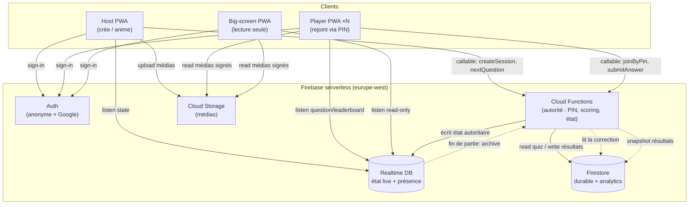
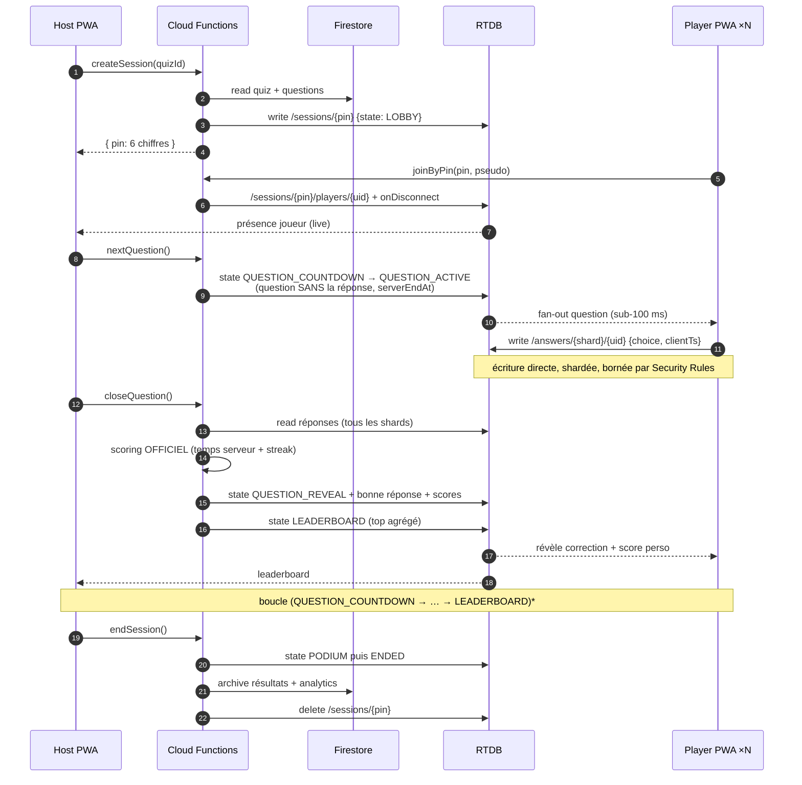

## 1. Architecture technique

mister-qowa repose sur une architecture **serverless Firebase** : un seul frontend (PWA React 19) parle directement à des services Google managés, et toute décision **faisant autorité** (allocation du PIN, calcul des scores, avance des questions) transite par des **Cloud Functions**. Le principe directeur : séparer le **durable** (Firestore) du **live faible latence** (Realtime Database), et ne jamais faire confiance au client pour un calcul officiel.

### 1.1 Composants et responsabilités

| Composant | Rôle | Données / responsabilités | Pourquoi ici |
|---|---|---|---|
| **PWA (React 19 + Vite 8)** | Client Host, Player, Big-screen | UI, rendu temps réel, validation `zod` d'entrée, file offline, optimistic UI | Installable, offline shell (`vite-plugin-pwa`), déployée sur GitHub Pages |
| **Firebase Auth** | Identité | Anonyme (joueur invité + pseudo), Google OAuth (host) | `uid` stable réutilisé dans Security Rules RTDB/Firestore |
| **Firestore** | Stockage **durable** | Comptes host, quiz, questions, banque de questions, résultats de parties **terminées**, analytics agrégées | Requêtes, index, historique long terme, faible débit d'écriture |
| **Realtime Database (RTDB)** | État de jeu **live** | Lobby, question courante, présence joueurs, réponses, leaderboard live | Fan-out sub-100 ms, présence native (`onDisconnect`), tarif au volume transféré |
| **Cloud Functions (europe-west)** | Autorité serveur | Allocation PIN, **scoring officiel**, avance d'état (`LOBBY → … → ENDED`), agrégation des réponses, anti-triche | Le client ne calcule jamais le score ; secret de correction protégé |
| **Cloud Storage** | Médias | Images/vidéos des questions, uploads host | URLs signées, CDN intégré, règles d'accès par quiz |
| **Hosting** | Frontend | GitHub Pages (convention parc, `base="/mister-qowa/"`) | Firebase Hosting = alternative, non retenue |

### 1.2 Pourquoi RTDB pour le live et Firestore pour le durable

C'est le choix architectural central. Les deux bases coexistent, chacune sur son terrain :

- **RTDB = le live.** Modèle de tarification au **volume transféré** (et non au document lu), latence de propagation **sub-100 ms**, **fan-out** natif (une écriture host → push instantané à N abonnés sur le même chemin), et surtout **présence** via `onDisconnect()` — indispensable pour détecter un joueur qui ferme l'onglet. La limite de Firestore de **1 écriture/document/seconde** rend Firestore inapte à recevoir directement les réponses de 1000 joueurs sur un même chemin ; RTDB encaisse un flux de fan-in bien supérieur si on shardde (cf. 1.5).
- **Firestore = le durable.** Requêtes indexées (« mes quiz », « top 10 historique »), transactions multi-documents, rétention longue, et écritures **rares** (création de quiz, snapshot de résultats en fin de partie). On y déverse l'état live **une seule fois**, à `ENDED`, via Cloud Function.

> Règle mémo du parc : *RTDB pendant la partie, Firestore avant et après.* L'état volatile (`/sessions/{pin}`) vit dans RTDB le temps de la partie puis est archivé dans Firestore et **supprimé** de RTDB (le tarif au volume punit les arborescences qui traînent).

### 1.3 Diagramme d'architecture



Point clé : **les écritures d'état autoritaire ne viennent jamais du client** — elles passent par une Cloud Function. Le client n'a qu'un droit de **lecture** sur l'état de jeu et un droit d'**écriture restreint** sur sa propre réponse (validée par Security Rules + revérifiée côté Function).

### 1.4 Flux d'une partie live



Détail anti-triche essentiel : la **question est diffusée sans sa bonne réponse**, l'instant de fin (`serverEndAt`) est posé par la Function avec l'horloge serveur, et le **temps de réponse officiel est mesuré côté serveur** à la fermeture — le `clientTs` n'est qu'indicatif. Le client ne reçoit la correction qu'à `QUESTION_REVEAL`.

### 1.5 Scalabilité : 1000+ joueurs / session

Le goulot n'est pas le fan-out **host → joueurs** (une écriture, N lecteurs : RTDB excelle), mais le **fan-in joueurs → serveur** (N écritures simultanées) et l'agrégation.

**Sharding des réponses.** Écrire les 1000 réponses sous un même nœud `/answers/{uid}` crée de la contention et un listener host énorme. On **shardde** par hachage de l'`uid` :

```
/sessions/{pin}/answers/{shardId}/{uid}   // shardId = hash(uid) % N_SHARDS (ex. 20)
```

Chaque shard reçoit ~50 écritures/question : pas de hot-path, et la Function lit les 20 shards en parallèle à la fermeture. Le **host n'écoute pas les réponses brutes** — seulement un compteur agrégé (`answeredCount`) maintenu par les Security Rules / la Function, pour la jauge « X/1000 ont répondu ».

**Limite Firestore 1 write/doc/s → agrégation.** On n'écrit **rien par-réponse dans Firestore** pendant la partie. Le live vit en RTDB ; Firestore ne reçoit qu'un **snapshot unique** en fin de partie (résultats + analytics) via la Function. Si une analytique temps réel devenait nécessaire, on passerait par des **compteurs distribués** (sharded counters) ou par export RTDB → BigQuery, jamais par incrément direct sur un document chaud.

**Fan-out RTDB et structure plate.** RTDB descend toute l'arborescence d'un chemin abonné : on garde des nœuds **plats et étroits**. Le joueur n'écoute que `/sessions/{pin}/current` (question + état), pas `/answers`. Le leaderboard diffusé est **tronqué (top 50)** et recalculé par la Function, pas un tri client sur 1000 entrées.

**Présence.** `onDisconnect()` nettoie `/players/{uid}/online` à la coupure réseau ; un champ `lastSeen` (timestamp serveur) sert de heartbeat de secours. La présence coûte une petite écriture par joueur, pas un flux continu.

**Débits & quotas.** RTDB plafonne à ~**100 k connexions simultanées** et ~**1000 écritures/s** par instance de base. Une session de 1000 joueurs (~1000 connexions, pics de ~1000 écritures à chaque question) **tient sur une seule instance**, mais plusieurs **milliers** de sessions concurrentes imposent du **multi-shard de bases RTDB** (router les sessions sur plusieurs instances par préfixe de PIN).

### 1.6 Latence : chemins critiques et optimisations

| Chemin critique | Cible | Optimisation |
|---|---|---|
| Host « next » → question affichée joueur | < 200 ms | Écriture RTDB unique, structure plate, listener ciblé `/current` |
| Joueur tape → réponse enregistrée | < 100 ms | Écriture RTDB directe (pas de Function sur le chemin chaud), shardée |
| Décompte synchronisé entre tous | dérive < 50 ms | `serverEndAt` absolu + offset d'horloge via `/.info/serverTimeOffset` |
| Fermeture → reveal/scores | < 500 ms | Function europe-west **min instances ≥ 1** (anti cold-start), lecture parallèle des shards |

La soumission de réponse **ne passe pas par une Function** (latence + coût + cold-start) : écriture RTDB directe **bornée par Security Rules** (un seul vote, dans la fenêtre de temps), revérifiée à la fermeture. Le décompte n'est jamais piloté par un timer client local : chacun calcule `serverEndAt - (now + serverTimeOffset)`, ce qui élimine la dérive entre appareils.

### 1.7 Mode offline / async / solo

Le mode **async/solo** (auto-rythmé, sans host) court-circuite la machine à états live : le quiz complet (avec corrections) est chargé depuis Firestore, mis en cache par le service worker (`vite-plugin-pwa`), et **jouable hors-ligne**. Le scoring local affiche un résultat **provisoire** ; à la reconnexion, une Function **recalcule le score officiel** et l'archive (le client reste non-autoritaire, même en solo). Les réponses produites hors-ligne sont mises en **file locale** (même pattern que `offlinePieceQueue` de mister-puzzle) et rejouées au retour réseau. Le mode **live** n'a pas de vrai offline : sans connexion, le joueur est marqué absent par la présence et reprend au prochain `LEADERBOARD`.

### 1.8 Estimation de coût Firebase (1 session de 1000 joueurs)

Hypothèses : 1 partie de **20 questions**, 1000 joueurs, ~5 Ko de payload par question fan-outé, 1 réponse/joueur/question.

| Poste | Volume | Coût indicatif |
|---|---|---|
| RTDB — download (fan-out) | 1000 joueurs × 20 q × ~5 Ko ≈ **100 Mo** | ~0,01 $/Go → **≈ 0,001 $** |
| RTDB — upload (réponses + présence) | ~20 000 écritures × ~1 Ko ≈ **20 Mo** | négligeable |
| Cloud Functions | ~50 invocations (PIN, 20× close, archive…) | sous le **free tier** (2 M/mois) → **≈ 0 $** |
| Firestore | ~1000 writes d'archive + lectures quiz | **≈ 0,002 $** |
| Storage / CDN médias | dépend des images (qq Mo) | quelques centimes |

**Ordre de grandeur : < 0,05 $ pour une session live de 1000 joueurs**, dominé par le download RTDB. À l'échelle de **centaines de sessions/jour**, le coût reste de l'ordre de quelques dollars/jour — tant qu'on **purge l'état RTDB** en fin de partie et qu'on n'écrit pas par-réponse dans Firestore.

### 1.9 Alternative self-hosted et seuil de bascule

Firebase est privilégié (aligné mister-puzzle, zéro ops). La stack de référence de la brief — **NestJS + Socket.io + PostgreSQL + Redis** — reste le **« self-hosted V2 »** documenté : Socket.io pour le live (rooms = sessions), Redis adapter pour le fan-out multi-nœuds + présence, PostgreSQL pour le durable. On bascule quand l'un de ces seuils est franchi :

- **Concurrence** : on dépasse durablement ~**100 k connexions simultanées** ou plusieurs milliers de sessions concurrentes (le multi-shard RTDB devient plus coûteux à opérer qu'un cluster Socket.io + Redis qu'on dimensionne).
- **Coût** : le volume de download RTDB rend la facture supérieure au coût d'un cluster auto-hébergé.
- **Latence/contrôle** : besoin de WebSocket bidirectionnel fin, de logique serveur lourde par message, ou de souveraineté des données hors Google.

En deçà, le surcoût opérationnel d'un backend stateful (scaling WebSocket, présence distribuée, HA Postgres/Redis) ne se justifie pas face au serverless Firebase.

---

Fichiers de référence consultés (conventions parc, alignées sur cette section) : `D:\Src\GithubMisterGuiiuG\mister-puzzle\src\firebase.ts` (init RTDB via `getDatabase`), `D:\Src\GithubMisterGuiiuG\mister-puzzle\src\config\firebaseEnv.ts` (config web par env), `D:\Src\GithubMisterGuiiuG\mister-puzzle\database.rules.json` (style Security Rules RTDB + présence `members/lastSeen`), `D:\Src\GithubMisterGuiiuG\mister-puzzle\src\utils\offlinePieceQueue.ts` (pattern file offline).
