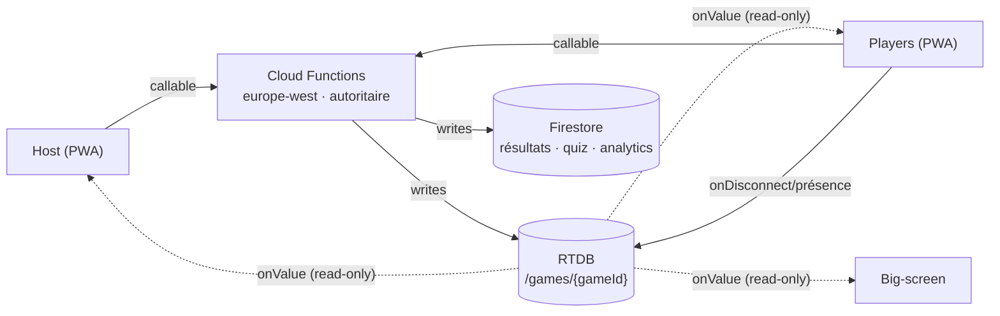
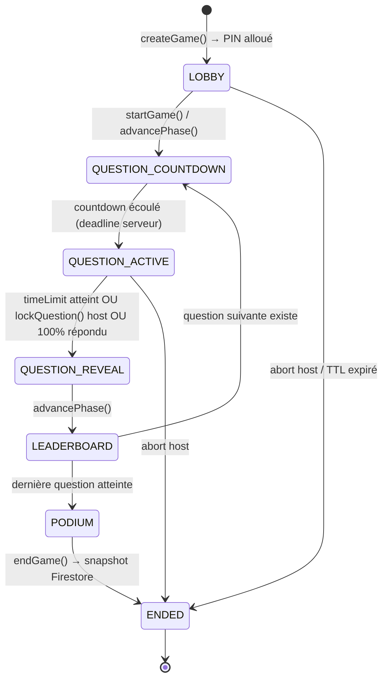
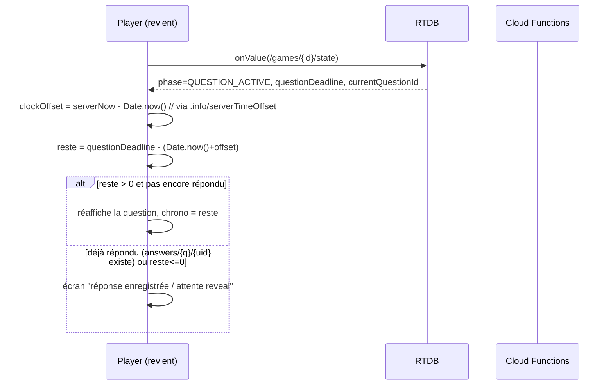

## 3. Protocole temps réel & moteur de jeu

Cette section définit le contrat d'exécution d'une partie : la machine à états canonique, le découpage des responsabilités entre **host**, **serveur autoritaire** (Cloud Functions + RTDB) et **players**, la formule de scoring, la reconnexion, l'anti-triche, le mode équipe et les réactions emoji. Principe directeur, hérité de `mister-puzzle` : **le client n'écrit jamais une valeur de confiance**. Toute donnée sensible (PIN, avance d'état, réponse soumise, score) transite par une Cloud Function ou est verrouillée par les Security Rules ; le client se contente d'écouter (`onValue`) et d'afficher.

### 3.1 Topologie temps réel

On sépare le **durable** (Firestore) du **live** (RTDB), exactement comme la brief le verrouille.



- **RTDB `/games/{gameId}`** : état live (phase, question courante, présence, réponses chiffrées, leaderboard, réactions). Lecture libre des champs publics, **écriture interdite** sur les champs autoritaires (cf. 3.7).
- **Cloud Functions callables** (`europe-west1`) : `createGame`, `joinGame`, `startGame`, `advancePhase`, `submitAnswer`, `lockQuestion`, `endGame`. Elles seules détiennent le `serverTimestamp` de référence et écrivent `phase`, `currentQuestion`, `scores`.
- **Firestore** : snapshot final de la partie (`/sessions/{id}`), banque de questions, analytics — écrit par les Functions à la transition `PODIUM → ENDED`.

### 3.2 Machine à états de partie

État global stocké dans `/games/{gameId}/state` ; **seules les Cloud Functions y écrivent**. Le client lit `state.phase` et rend l'écran correspondant.



| Phase | Écrit par | Champ déclencheur | Affichage host | Affichage player |
|---|---|---|---|---|
| `LOBBY` | `createGame` | — | PIN + liste joueurs | pseudo + « en attente » |
| `QUESTION_COUNTDOWN` | `advancePhase` | `countdownDeadline` (3 s) | « Question N » | « Préparez-vous » |
| `QUESTION_ACTIVE` | `advancePhase` | `questionDeadline` | question + chrono | options cliquables |
| `QUESTION_REVEAL` | `advancePhase`/`lockQuestion` | `correctOptionId` | bonne réponse + distribution | juste/faux + points gagnés |
| `LEADERBOARD` | `advancePhase` | `leaderboard[]` | top 5 | rang + delta |
| `PODIUM` | `advancePhase` | `podium[1..3]` | podium animé | rang final |
| `ENDED` | `endGame` | `endedAt` | bilan + export | « merci » |

Chaque phase porte une **deadline serveur** (`*Deadline = serverTimestamp + durée`). Le client n'utilise jamais son horloge locale pour décider d'une transition : il calcule un offset (cf. 3.6) et n'affiche qu'un compte à rebours indicatif. La transition réelle est toujours écrite par une Function (déclenchée par le host, ou par une tâche `onSchedule`/`tasks` planifiée à la deadline pour le mode async).

### 3.3 Modèle de données RTDB

```
/games/{gameId}
  state:
    phase            : "QUESTION_ACTIVE"        # autoritaire (Functions)
    questionIndex    : 3
    currentQuestionId: "q_8h2k"
    countdownDeadline: 1733650000000            # ms epoch serveur
    questionDeadline : 1733650020000
    timeLimitMs      : 20000
    basePoints       : 1000
    correctOptionId  : null                     # null tant que phase != REVEAL
  pin: "402913"                                  # index inverse: /pins/402913 -> gameId
  mode: "live"                                   # live | async | team
  players/{uid}:
    pseudo   : "Zoé"
    teamId   : "rouge"                           # null hors mode équipe
    joinedAt : 1733649900000
    connected: true                              # géré par onDisconnect
    score    : 0                                 # autoritaire (Functions)
    streak   : 0
  answers/{questionId}/{uid}:                    # écrit UNIQUEMENT par submitAnswer (CF)
    optionId       : "b"
    answerHash     : "9f2c…"                     # réponse libre normalisée+hashée
    receivedAt     : 1733650013480               # serverTimestamp
    responseTimeMs : 13480
    awarded        : 380                          # points calculés serveur
    correct        : true
  leaderboard: [ {uid, pseudo, score, rank}, … ] # recomputé par CF au REVEAL
  reactions/{pushId}: { uid, emoji, at }         # éphémère, TTL court
```

Le nœud `answers` est **interdit en écriture directe** aux clients (Security Rules `.write: false`). C'est le pivot de l'anti-triche : un player ne peut pas écrire son `awarded` ni lire la réponse des autres avant le `REVEAL`.

### 3.4 Contrat d'événements (callables ↔ RTDB)

Toutes les entrées sont validées par **zod v4** dans la Function avant tout effet de bord. Schémas partagés client/serveur (mêmes définitions, importées des deux côtés).

```ts
// shared/schemas.ts — utilisé par le client (pré-validation UX) ET la CF (validation autoritaire)
import { z } from 'zod';

export const JoinGameInput = z.object({
  pin: z.string().regex(/^\d{6}$/),
  pseudo: z.string().trim().min(1).max(24),
  teamId: z.string().max(32).nullable().default(null),
});

export const SubmitAnswerInput = z.object({
  gameId: z.string().min(1).max(64),
  questionId: z.string().min(1).max(64),
  // exactement une des deux formes selon le type de question
  optionId: z.string().min(1).max(8).optional(),     // QCM / vrai-faux / sondage
  freeText: z.string().trim().min(1).max(120).optional(),
}).refine(d => !!d.optionId !== !!d.freeText, {
  message: 'optionId XOR freeText',
});
```

| Événement | Émetteur | Type | Effet serveur (Cloud Function autoritaire) |
|---|---|---|---|
| `createGame` | Host | callable | Alloue un PIN unique (transaction sur `/pins`), crée `/games/{id}`, phase `LOBBY`. |
| `joinGame` | Player | callable | Valide PIN + pseudo (anti-doublon), crée `/players/{uid}`, renvoie `gameId`. |
| `startGame` | Host | callable | `LOBBY → QUESTION_COUNTDOWN`, pose `countdownDeadline`. |
| `advancePhase` | Host | callable | Avance d'un cran (table 3.2). Au passage `ACTIVE→REVEAL`, **calcule tous les scores** et le leaderboard. |
| `lockQuestion` | Host | callable | Force `ACTIVE → REVEAL` avant la deadline (verrouille les réponses tardives). |
| `submitAnswer` | Player | callable | Cœur anti-triche : valide phase, deadline, unicité ; calcule `responseTimeMs` et `awarded` ; écrit `/answers`. |
| `reactEmoji` | Player/Host | callable ou write rules | Ajoute `/reactions/{push}` (rate-limité). |
| `endGame` | Host | callable | `PODIUM → ENDED`, snapshot vers Firestore, purge RTDB après TTL. |

> Les transitions de phase passent **toujours** par `advancePhase`/`lockQuestion` (jamais d'écriture directe du host sur `state`), ce qui garantit que le serveur recalcule les scores au bon moment et applique les mêmes règles en mode live et async.

### 3.5 Séquence d'un tour de question complet

```mermaid
sequenceDiagram
  autonumber
  participant H as Host
  participant CF as Cloud Functions
  participant DB as RTDB /games/{id}
  participant P1 as Player A
  participant P2 as Player B

  H->>CF: advancePhase(gameId)  // → COUNTDOWN
  CF->>DB: state.phase=QUESTION_COUNTDOWN, countdownDeadline=+3s
  DB-->>P1: onValue(state)
  DB-->>P2: onValue(state)

  Note over CF,DB: à la deadline, advancePhase → ACTIVE
  H->>CF: advancePhase(gameId)  // → ACTIVE
  CF->>DB: state.phase=QUESTION_ACTIVE, questionDeadline=+timeLimit
  DB-->>P1: question + options
  DB-->>P2: question + options

  P1->>CF: submitAnswer(optionId="b")
  CF->>CF: vérifie phase=ACTIVE, now<=deadline, pas de doublon
  CF->>CF: responseTimeMs = now - (deadline - timeLimit); awarded = scoring()
  CF->>DB: /answers/{q}/{P1} = {correct, awarded, receivedAt}
  CF-->>P1: { received: true }   // PAS de correct/score renvoyé ici

  P2->>CF: submitAnswer(optionId="c")  // faux
  CF->>DB: /answers/{q}/{P2} = {correct:false, awarded:0}
  CF-->>P2: { received: true }

  Note over CF: si 100% répondu OU deadline OU lockQuestion ⇒ REVEAL
  H->>CF: advancePhase(gameId)  // → REVEAL
  CF->>CF: agrège /answers, met à jour players.score & streak
  CF->>DB: state.correctOptionId="b", leaderboard recalculé
  DB-->>P1: REVEAL juste +380 pts
  DB-->>P2: REVEAL faux +0
  DB-->>H: distribution des réponses

  H->>CF: advancePhase(gameId)  // → LEADERBOARD
  CF->>DB: state.phase=LEADERBOARD, leaderboard[]
```

Point clé : la réponse du callable `submitAnswer` ne révèle **jamais** `correct`/`awarded` au moment de la soumission — seulement `{ received: true }`. La justesse n'est diffusée qu'à la phase `REVEAL`, pour tous en même temps. Cela empêche un joueur de déduire la bonne réponse en sondant l'API pendant que la question est encore active.

### 3.6 Formule de scoring (autoritaire serveur)

Identique à la brief, **calculée exclusivement dans `advancePhase` (REVEAL)** à partir des `receivedAt` serveur.

```
correct == false  OU  hors-temps        => awarded = 0
sondage (poll, sans bonne réponse)       => awarded = 0
correct == true :
  factor  = 1 - 0.5 * (responseTimeMs / timeLimitMs)     // ∈ [0.5, 1]
  awarded = round(basePoints * factor)                   // borné [basePoints/2, basePoints]
streak (optionnel, après calcul de base) :
  awarded = round(awarded * (1 + STREAK_BONUS * min(consecutiveCorrect, STREAK_CAP)))
```

```ts
// functions/scoring.ts — source de vérité unique
export function scoreAnswer(p: {
  correct: boolean;
  isPoll: boolean;
  responseTimeMs: number;
  timeLimitMs: number;
  basePoints: number;
  streak: number;             // bonnes réponses consécutives AVANT celle-ci
  streakBonus?: number;       // ex. 0.1 (=+10%/cran)
  streakCap?: number;         // ex. 5
}): number {
  if (p.isPoll || !p.correct) return 0;
  const clamped = Math.min(Math.max(p.responseTimeMs, 0), p.timeLimitMs);
  const factor = 1 - 0.5 * (clamped / p.timeLimitMs); // [0.5, 1]
  let pts = Math.round(p.basePoints * factor);
  const bonus = (p.streakBonus ?? 0) * Math.min(p.streak, p.streakCap ?? 0);
  pts = Math.round(pts * (1 + bonus));
  return pts;
}
```

**Exemples chiffrés** (`basePoints = 1000`, `timeLimitMs = 20000`) :

| Cas | `responseTimeMs` | correct | streak | Calcul | `awarded` |
|---|---|---|---|---|---|
| Réponse instantanée | 0 | ✓ | 0 | `1000 × (1 − 0) = 1000` | **1000** |
| Mi-temps | 10 000 | ✓ | 0 | `1000 × (1 − 0.25) = 750` | **750** |
| Au buzzer | 19 800 | ✓ | 0 | `1000 × (1 − 0.495) = 505` | **505** |
| Pile à la deadline | 20 000 | ✓ | 0 | `1000 × 0.5 = 500` (plancher) | **500** |
| Mauvaise réponse | 5 000 | ✗ | — | court-circuit | **0** |
| Hors-temps (tardive) | 21 000 | ✓ | — | rejetée (cf. 3.8) | **0** |
| Mi-temps + 3 streaks (10 %) | 10 000 | ✓ | 3 | `750 × (1 + 0.30) = 975` | **975** |
| Sondage | 8 000 | (n/a) | — | poll ⇒ 0 | **0** |

### 3.7 Reconnexion, présence et reprise d'état

La présence s'appuie sur le pattern `onDisconnect` déjà utilisé dans `mister-puzzle` (`joinMember` → `onDisconnect(memberRef).remove()`). Pour un quiz on **ne supprime pas** le joueur à la déconnexion (on garde son score), on bascule seulement `connected: false`.

```ts
// client player — présence robuste aux coupures réseau
import { ref, onValue, onDisconnect, set, serverTimestamp } from 'firebase/database';

function trackPresence(gameId: string, uid: string) {
  const connRef = ref(db, '.info/connected');           // pseudo-nœud RTDB
  const meRef = ref(db, `games/${gameId}/players/${uid}/connected`);
  return onValue(connRef, snap => {
    if (snap.val() !== true) return;                     // hors-ligne : rien à faire
    onDisconnect(meRef).set(false).then(() => set(meRef, true));
    // lastSeen tenu à jour pour le ménage côté serveur
    onDisconnect(ref(db, `games/${gameId}/players/${uid}/lastSeen`))
      .set(serverTimestamp());
  });
}
```

**Reprise d'état (state resync).** L'état vivant tenant entièrement dans `/games/{gameId}/state`, la reprise est triviale : au remount, le player se réabonne via `onValue(state)` et **rend la phase courante telle quelle**. Aucun rejouement n'est nécessaire.



Le décalage d'horloge se mesure avec le nœud Firebase `'.info/serverTimeOffset'`, ce qui rend le chrono fiable même si l'horloge du téléphone est fausse :

```ts
let clockOffset = 0;
onValue(ref(db, '.info/serverTimeOffset'), s => { clockOffset = s.val() ?? 0; });
const serverNow = () => Date.now() + clockOffset;
```

Côté serveur, une fonction planifiée balaie périodiquement les joueurs `connected:false` dont `lastSeen` dépasse un TTL (ex. 2 min) pour libérer les slots de lobby — analogue au `trimHistoryIfNeeded` de `mister-puzzle`.

### 3.8 Anti-triche & races (serveur autoritaire)

Toute la confiance repose sur `submitAnswer` (Cloud Function) + Security Rules. Le client **ne peut pas** : écrire `/answers`, lire les réponses des autres avant `REVEAL`, modifier son `score`, ni avancer la phase.

```ts
// functions/submitAnswer.ts (schéma — onCall, region europe-west1)
export const submitAnswer = onCall({ region: 'europe-west1' }, async (req) => {
  const uid = req.auth?.uid;
  if (!uid) throw new HttpsError('unauthenticated', 'login requis');
  const input = SubmitAnswerInput.parse(req.data);            // zod v4 autoritaire

  const stateSnap = await admin.database()
    .ref(`games/${input.gameId}/state`).get();
  const st = stateSnap.val();

  // 1. la question soumise est bien la question active
  if (st?.phase !== 'QUESTION_ACTIVE' || st.currentQuestionId !== input.questionId)
    throw new HttpsError('failed-precondition', 'question close');

  // 2. horloge SERVEUR uniquement — le client n'envoie aucun timestamp
  const now = Date.now();                                     // horloge CF, pas client
  if (now > st.questionDeadline)
    throw new HttpsError('deadline-exceeded', 'hors temps');  // réponse tardive ⇒ rejetée

  // 3. unicité atomique : première écriture gagne, double réponse rejetée
  const ansRef = admin.database()
    .ref(`games/${input.gameId}/answers/${input.questionId}/${uid}`);
  const tx = await ansRef.transaction(cur => (cur === null ? {
    optionId: input.optionId ?? null,
    answerHash: input.freeText ? normalizeAndHash(input.freeText) : null,
    receivedAt: now,
    responseTimeMs: now - (st.questionDeadline - st.timeLimitMs),
    locked: true,
  } : undefined /* abort: déjà répondu */));

  if (!tx.committed) throw new HttpsError('already-exists', 'déjà répondu');
  return { received: true };                                  // aucune info de justesse
});
```

Mesures de défense :

- **Horloge serveur exclusive.** `responseTimeMs` est dérivé du `now` de la Function et de `questionDeadline` (lui-même serveur). Le client n'envoie aucun timestamp → impossible de se déclarer « plus rapide ».
- **Réponse tardive (race « après le temps »).** Toute soumission `now > questionDeadline` est rejetée (`deadline-exceeded`). Même si l'UI a laissé cliquer à cause de latence, le serveur tranche. `lockQuestion` côté host pose en plus un verrou immédiat.
- **Double réponse (race).** `transaction(cur => cur === null ? … : undefined)` garantit l'unicité : la **première** écriture commit, les suivantes abortent (`already-exists`). Pas de dernière-réponse-gagne.
- **Pas de fuite de justesse.** `correct`/`awarded` ne sont calculés et écrits qu'au `REVEAL`, jamais renvoyés à la soumission → impossible de brute-forcer la bonne réponse via retries.
- **Validation zod v4** sur toutes les entrées + **Security Rules** verrouillant les nœuds sensibles (modèle directement repris des `.validate` de `database.rules.json` de `mister-puzzle`).
- **Rate limiting** par `uid` (réutilisation du `RateLimiter` de `src/utils/security.ts`, ou App Check) contre le spam de soumissions/réactions.
- **Réponse libre** : `normalizeAndHash` (trim, casse, accents, espaces) côté serveur → comparaison robuste sans exposer la valeur attendue.

```jsonc
// database.rules.json (extrait mister-qowa) — nœuds autoritaires en lecture seule
{
  "rules": {
    "games": {
      "$gameId": {
        "state":   { ".read": true,  ".write": false },   // Functions only
        "answers": { ".read": false, ".write": false },    // jamais lisible/écrivable côté client
        "players": {
          ".read": true,
          "$uid": {
            "connected": { ".write": "auth.uid === $uid", ".validate": "newData.isBoolean()" },
            "lastSeen":  { ".write": "auth.uid === $uid", ".validate": "newData.isNumber()" },
            "score":     { ".write": false }                // score = Functions only
          }
        },
        "reactions": { ".read": true, ".write": "auth != null" }
      }
    }
  }
}
```

### 3.9 Mode équipe

Le `teamId` est porté par chaque joueur (`/players/{uid}/teamId`). Le scoring individuel est inchangé ; le **score d'équipe est une agrégation recalculée par le serveur** au `REVEAL`, jamais par le client.

```ts
// dans advancePhase, après calcul des points individuels
const teamScores: Record<string, number> = {};
for (const [uid, p] of Object.entries(players)) {
  if (!p.teamId) continue;
  teamScores[p.teamId] = (teamScores[p.teamId] ?? 0) + p.score;
}
await stateRef.child('teamLeaderboard').set(
  Object.entries(teamScores)
    .map(([teamId, score]) => ({ teamId, score }))
    .sort((a, b) => b.score - a.score)
    .map((t, i) => ({ ...t, rank: i + 1 }))
);
```

- Le leaderboard `LEADERBOARD`/`PODIUM` affiche les équipes au lieu des individus quand `mode === 'team'`.
- Le streak peut être configuré **par joueur** (par défaut) ou **par équipe** (le streak collectif réinitialisé si un membre se trompe) — paramètre `streakScope: 'player' | 'team'`.
- L'équilibrage d'équipes (taille max, auto-assignation) est validé au `joinGame`.

### 3.10 Réactions emoji live

Canal éphémère à faible enjeu : haute fréquence, faible valeur, donc écriture client autorisée mais **rate-limitée** et purgée.

```ts
// client — émission d'une réaction
import { push, ref, serverTimestamp } from 'firebase/database';
const REACTIONS = ['👏', '😂', '😮', '🔥', '❤️'] as const;

async function sendReaction(gameId: string, uid: string, emoji: typeof REACTIONS[number]) {
  await push(ref(db, `games/${gameId}/reactions`), { uid, emoji, at: serverTimestamp() });
}
```

```ts
// client — consommation : on n'écoute que les enfants ajoutés (pas tout l'historique)
import { ref, query, limitToLast, onChildAdded } from 'firebase/database';

const reactionsQ = query(ref(db, `games/${gameId}/reactions`), limitToLast(30));
const unsub = onChildAdded(reactionsQ, snap => {
  const { emoji } = snap.val();
  floatEmoji(emoji); // animation framer-motion : montée + fade, retirée du DOM à la fin
});
```

- **Rate limit** : max ~3 réactions / 2 s par `uid` (validé en règle `.validate` sur `at`, ou via App Check / `RateLimiter`).
- **Purge** : `onChildAdded` + `limitToLast(30)` côté lecture ; une Function planifiée (ou `onDisconnect` du host à `endGame`) supprime `/reactions` pour éviter la croissance illimitée.
- **Whitelist** d'emojis (5 valeurs) validée serveur → pas d'injection de contenu arbitraire.
- Les réactions n'ont **aucun impact sur le score** : strictement cosmétiques, et donc volontairement hors du chemin autoritaire pour préserver la latence des soumissions de réponses.

---

Fichiers de référence consultés (alignement parc) : `D:/Src/GithubMisterGuiiuG/mister-puzzle/src/firebase.ts`, `D:/Src/GithubMisterGuiiuG/mister-puzzle/src/hooks/useSocket.ts` (patterns `ref`/`onValue`/`onDisconnect`/`update` multi-chemins), `D:/Src/GithubMisterGuiiuG/mister-puzzle/database.rules.json` (modèle de Security Rules `.validate`), `D:/Src/GithubMisterGuiiuG/mister-puzzle/src/utils/security.ts` (`RateLimiter`, `hashString`).
