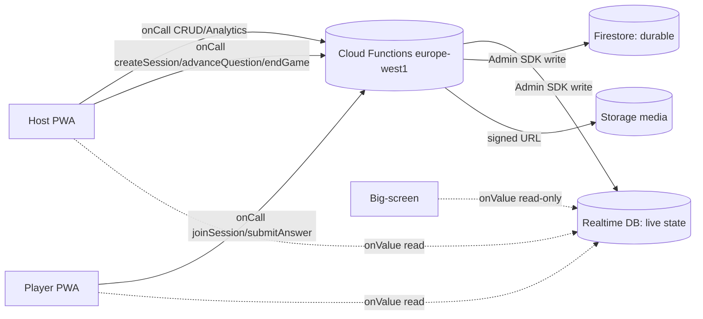

## 4. API & contrats

Cette section fixe le contrat d'API de mister-qowa. On distingue trois surfaces :

- **REST/HTTPS callable de gestion** (gestion CRUD hors-jeu, à faible débit) : authoring de quiz/questions, upload média, export analytics. Exposées comme **Cloud Functions `onCall`** (callable v2, région `europe-west1`) ou `onRequest` pour le CSV/stream binaire.
- **Cloud Functions autoritaires de jeu** (chaud, faible latence) : `createSession`, `joinSession`, `submitAnswer`, `advanceQuestion`, `endGame`. Le client n'écrit jamais le score officiel ni l'état de phase.
- **RTDB** : canal temps réel. Le client lit massivement, mais n'écrit que dans des sous-arbres étroits verrouillés par Security Rules ; le serveur (Functions avec Admin SDK) écrit tout le reste.

Toutes les entrées sont validées par **zod v4** côté Function. Convention d'erreur : on renvoie un `HttpsError` Firebase dont le `code` appartient à l'ensemble canonique (`invalid-argument`, `unauthenticated`, `permission-denied`, `not-found`, `failed-precondition`, `resource-exhausted`, `already-exists`, `deadline-exceeded`, `aborted`, `internal`), enrichi d'un `details` applicatif `{ appCode, message, fieldErrors? }`.



### 4.0 Conventions transverses

- **Auth** : tout `onCall` exige `request.auth`. Les routes d'authoring exigent un compte Google (`firebase.sign_in_provider !== 'anonymous'`) ; `joinSession`/`submitAnswer` acceptent l'anonyme.
- **Idempotence** : les mutations chaudes acceptent un `clientRequestId` (UUID v4) ; un rejeu renvoie le résultat mémorisé au lieu de réappliquer.
- **Horloge** : seul le serveur fait foi. Les durées (`responseTimeMs`) sont recalculées serveur à partir des timestamps RTDB, jamais lues du client.
- **Pagination** : curseur opaque `cursor` (base64 du dernier `docId` + champ de tri), `limit` ∈ [1, 100], défaut 20.
- **Enveloppe de réponse** : `{ ok: true, data }` ou `{ ok: false, error: { appCode, message, fieldErrors? } }` (le transport callable encapsule déjà ; l'enveloppe applicative vit dans `data`/`HttpsError.details`).

Schémas zod partagés (extrait `@mister-qowa/contracts`) :

```ts
import { z } from 'zod';

export const questionType = z.enum(['multiple_choice', 'true_false', 'free_text', 'poll']);

export const optionSchema = z.object({
  id: z.string().uuid(),
  text: z.string().min(1).max(120),
  isCorrect: z.boolean().default(false), // ignoré pour 'poll'
});

export const questionSchema = z
  .object({
    id: z.string().uuid(),
    type: questionType,
    prompt: z.string().min(1).max(500),
    options: z.array(optionSchema).max(4).default([]),
    acceptedAnswers: z.array(z.string().min(1).max(120)).max(20).default([]), // free_text
    timeLimitMs: z.number().int().min(5_000).max(120_000),
    basePoints: z.number().int().min(0).max(2_000),
    mediaId: z.string().uuid().nullable().default(null),
  })
  .superRefine((q, ctx) => {
    if (q.type === 'multiple_choice') {
      if (q.options.length < 2) ctx.addIssue({ code: 'custom', path: ['options'], message: 'min 2 options' });
      if (!q.options.some((o) => o.isCorrect)) ctx.addIssue({ code: 'custom', path: ['options'], message: 'need a correct option' });
    }
    if (q.type === 'true_false' && q.options.length !== 2)
      ctx.addIssue({ code: 'custom', path: ['options'], message: 'exactly 2 options' });
    if (q.type === 'free_text' && q.acceptedAnswers.length === 0)
      ctx.addIssue({ code: 'custom', path: ['acceptedAnswers'], message: 'need accepted answers' });
  });

export const quizSchema = z.object({
  id: z.string().uuid(),
  title: z.string().min(1).max(120),
  description: z.string().max(1_000).default(''),
  visibility: z.enum(['private', 'unlisted', 'public']).default('private'),
  tags: z.array(z.string().min(1).max(24)).max(10).default([]),
  questionIds: z.array(z.string().uuid()).max(200).default([]),
});
```

### 4.1 Endpoints REST / Cloud Functions callable (gestion)

Notation : `onCall` = appel via `httpsCallable(name)` (data JSON). `onRequest` = vrai HTTP (pour CSV/upload binaire). Tous les `path` `onRequest` sont préfixés `https://europe-west1-<projet>.cloudfunctions.net/api`.

#### Quiz — CRUD

| Méthode | Fonction / Chemin | Auth | Description |
|---|---|---|---|
| onCall | `quiz.create` | Google | Crée un quiz |
| onCall | `quiz.get` | Google (owner ou public) | Lit un quiz + ses questions |
| onCall | `quiz.list` | Google | Liste paginée des quiz du host |
| onCall | `quiz.update` | Google (owner) | Maj partielle (PATCH) |
| onCall | `quiz.delete` | Google (owner) | Suppression (soft delete) |

**`quiz.create`**
Payload (zod) :

```ts
export const quizCreateInput = quizSchema.omit({ id: true, questionIds: true }).extend({
  questions: z.array(questionSchema.omit({ id: true })).max(200).default([]),
});
```

Requête :

```json
{ "title": "Capitales d'Europe", "visibility": "private", "tags": ["geo"],
  "questions": [
    { "type": "multiple_choice", "prompt": "Capitale de la France ?",
      "options": [
        { "text": "Paris", "isCorrect": true }, { "text": "Lyon", "isCorrect": false },
        { "text": "Marseille", "isCorrect": false } ],
      "acceptedAnswers": [], "timeLimitMs": 20000, "basePoints": 1000, "mediaId": null } ] }
```

Réponse `200` :

```json
{ "ok": true, "data": { "id": "8e1c…", "title": "Capitales d'Europe",
  "questionIds": ["4af2…"], "createdAt": 1717840000000, "ownerId": "uid_host_42" } }
```

Erreurs : `invalid-argument` (zod `fieldErrors`), `unauthenticated`, `permission-denied` (compte anonyme), `resource-exhausted` (quota quiz/host).

**`quiz.update`** — PATCH partiel, validé par `quizSchema.partial().pick({ title, description, visibility, tags })`. `not-found` si quiz inexistant/soft-deleted, `permission-denied` si non-owner, `aborted` si conflit de version optimiste (`expectedRev`).

**`quiz.list`**

```json
// req
{ "cursor": null, "limit": 20, "filter": { "visibility": "private", "tag": "geo" } }
// res
{ "ok": true, "data": { "items": [ { "id": "8e1c…", "title": "…", "questionCount": 12 } ],
  "nextCursor": "eyJkb2NJZCI6…", "hasMore": true } }
```

#### Questions — CRUD & banque de questions

| Méthode | Fonction | Auth | Description |
|---|---|---|---|
| onCall | `question.upsert` | Google (owner du quiz) | Crée/maj une question dans un quiz |
| onCall | `question.delete` | Google (owner) | Retire une question |
| onCall | `question.reorder` | Google (owner) | Réordonne `questionIds` |
| onCall | `bank.search` | Google | Recherche dans la banque de questions (réutilisables) |
| onCall | `bank.import` | Google (owner) | Copie des questions de la banque vers un quiz |

**`question.upsert`**

```ts
export const questionUpsertInput = z.object({
  quizId: z.string().uuid(),
  question: questionSchema.partial({ id: true }), // id absent => create
  expectedRev: z.number().int().nonnegative().optional(),
});
```

Réponse : `{ ok: true, data: { questionId, rev } }`. Erreurs : `invalid-argument` (superRefine type/options), `not-found` (quiz), `permission-denied`, `aborted` (rev).

**`question.reorder`** : `{ quizId, orderedQuestionIds: string[] }` ; `failed-precondition` si l'ensemble ne correspond pas exactement aux IDs existants.

#### Média — upload

Le binaire ne transite pas par un callable. Modèle en deux temps : on demande une URL signée, le client `PUT` directement sur Storage, puis une Function de finalisation (déclenchée par Storage trigger ou callable) valide.

| Méthode | Fonction / Chemin | Auth | Description |
|---|---|---|---|
| onCall | `media.createUploadUrl` | Google | Renvoie une URL signée `PUT` + `mediaId` |
| PUT | (URL signée Storage) | URL signée | Upload binaire direct |
| onCall | `media.finalize` | Google | Valide taille/MIME, génère vignette, marque prêt |

**`media.createUploadUrl`**

```ts
export const mediaUploadInput = z.object({
  filename: z.string().min(1).max(200),
  contentType: z.enum(['image/png', 'image/jpeg', 'image/webp', 'video/mp4']),
  sizeBytes: z.number().int().min(1).max(50_000_000), // 50 MB plafond, contrôlé aussi par Storage Rules
});
```

```json
// res
{ "ok": true, "data": {
  "mediaId": "b21f…",
  "uploadUrl": "https://storage.googleapis.com/…&X-Goog-Signature=…",
  "storagePath": "media/uid_host_42/b21f….mp4",
  "expiresAt": 1717840600000 } }
```

Erreurs : `invalid-argument` (MIME/taille hors bornes), `resource-exhausted` (quota stockage/host). `media.finalize` renvoie `failed-precondition` si l'objet uploadé ne correspond pas au `contentType`/`sizeBytes` annoncés (anti-spoof).

#### Création de session (authoring, pré-jeu)

`session.create` prépare une partie à partir d'un quiz (snapshot immuable des questions) ; il **délègue** au contrat autoritaire `createSession` (§4.2) pour l'allocation du PIN. Distinct du démarrage live.

```ts
export const sessionCreateInput = z.object({
  quizId: z.string().uuid(),
  mode: z.enum(['live', 'async', 'team']).default('live'),
  options: z
    .object({
      streakBonusPct: z.number().min(0).max(100).default(0),
      shuffleQuestions: z.boolean().default(false),
      shuffleOptions: z.boolean().default(true),
      allowLateJoin: z.boolean().default(true),
      maxPlayers: z.number().int().min(1).max(2_000).default(1_000),
    })
    .default({}),
});
```

#### Export analytics / CSV

| Méthode | Fonction / Chemin | Auth | Description |
|---|---|---|---|
| onCall | `analytics.session` | Google (owner) | KPIs agrégés d'une session terminée (JSON) |
| onRequest GET | `/api/sessions/:sessionId/export.csv` | Google (Bearer ID token) | Stream CSV des réponses |
| onCall | `analytics.questionStats` | Google (owner) | Distribution des réponses par question |

**`analytics.session`** réponse :

```json
{ "ok": true, "data": {
  "sessionId": "S_3K9", "quizId": "8e1c…", "playerCount": 312,
  "completionRate": 0.94, "avgScore": 6420, "medianResponseMs": 4310,
  "byQuestion": [ { "questionId": "4af2…", "correctRate": 0.71, "avgResponseMs": 5120 } ] } }
```

**Export CSV** (`onRequest`, vrai HTTP pour streamer) :

```
GET /api/sessions/S_3K9/export.csv
Authorization: Bearer <Firebase ID token>
Accept: text/csv
→ 200 OK
Content-Type: text/csv; charset=utf-8
Content-Disposition: attachment; filename="session-S_3K9.csv"

playerId,nickname,questionId,answer,correct,responseMs,pointsAwarded,rank
p_001,Alice,4af2…,Paris,true,3120,920,1
```

Codes : `200` (stream), `401` (token absent/expiré), `403` (non-owner), `404` (session inconnue), `409`/`failed-precondition` (session non terminée → export refusé), `429` (rate limit export).

### 4.2 Contrat des Cloud Functions autoritaires (jeu)

Toutes en `onCall` v2, `europe-west1`, `enforceAppCheck: true`, mémoïsées par `clientRequestId`. Signatures TypeScript du contrat partagé :

```ts
import type { CallableRequest } from 'firebase-functions/v2/https';

// ---- Enveloppe générique ----
type Ok<T> = { ok: true; data: T };
type Err = { ok: false; error: { appCode: string; message: string; fieldErrors?: Record<string, string[]> } };
type Result<T> = Ok<T> | Err; // côté HttpsError.details pour le cas Err

type GameState = 'LOBBY' | 'QUESTION_COUNTDOWN' | 'QUESTION_ACTIVE' | 'QUESTION_REVEAL' | 'LEADERBOARD' | 'PODIUM' | 'ENDED';

// ---- createSession : Host crée la partie, serveur alloue le PIN ----
interface CreateSessionInput {
  quizId: string;
  mode: 'live' | 'async' | 'team';
  options: SessionOptions;
  clientRequestId: string; // UUID v4, idempotence
}
interface CreateSessionOutput {
  sessionId: string; // ex. "S_3K9"
  pin: string; // 6 chiffres, unique parmi sessions actives
  hostToken: string; // capability token pour les actions host
  rtdbPath: string; // ex. "/sessions/S_3K9"
  state: GameState; // 'LOBBY'
  expiresAt: number;
}
declare function createSession(req: CallableRequest<CreateSessionInput>): Promise<Result<CreateSessionOutput>>;

// ---- joinSession : Player rejoint via PIN ----
interface JoinSessionInput {
  pin: string; // 6 chiffres
  nickname: string; // 1..20, filtré (anti-insulte)
  teamId?: string; // requis si mode 'team'
  clientRequestId: string;
}
interface JoinSessionOutput {
  sessionId: string;
  playerId: string; // dérivé de auth.uid, stable
  rtdbPath: string; // sous-arbre lisible par ce joueur
  state: GameState;
  reconnect: boolean; // true si le uid était déjà présent
}
declare function joinSession(req: CallableRequest<JoinSessionInput>): Promise<Result<JoinSessionOutput>>;

// ---- submitAnswer : Player répond (serveur calcule le score) ----
interface SubmitAnswerInput {
  sessionId: string;
  questionId: string;
  // un seul des deux selon le type :
  selectedOptionId?: string; // multiple_choice / true_false
  freeText?: string; // free_text
  selectedPollOptionId?: string; // poll
  clientRequestId: string;
}
interface SubmitAnswerOutput {
  accepted: boolean; // false si hors-temps / déjà répondu / mauvaise phase
  // scoring révélé seulement à QUESTION_REVEAL côté RTDB, jamais ici en clair pendant ACTIVE :
  received: true; // ACK que le serveur a enregistré ; pas de correct/points pendant ACTIVE
}
declare function submitAnswer(req: CallableRequest<SubmitAnswerInput>): Promise<Result<SubmitAnswerOutput>>;

// ---- advanceQuestion : Host avance la machine à états ----
interface AdvanceQuestionInput {
  sessionId: string;
  hostToken: string;
  // transition demandée (le serveur valide la légalité depuis l'état courant) :
  to: 'QUESTION_COUNTDOWN' | 'QUESTION_ACTIVE' | 'QUESTION_REVEAL' | 'LEADERBOARD' | 'PODIUM';
  questionIndex?: number; // requis pour COUNTDOWN (quelle question)
  clientRequestId: string;
}
interface AdvanceQuestionOutput {
  state: GameState;
  questionIndex: number;
  serverDeadlineMs: number | null; // timestamp serveur de fin de QUESTION_ACTIVE
}
declare function advanceQuestion(req: CallableRequest<AdvanceQuestionInput>): Promise<Result<AdvanceQuestionOutput>>;

// ---- endGame : Host termine, serveur fige les résultats vers Firestore ----
interface EndGameInput {
  sessionId: string;
  hostToken: string;
  clientRequestId: string;
}
interface EndGameOutput {
  state: 'ENDED';
  finalLeaderboard: Array<{ playerId: string; nickname: string; score: number; rank: number }>;
  resultDocPath: string; // chemin Firestore du document durable
}
declare function endGame(req: CallableRequest<EndGameInput>): Promise<Result<EndGameOutput>>;
```

Erreurs typées par fonction :

| Fonction | Erreurs notables |
|---|---|
| `createSession` | `permission-denied` (anonyme), `not-found` (quiz), `resource-exhausted` (PIN épuisés / quota), `failed-precondition` (quiz vide) |
| `joinSession` | `not-found` (PIN inconnu), `failed-precondition` (`state !== LOBBY` et `allowLateJoin=false`), `resource-exhausted` (`maxPlayers` atteint), `already-exists` (nickname pris si unicité activée), `invalid-argument` (nickname filtré) |
| `submitAnswer` | `failed-precondition` (phase ≠ `QUESTION_ACTIVE` / hors-temps), `not-found` (session/question), `already-exists` (déjà répondu, non-idempotent), `deadline-exceeded` (deadline serveur dépassée) |
| `advanceQuestion` | `permission-denied` (`hostToken` invalide), `failed-precondition` (transition illégale dans la FSM), `aborted` (avance concurrente) |
| `endGame` | `permission-denied`, `failed-precondition` (déjà `ENDED`), `internal` (échec d'écriture Firestore — rollback RTDB) |

Exemple `submitAnswer` — requête/réponse :

```json
// httpsCallable('submitAnswer')(...)
{ "sessionId": "S_3K9", "questionId": "4af2…", "selectedOptionId": "opt_paris",
  "clientRequestId": "f1d2c3b4-…" }
```

```json
// data (succès, pendant QUESTION_ACTIVE — aucun score divulgué)
{ "ok": true, "data": { "accepted": true, "received": true } }
```

```json
// HttpsError.details (hors-temps)
{ "ok": false, "error": { "appCode": "ANSWER_DEADLINE", "message": "La fenêtre de réponse est fermée." } }
```

Note scoring (rappel verrouillé, **calculé ici, jamais côté client**) :
`points = round(basePoints * (1 - 0.5 * (responseTimeMs / timeLimitMs)))`, borné `[basePoints/2, basePoints]` ; faux ou hors-temps → `0` ; `poll` → `0`. `responseTimeMs = serverAnswerTs − serverQuestionActiveTs` (timestamps RTDB serveur, jamais le client). Streak : `points *= (1 + streakBonusPct/100 * consecutiveCorrect)` borné par `options.streakBonusPct`.

### 4.3 Contrat des chemins RTDB (qui écrit quoi)

Arbre sous `/sessions/{sessionId}` (état live éphémère ; purge TTL après `endGame`). Règle d'or : **le client n'écrit que sa présence et son intention de réponse brute ; tout ce qui fait autorité (phase, scores, leaderboard, révélation) est écrit par les Functions (Admin SDK) et lu seul par le client.**

```
/sessions/{sessionId}
  /meta            { pin, quizId, mode, hostUid, createdAt, expiresAt }     # W: server   R: host, big-screen
  /state           "LOBBY" | "QUESTION_COUNTDOWN" | … | "ENDED"             # W: server   R: all
  /current
    /questionIndex      number                                             # W: server   R: all
    /questionPublic     { type, prompt, options[{id,text}], mediaUrl,       # W: server   R: all
                          timeLimitMs }   # NB: pas de isCorrect ni acceptedAnswers pendant ACTIVE
    /activeStartedAt    serverTimestamp                                     # W: server   R: all
    /serverDeadlineMs   number                                             # W: server   R: all
  /reveal
    /{questionId}       { correctOptionIds[], distribution{optId:count} }   # W: server   R: all  (à REVEAL)
  /players
    /{playerId}
      /profile      { nickname, teamId?, joinedAt }                        # W: server   R: all
      /presence     { online: bool, lastSeen }                            # W: CLIENT (ce joueur) + onDisconnect   R: all
  /answers
    /{questionId}
      /{playerId}   { selectedOptionId? | freeText? , clientTs }           # W: CLIENT (ce joueur, 1×)  R: server only
  /scores
    /{playerId}     { total, lastDelta, streak, rank }                     # W: server   R: all
  /leaderboard
    /top            [ { playerId, nickname, score, rank } ]  (top N)        # W: server   R: all
```

Matrice d'autorité (résumé) :

| Chemin | Écrit par | Lu par | Garde (Security Rules) |
|---|---|---|---|
| `/state`, `/current/*`, `/reveal/*`, `/scores/*`, `/leaderboard/*`, `/meta`, `/players/*/profile` | **Serveur** (Admin SDK) | host, players, big-screen | `.write: false` pour tout client ; lecture conditionnée à l'appartenance à la session |
| `/players/{playerId}/presence` | **Client** = ce joueur uniquement + `onDisconnect()` | tous | `auth.uid === playerId`, schéma `{online:boolean,lastSeen:number}` |
| `/answers/{questionId}/{playerId}` | **Client** = ce joueur, **une seule fois** | **serveur uniquement** | `auth.uid === playerId && !data.exists() && root.../state === 'QUESTION_ACTIVE' && now < serverDeadlineMs` ; `.read: false` pour les clients |

Extrait Security Rules RTDB (cœur de l'invariant d'autorité) :

```json
{
  "rules": {
    "sessions": {
      "$sid": {
        ".read": "auth != null && (root.child('sessions/'+$sid+'/players/'+auth.uid).exists() || root.child('sessions/'+$sid+'/meta/hostUid').val() === auth.uid)",
        "state": { ".write": false },
        "current": { ".write": false },
        "reveal": { ".write": false },
        "scores": { ".write": false },
        "leaderboard": { ".write": false },
        "meta": { ".write": false },
        "players": {
          "$pid": {
            "profile": { ".write": false },
            "presence": {
              ".write": "auth.uid === $pid",
              ".validate": "newData.hasChildren(['online','lastSeen']) && newData.child('online').isBoolean()"
            }
          }
        },
        "answers": {
          ".read": false,
          "$qid": {
            "$pid": {
              ".write": "auth.uid === $pid && !data.exists() && root.child('sessions/'+$sid+'/state').val() === 'QUESTION_ACTIVE' && now < root.child('sessions/'+$sid+'/current/serverDeadlineMs').val()",
              ".validate": "newData.hasChildren(['clientTs'])"
            }
          }
        }
      }
    }
  }
}
```

Pourquoi `/answers` est écrit par le client mais **lu seulement par le serveur** : on garde le fan-in sub-100ms (le joueur pousse directement dans RTDB, pas de cold-start de Function sur le chemin chaud) tout en empêchant la triche par observation des réponses d'autrui. Le serveur lit `/answers`, recalcule `responseTimeMs` avec ses propres timestamps, applique le scoring, puis publie `/scores` et `/reveal`. `submitAnswer` (§4.2) reste le chemin **autoritaire alternatif** (ACK + idempotence + anti-rejeu) ; en mode haute concurrence on privilégie l'écriture RTDB directe gardée par les Rules, et la Function `onValue`/trigger consolide.

**Flux de bout en bout (une question)** :

```mermaid
sequenceDiagram
  participant H as Host
  participant CF as Cloud Function
  participant DB as RTDB
  participant P as Player
  H->>CF: advanceQuestion(to=QUESTION_ACTIVE, idx)
  CF->>DB: set /state=QUESTION_ACTIVE, /current/{...}, /activeStartedAt, /serverDeadlineMs
  DB-->>P: onValue(/state,/current) → affiche question + timer
  P->>DB: set /answers/{qid}/{pid} {selectedOptionId, clientTs}  (Rules: phase+deadline)
  H->>CF: advanceQuestion(to=QUESTION_REVEAL)
  CF->>DB: read /answers/{qid}/* ; compute scores (server clock)
  CF->>DB: set /reveal/{qid}, /scores/*, /leaderboard/top
  DB-->>P: onValue(/reveal,/scores) → correct/points révélés
  DB-->>H: onValue(/leaderboard) → classement
```

Cet enchaînement garantit les invariants verrouillés : PIN et scores alloués/calculés **côté serveur**, aucune divulgation de bonne réponse avant `QUESTION_REVEAL`, présence/`onDisconnect` gérés par le client, et FSM `LOBBY → (COUNTDOWN → ACTIVE → REVEAL → LEADERBOARD)* → PODIUM → ENDED` pilotée exclusivement par `advanceQuestion`/`endGame`.
