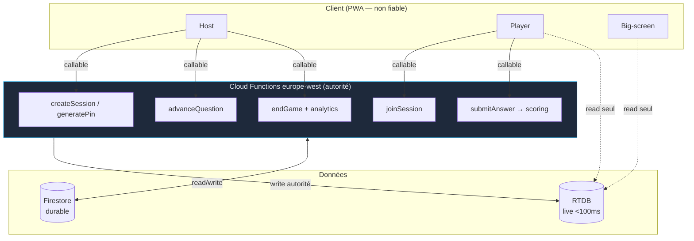

## 7. Code exemple — Backend

Cette section fournit du code réel et déployable pour les deux variantes : la cible **Firebase serverless** (recommandée) et l'**équivalent self-hosted NestJS + Socket.io** (variante V2). Le principe directeur est invariant : **le client ne calcule jamais le score officiel ni l'état faisant autorité**. Toute mutation sensible (allocation du PIN, scoring, avance des questions) passe par une frontière de confiance — Cloud Functions d'un côté, gateway authentifiée de l'autre.

### 7.1 Frontière de confiance et répartition des données



Règle d'or appliquée par les Security Rules : **les clients lisent RTDB, mais seules les Functions y écrivent** les nœuds sensibles (`scores`, `currentQuestion`, `phase`). Les joueurs ne peuvent écrire que leur propre présence et leur propre réponse *brute* (pas le score).

---

### 7.2 Firestore Security Rules

Firestore stocke le durable : comptes host, quiz/questions (avec la bonne réponse — **jamais exposée au player**), et résultats archivés. Les Rules empêchent un joueur de lire les réponses correctes et d'altérer les sessions.

```javascript
rules_version = '2';

service cloud.firestore {
  match /databases/{database}/documents {

    function isSignedIn() {
      return request.auth != null;
    }
    function isHost(hostId) {
      return isSignedIn() && request.auth.uid == hostId;
    }
    // Un host « vérifié » = compte Google, pas un invité anonyme.
    function isVerifiedHost() {
      return isSignedIn() && request.auth.token.firebase.sign_in_provider == 'google.com';
    }

    // --- Comptes host : chacun ne lit/écrit que son propre profil ---
    match /hosts/{hostId} {
      allow read, write: if isHost(hostId);
    }

    // --- Quiz : créés/édités par leur propriétaire host vérifié ---
    match /quizzes/{quizId} {
      allow read: if isSignedIn()
        && (resource.data.visibility == 'public' || isHost(resource.data.ownerId));

      allow create: if isVerifiedHost()
        && request.resource.data.ownerId == request.auth.uid
        && request.resource.data.title is string
        && request.resource.data.title.size() >= 1
        && request.resource.data.title.size() <= 120;

      allow update, delete: if isHost(resource.data.ownerId);

      // Questions : la bonne réponse vit ici et n'est JAMAIS lisible par un player.
      // Seul le host propriétaire lit/écrit. Le scoring se fait côté Functions (admin SDK,
      // qui contourne les Rules), donc les players n'ont aucun besoin de lecture ici.
      match /questions/{questionId} {
        allow read, write: if isHost(get(/databases/$(database)/documents/quizzes/$(quizId)).data.ownerId);
      }
    }

    // --- Sessions (méta durable, miroir du live RTDB) ---
    // Création/maj : Cloud Functions uniquement (admin SDK). Lecture : participants.
    match /sessions/{sessionId} {
      allow read: if isSignedIn();
      allow write: if false; // verrouillé : seules les Functions écrivent

      // Résultats archivés d'une partie terminée : lecture seule pour tous les signés.
      match /results/{playerId} {
        allow read: if isSignedIn();
        allow write: if false;
      }
    }

    // --- Analytics agrégées : lecture host propriétaire, écriture Functions ---
    match /analytics/{analyticsId} {
      allow read: if isHost(resource.data.ownerId);
      allow write: if false;
    }
  }
}
```

Points clés :
- `allow write: if false` sur `sessions` et `analytics` : **impossible** pour un client d'inventer une session ou de trafiquer une stat. C'est l'admin SDK des Functions qui écrit (il contourne les Rules).
- La sous-collection `questions` (qui contient `correctAnswer`) n'est lisible **que** par le host. Un player ne peut donc pas tricher en lisant la base.

---

### 7.3 Realtime Database Rules

RTDB porte l'état live. C'est ici que se joue la sécurité fine du gameplay : un player ne peut écrire **que** sa présence et sa réponse brute sous **sa propre** clé `uid` ; il ne peut **jamais** toucher `scores`, `phase`, ni `currentQuestionIndex`. La forme reprend le style validé du parc (mister-puzzle : `.write` conditionnel + `.validate` strict).

```json
{
  "rules": {
    "sessions": {
      "$sessionId": {
        ".read": "auth != null",

        "meta": {
          ".write": false,
          "pin":     { ".validate": "newData.isString() && newData.val().matches(/^[0-9]{6}$/)" },
          "hostUid": { ".validate": "newData.isString()" },
          "phase":   { ".validate": "newData.val().matches(/^(LOBBY|QUESTION_COUNTDOWN|QUESTION_ACTIVE|QUESTION_REVEAL|LEADERBOARD|PODIUM|ENDED)$/)" }
        },

        "currentQuestion": { ".write": false },

        "scores":          { ".write": false },

        "leaderboard":     { ".write": false },

        "players": {
          "$uid": {
            ".write": "auth != null && auth.uid == $uid",
            ".validate": "newData.hasChildren(['nickname', 'joinedAt'])",
            "nickname": {
              ".validate": "newData.isString() && newData.val().length >= 1 && newData.val().length <= 20"
            },
            "joinedAt":  { ".validate": "newData.isNumber()" },
            "lastSeen":  { ".validate": "newData.isNumber()" },
            "connected": { ".validate": "newData.isBoolean()" },
            "teamId":    { ".validate": "!newData.exists() || (newData.isString() && newData.val().length <= 40)" },
            "$other":    { ".validate": false }
          }
        },

        "answers": {
          "$questionId": {
            "$uid": {
              ".write": "auth != null && auth.uid == $uid && !data.exists()",
              ".validate": "newData.hasChildren(['choice', 'clientTs']) && root.child('sessions/' + $sessionId + '/currentQuestion/id').val() == $questionId && root.child('sessions/' + $sessionId + '/meta/phase').val() == 'QUESTION_ACTIVE'",
              "choice": {
                ".validate": "newData.isString() && newData.val().length <= 200"
              },
              "clientTs": { ".validate": "newData.isNumber()" },
              "$other":   { ".validate": false }
            }
          }
        }
      }
    }
  }
}
```

Ce que ces Rules garantissent :
- **`scores` / `leaderboard` / `currentQuestion` : `.write: false`** → un player ne peut jamais se donner de points ni avancer la partie. Seules les Functions (admin) écrivent.
- **`answers/$questionId/$uid` : `auth.uid == $uid && !data.exists()`** → un joueur ne répond que pour lui-même, **une seule fois** (anti double-soumission), et **uniquement** si la question est la question courante en phase `QUESTION_ACTIVE` (anti hors-temps / anti réponse anticipée).
- **Rejoindre un PIN inexistant est impossible** : on ne *rejoint* pas via RTDB. Le client appelle `joinSession` (callable) qui résout le PIN → `sessionId` côté serveur. S'il n'existe pas, la Function rejette ; le client n'a alors aucun chemin RTDB valide où écrire (il ne connaît pas de `$sessionId`).
- **`$other: { .validate: false }`** ferme la porte aux champs non prévus (un player ne peut pas injecter un faux `score` dans son nœud `players/$uid`).

---

### 7.4 Cloud Functions autoritaires (TypeScript)

Région `europe-west1`, Functions v2 (`onCall`), validation **zod v4**, Admin SDK. Le PIN, le scoring et l'avance des questions sont calculés exclusivement ici, en s'appuyant sur les **timestamps serveur** (jamais le `clientTs`, qui n'est qu'indicatif/anti-fraude).

#### Schémas zod et utilitaires partagés

```typescript
// functions/src/schemas.ts
import { z } from 'zod';

export const createSessionSchema = z.object({
  quizId: z.string().min(1).max(128),
  mode: z.enum(['live', 'async', 'team']).default('live'),
  streakEnabled: z.boolean().default(false),
});

export const joinSessionSchema = z.object({
  pin: z.string().regex(/^[0-9]{6}$/, 'PIN = 6 chiffres'),
  nickname: z.string().trim().min(1).max(20),
  teamId: z.string().max(40).optional(),
});

export const submitAnswerSchema = z.object({
  sessionId: z.string().min(1),
  questionId: z.string().min(1),
  choice: z.string().max(200),
});

export const advanceSchema = z.object({ sessionId: z.string().min(1) });

export type QuestionType = 'multiple' | 'boolean' | 'open' | 'poll';

export interface QuestionDoc {
  id: string;
  type: QuestionType;
  prompt: string;
  options: string[];
  correctAnswer: string | null; // null pour les sondages
  timeLimitMs: number;
  basePoints: number;
}
```

```typescript
// functions/src/scoring.ts
/**
 * Scoring type Kahoot — FAIT AUTORITÉ côté serveur.
 * - faux / hors-temps => 0
 * - juste => round(basePoints * (1 - 0.5 * (responseTimeMs / timeLimitMs)))
 *   borné dans [basePoints / 2, basePoints].
 * - sondage => 0 (pas de bonne réponse).
 */
export function computeScore(params: {
  type: 'multiple' | 'boolean' | 'open' | 'poll';
  correctAnswer: string | null;
  submitted: string;
  responseTimeMs: number;
  timeLimitMs: number;
  basePoints: number;
}): { correct: boolean; points: number } {
  const { type, correctAnswer, submitted, responseTimeMs, timeLimitMs, basePoints } = params;

  if (type === 'poll') return { correct: false, points: 0 };
  if (responseTimeMs < 0 || responseTimeMs > timeLimitMs) return { correct: false, points: 0 };

  const norm = (s: string) => s.trim().toLowerCase().normalize('NFKD').replace(/\p{Diacritic}/gu, '');
  const correct = correctAnswer != null && norm(submitted) === norm(correctAnswer);
  if (!correct) return { correct: false, points: 0 };

  const ratio = responseTimeMs / timeLimitMs; // [0, 1]
  const raw = basePoints * (1 - 0.5 * ratio);
  const points = Math.round(Math.max(basePoints / 2, Math.min(basePoints, raw)));
  return { correct: true, points };
}

/** Bonus de série : +10 % par bonne réponse consécutive, plafonné. */
export function applyStreakBonus(points: number, streak: number, enabled: boolean): number {
  if (!enabled || points === 0) return points;
  const factor = 1 + Math.min(streak, 5) * 0.1; // +10 % / réponse, cap +50 %
  return Math.round(points * factor);
}
```

#### `createSession` — allocation atomique du PIN

```typescript
// functions/src/sessions.ts
import { onCall, HttpsError } from 'firebase-functions/v2/https';
import { initializeApp } from 'firebase-admin/app';
import { getFirestore, FieldValue } from 'firebase-admin/firestore';
import { getDatabase } from 'firebase-admin/database';
import { createSessionSchema, joinSessionSchema } from './schemas';

initializeApp();
const fs = getFirestore();
const rtdb = getDatabase();

const REGION = 'europe-west1';

function gen6() {
  return String(Math.floor(100000 + Math.random() * 900000));
}

export const createSession = onCall({ region: REGION }, async (req) => {
  if (!req.auth) throw new HttpsError('unauthenticated', 'Connexion requise.');

  const parsed = createSessionSchema.safeParse(req.data);
  if (!parsed.success) {
    throw new HttpsError('invalid-argument', parsed.error.issues[0]?.message ?? 'Données invalides.');
  }
  const { quizId, mode, streakEnabled } = parsed.data;

  const quizSnap = await fs.doc(`quizzes/${quizId}`).get();
  if (!quizSnap.exists) throw new HttpsError('not-found', 'Quiz introuvable.');
  if (quizSnap.get('ownerId') !== req.auth.uid) {
    throw new HttpsError('permission-denied', "Vous n'êtes pas propriétaire de ce quiz.");
  }

  // Allocation atomique du PIN via un index /pins/{pin} -> sessionId.
  // On retente en cas de collision (probabilité ~nulle à faible charge).
  let pin = '';
  let sessionId = '';
  for (let attempt = 0; attempt < 5; attempt++) {
    pin = gen6();
    const sessionRef = fs.collection('sessions').doc();
    sessionId = sessionRef.id;
    try {
      await fs.runTransaction(async (tx) => {
        const pinRef = fs.doc(`pins/${pin}`);
        const existing = await tx.get(pinRef);
        if (existing.exists) throw new HttpsError('already-exists', 'collision');
        tx.set(pinRef, { sessionId, createdAt: FieldValue.serverTimestamp() });
        tx.set(sessionRef, {
          quizId, mode, streakEnabled,
          ownerId: req.auth!.uid,
          pin, phase: 'LOBBY',
          currentQuestionIndex: -1,
          createdAt: FieldValue.serverTimestamp(),
        });
      });
      break; // succès
    } catch (e) {
      if (attempt === 4) throw new HttpsError('resource-exhausted', "Impossible d'allouer un PIN, réessayez.");
      // sinon : collision, on reboucle avec un nouveau PIN
    }
  }

  // Miroir live minimal dans RTDB (lisible par les joueurs).
  await rtdb.ref(`sessions/${sessionId}/meta`).set({
    pin, hostUid: req.auth.uid, phase: 'LOBBY',
  });

  return { sessionId, pin };
});
```

#### `joinSession` — résolution du PIN (le seul point d'entrée joueur)

```typescript
export const joinSession = onCall({ region: REGION }, async (req) => {
  if (!req.auth) throw new HttpsError('unauthenticated', 'Connexion requise (invité anonyme accepté).');

  const parsed = joinSessionSchema.safeParse(req.data);
  if (!parsed.success) {
    throw new HttpsError('invalid-argument', parsed.error.issues[0]?.message ?? 'Données invalides.');
  }
  const { pin, nickname, teamId } = parsed.data;

  // Résolution serveur PIN -> sessionId. Rejoindre un PIN inexistant échoue ICI.
  const pinSnap = await fs.doc(`pins/${pin}`).get();
  if (!pinSnap.exists) throw new HttpsError('not-found', 'Aucune partie avec ce PIN.');
  const sessionId: string = pinSnap.get('sessionId');

  const sessionSnap = await fs.doc(`sessions/${sessionId}`).get();
  const phase = sessionSnap.get('phase');
  if (phase !== 'LOBBY') throw new HttpsError('failed-precondition', 'La partie a déjà commencé.');

  // Écriture autorité de la présence (l'Admin SDK contourne les Rules, mais on respecte la forme).
  await rtdb.ref(`sessions/${sessionId}/players/${req.auth.uid}`).set({
    nickname, joinedAt: Date.now(), connected: true,
    ...(teamId ? { teamId } : {}),
  });
  // Score initialisé à 0 — nœud INACCESSIBLE en écriture au client.
  await rtdb.ref(`sessions/${sessionId}/scores/${req.auth.uid}`).set({ total: 0, streak: 0 });

  return { sessionId };
});
```

#### `submitAnswer` — scoring sur timestamp serveur

```typescript
// functions/src/answers.ts
import { onCall, HttpsError } from 'firebase-functions/v2/https';
import { getFirestore } from 'firebase-admin/firestore';
import { getDatabase } from 'firebase-admin/database';
import { submitAnswerSchema, type QuestionDoc } from './schemas';
import { computeScore, applyStreakBonus } from './scoring';

const fs = getFirestore();
const rtdb = getDatabase();
const REGION = 'europe-west1';

export const submitAnswer = onCall({ region: REGION }, async (req) => {
  if (!req.auth) throw new HttpsError('unauthenticated', 'Connexion requise.');
  const uid = req.auth.uid;

  const parsed = submitAnswerSchema.safeParse(req.data);
  if (!parsed.success) {
    throw new HttpsError('invalid-argument', parsed.error.issues[0]?.message ?? 'Données invalides.');
  }
  const { sessionId, questionId, choice } = parsed.data;

  // 1) Lecture de l'état autoritaire : phase + horodatage serveur d'activation.
  const metaSnap = await rtdb.ref(`sessions/${sessionId}/currentQuestion`).get();
  const meta = metaSnap.val() as { id: string; activatedAt: number; timeLimitMs: number } | null;
  if (!meta || meta.id !== questionId) {
    throw new HttpsError('failed-precondition', "Cette question n'est plus active.");
  }
  const phaseSnap = await rtdb.ref(`sessions/${sessionId}/meta/phase`).get();
  if (phaseSnap.val() !== 'QUESTION_ACTIVE') {
    throw new HttpsError('failed-precondition', 'Hors de la fenêtre de réponse.');
  }

  // 2) Une seule réponse par joueur et par question (transaction RTDB).
  const lockRef = rtdb.ref(`sessions/${sessionId}/answers/${questionId}/${uid}`);
  const txn = await lockRef.transaction((cur) => (cur === null ? { choice, serverTs: Date.now() } : undefined));
  if (!txn.committed) throw new HttpsError('already-exists', 'Réponse déjà enregistrée.');

  // 3) responseTimeMs calculé SERVEUR (clientTs ignoré pour le score).
  const responseTimeMs = Date.now() - meta.activatedAt;

  // 4) Définition de la question (avec bonne réponse) — jamais exposée au client.
  const qSnap = await fs.doc(`quizzes/${(await fs.doc(`sessions/${sessionId}`).get()).get('quizId')}/questions/${questionId}`).get();
  if (!qSnap.exists) throw new HttpsError('not-found', 'Question introuvable.');
  const q = qSnap.data() as QuestionDoc;

  // 5) Scoring autoritaire.
  const { correct, points } = computeScore({
    type: q.type, correctAnswer: q.correctAnswer, submitted: choice,
    responseTimeMs, timeLimitMs: q.timeLimitMs, basePoints: q.basePoints,
  });

  // 6) Mise à jour atomique du score + streak (transaction).
  const sessionSnap = await fs.doc(`sessions/${sessionId}`).get();
  const streakEnabled = sessionSnap.get('streakEnabled') === true;
  const scoreRef = rtdb.ref(`sessions/${sessionId}/scores/${uid}`);
  await scoreRef.transaction((cur) => {
    const prev = (cur as { total: number; streak: number } | null) ?? { total: 0, streak: 0 };
    const streak = correct ? prev.streak + 1 : 0;
    const gained = applyStreakBonus(points, streak - 1, streakEnabled);
    return { total: prev.total + gained, streak };
  });

  // Le client reçoit juste un accusé ; le détail (correct/points) est révélé en phase REVEAL.
  return { received: true };
});
```

#### `advanceQuestion` — machine à états (host uniquement)

```typescript
// functions/src/flow.ts
import { onCall, HttpsError } from 'firebase-functions/v2/https';
import { getFirestore } from 'firebase-admin/firestore';
import { getDatabase, ServerValue } from 'firebase-admin/database';
import { advanceSchema, type QuestionDoc } from './schemas';

const fs = getFirestore();
const rtdb = getDatabase();
const REGION = 'europe-west1';

export const advanceQuestion = onCall({ region: REGION }, async (req) => {
  if (!req.auth) throw new HttpsError('unauthenticated', 'Connexion requise.');

  const parsed = advanceSchema.safeParse(req.data);
  if (!parsed.success) throw new HttpsError('invalid-argument', 'sessionId requis.');
  const { sessionId } = parsed.data;

  const sessionRef = fs.doc(`sessions/${sessionId}`);
  const sessionSnap = await sessionRef.get();
  if (!sessionSnap.exists) throw new HttpsError('not-found', 'Session introuvable.');
  if (sessionSnap.get('ownerId') !== req.auth.uid) {
    throw new HttpsError('permission-denied', 'Seul le host peut avancer la partie.');
  }

  const nextIndex = (sessionSnap.get('currentQuestionIndex') ?? -1) + 1;
  const questions = await fs.collection(`quizzes/${sessionSnap.get('quizId')}/questions`)
    .orderBy('order').get();

  // Fin du quiz -> PODIUM (endGame sera déclenché ensuite).
  if (nextIndex >= questions.size) {
    await rtdb.ref(`sessions/${sessionId}/meta/phase`).set('PODIUM');
    await sessionRef.update({ phase: 'PODIUM' });
    return { phase: 'PODIUM' };
  }

  const qDoc = questions.docs[nextIndex];
  const q = { id: qDoc.id, ...(qDoc.data() as Omit<QuestionDoc, 'id'>) };

  await sessionRef.update({ currentQuestionIndex: nextIndex, phase: 'QUESTION_ACTIVE' });

  // Vue publique de la question : on RETIRE correctAnswer avant de publier dans RTDB.
  await rtdb.ref(`sessions/${sessionId}/currentQuestion`).set({
    id: q.id, type: q.type, prompt: q.prompt, options: q.options,
    timeLimitMs: q.timeLimitMs,
    activatedAt: ServerValue.TIMESTAMP, // horodatage serveur = base du scoring
  });
  await rtdb.ref(`sessions/${sessionId}/meta/phase`).set('QUESTION_ACTIVE');

  return { phase: 'QUESTION_ACTIVE', questionId: q.id, index: nextIndex };
});
```

#### `endGame` — clôture + agrégation analytics

```typescript
// functions/src/endgame.ts
import { onCall, HttpsError } from 'firebase-functions/v2/https';
import { getFirestore, FieldValue } from 'firebase-admin/firestore';
import { getDatabase } from 'firebase-admin/database';
import { advanceSchema } from './schemas';

const fs = getFirestore();
const rtdb = getDatabase();
const REGION = 'europe-west1';

export const endGame = onCall({ region: REGION }, async (req) => {
  if (!req.auth) throw new HttpsError('unauthenticated', 'Connexion requise.');
  const parsed = advanceSchema.safeParse(req.data);
  if (!parsed.success) throw new HttpsError('invalid-argument', 'sessionId requis.');
  const { sessionId } = parsed.data;

  const sessionRef = fs.doc(`sessions/${sessionId}`);
  const sessionSnap = await sessionRef.get();
  if (!sessionSnap.exists) throw new HttpsError('not-found', 'Session introuvable.');
  if (sessionSnap.get('ownerId') !== req.auth.uid) {
    throw new HttpsError('permission-denied', 'Seul le host peut clôturer la partie.');
  }

  // Snapshot des scores live + players depuis RTDB.
  const [scoresSnap, playersSnap] = await Promise.all([
    rtdb.ref(`sessions/${sessionId}/scores`).get(),
    rtdb.ref(`sessions/${sessionId}/players`).get(),
  ]);
  const scores = (scoresSnap.val() ?? {}) as Record<string, { total: number; streak: number }>;
  const players = (playersSnap.val() ?? {}) as Record<string, { nickname: string }>;

  // Persistance durable des résultats (batch Firestore).
  const batch = fs.batch();
  const ranking = Object.entries(scores)
    .map(([uid, s]) => ({ uid, nickname: players[uid]?.nickname ?? '—', total: s.total }))
    .sort((a, b) => b.total - a.total);

  ranking.forEach((r, i) => {
    batch.set(sessionRef.collection('results').doc(r.uid), { ...r, rank: i + 1 });
  });

  // Agrégation analytics pour le host.
  batch.set(fs.collection('analytics').doc(sessionId), {
    ownerId: sessionSnap.get('ownerId'),
    quizId: sessionSnap.get('quizId'),
    playerCount: ranking.length,
    topScore: ranking[0]?.total ?? 0,
    avgScore: ranking.length ? Math.round(ranking.reduce((a, r) => a + r.total, 0) / ranking.length) : 0,
    endedAt: FieldValue.serverTimestamp(),
  });

  batch.update(sessionRef, { phase: 'ENDED', endedAt: FieldValue.serverTimestamp() });
  await batch.commit();

  await rtdb.ref(`sessions/${sessionId}/meta/phase`).set('ENDED');
  // Libération du PIN pour réutilisation.
  await fs.doc(`pins/${sessionSnap.get('pin')}`).delete();

  return { phase: 'ENDED', ranking };
});
```

---

### 7.5 Équivalent self-hosted (V2) — gateway NestJS + Socket.io

La variante V2 reprend **exactement la même logique d'autorité**, transposée sur la stack de la brief (NestJS + Socket.io + PostgreSQL + Redis). Mêmes garanties : timestamp serveur pour le scoring, validation zod, état faisant autorité côté serveur. La logique de scoring (`computeScore`, `applyStreakBonus`) est **partagée à l'identique** avec les Functions — c'est le même fichier `scoring.ts`.

Redis joue le rôle de RTDB (état live + adaptateur pub/sub pour le fan-out multi-instances vers 1000+ joueurs) ; PostgreSQL remplace Firestore (durable).

```typescript
// gateway/src/game.gateway.ts
import {
  WebSocketGateway, WebSocketServer, SubscribeMessage,
  ConnectedSocket, MessageBody, OnGatewayConnection,
} from '@nestjs/websockets';
import { Server, Socket } from 'socket.io';
import { Logger } from '@nestjs/common';
import { z } from 'zod';
import { computeScore, applyStreakBonus } from '../shared/scoring'; // MÊME fichier que les Functions
import { GameStore } from './game.store'; // façade Redis + Postgres

const joinSchema = z.object({
  pin: z.string().regex(/^[0-9]{6}$/),
  nickname: z.string().trim().min(1).max(20),
  teamId: z.string().max(40).optional(),
});
const answerSchema = z.object({ questionId: z.string().min(1), choice: z.string().max(200) });

@WebSocketGateway({ cors: { origin: process.env.CORS_ORIGINS?.split(',') ?? true } })
export class GameGateway implements OnGatewayConnection {
  @WebSocketServer() server!: Server;
  private readonly log = new Logger(GameGateway.name);

  constructor(private readonly store: GameStore) {}

  async handleConnection(socket: Socket) {
    // Auth : JWT vérifié au handshake (équivalent Firebase Auth).
    const uid = await this.store.verifyToken(socket.handshake.auth?.token);
    if (!uid) { socket.disconnect(true); return; }
    socket.data.uid = uid;
  }

  @SubscribeMessage('join')
  async onJoin(@ConnectedSocket() socket: Socket, @MessageBody() body: unknown) {
    const parsed = joinSchema.safeParse(body);
    if (!parsed.success) return { error: parsed.error.issues[0]?.message ?? 'invalid' };

    // Résolution PIN -> sessionId côté serveur. PIN inexistant => rejet (comme joinSession).
    const sessionId = await this.store.resolvePin(parsed.data.pin);
    if (!sessionId) return { error: 'Aucune partie avec ce PIN.' };
    if ((await this.store.getPhase(sessionId)) !== 'LOBBY') return { error: 'Partie déjà commencée.' };

    const uid = socket.data.uid as string;
    await this.store.addPlayer(sessionId, uid, parsed.data.nickname, parsed.data.teamId);
    await this.store.initScore(sessionId, uid); // score=0, INACCESSIBLE en écriture au client
    socket.join(sessionId);
    this.server.to(sessionId).emit('lobby:update', await this.store.listPlayers(sessionId));
    return { sessionId };
  }

  @SubscribeMessage('answer')
  async onAnswer(@ConnectedSocket() socket: Socket, @MessageBody() body: unknown) {
    const parsed = answerSchema.safeParse(body);
    if (!parsed.success) return { error: 'invalid' };
    const uid = socket.data.uid as string;
    const sessionId = [...socket.rooms].find((r) => r !== socket.id);
    if (!sessionId) return { error: 'Pas dans une partie.' };

    const cur = await this.store.getCurrentQuestion(sessionId); // { id, activatedAt, timeLimitMs }
    if (!cur || cur.id !== parsed.data.questionId) return { error: 'Question inactive.' };
    if ((await this.store.getPhase(sessionId)) !== 'QUESTION_ACTIVE') return { error: 'Hors fenêtre.' };

    // Verrou Redis SETNX : une seule réponse par (question, uid).
    const first = await this.store.lockAnswer(sessionId, cur.id, uid);
    if (!first) return { error: 'Réponse déjà enregistrée.' };

    const responseTimeMs = Date.now() - cur.activatedAt; // timestamp SERVEUR
    const q = await this.store.getQuestionWithAnswer(sessionId, cur.id); // bonne réponse jamais émise au client
    const { correct, points } = computeScore({
      type: q.type, correctAnswer: q.correctAnswer, submitted: parsed.data.choice,
      responseTimeMs, timeLimitMs: q.timeLimitMs, basePoints: q.basePoints,
    });
    const streak = await this.store.bumpStreak(sessionId, uid, correct);
    const gained = applyStreakBonus(points, streak - 1, await this.store.streakEnabled(sessionId));
    await this.store.addScore(sessionId, uid, gained);
    return { received: true };
  }

  @SubscribeMessage('next')
  async onNext(@ConnectedSocket() socket: Socket) {
    const uid = socket.data.uid as string;
    const sessionId = [...socket.rooms].find((r) => r !== socket.id);
    if (!sessionId) return { error: 'Pas dans une partie.' };
    if (!(await this.store.isHost(sessionId, uid))) return { error: 'Réservé au host.' };

    const next = await this.store.advance(sessionId); // incrémente l'index, fixe activatedAt serveur
    if (!next) {
      await this.store.setPhase(sessionId, 'PODIUM');
      this.server.to(sessionId).emit('phase', { phase: 'PODIUM' });
      return { phase: 'PODIUM' };
    }
    // On émet la vue PUBLIQUE (sans correctAnswer).
    this.server.to(sessionId).emit('question', {
      id: next.id, type: next.type, prompt: next.prompt,
      options: next.options, timeLimitMs: next.timeLimitMs,
    });
    return { phase: 'QUESTION_ACTIVE', questionId: next.id };
  }
}
```

**Correspondance des deux variantes :**

| Préoccupation | Firebase (cible) | Self-hosted (V2) |
|---|---|---|
| Auth | Firebase Auth (anon + Google) | JWT vérifié au handshake |
| État live | RTDB + `onDisconnect` | Redis + adaptateur pub/sub |
| Durable | Firestore | PostgreSQL |
| Autorité | Cloud Functions `onCall` | Handlers `@SubscribeMessage` |
| Anti double-réponse | transaction RTDB `!data.exists()` | Redis `SETNX` |
| Base du scoring | `activatedAt` serveur (RTDB) | `activatedAt` serveur (Redis) |
| Validation | zod v4 + Security Rules | zod v4 + checks gateway |

Dans les deux cas, **la bonne réponse ne quitte jamais le serveur** avant la phase `QUESTION_REVEAL`, le `responseTimeMs` est toujours calculé à partir d'un horodatage serveur, et le client ne possède aucun chemin d'écriture vers `scores`.
```
