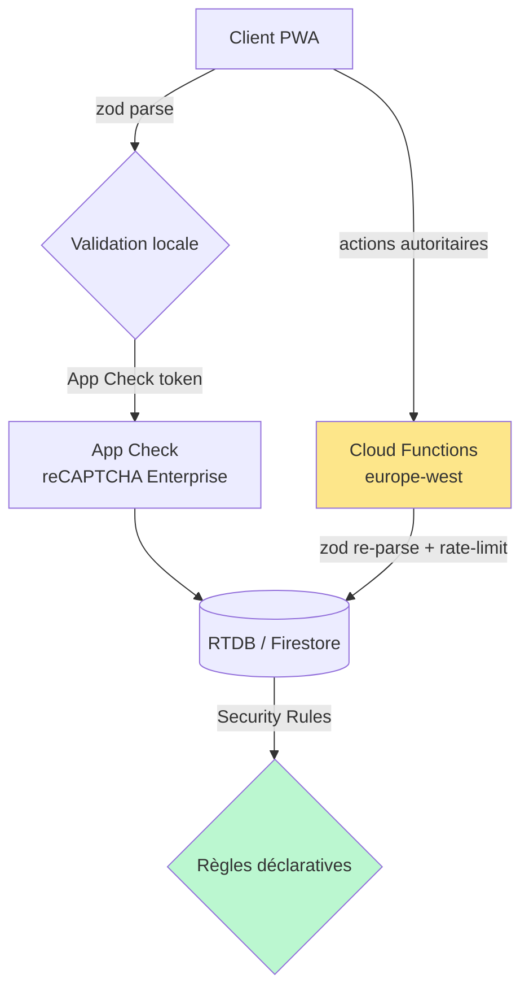
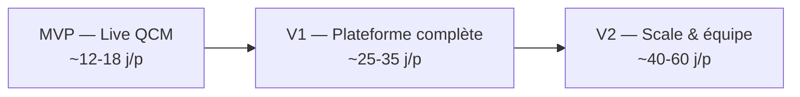

## 8. Déploiement, sécurité, analytics & feuille de route

Cette section opérationnalise mister-qowa : comment passer du dépôt local à `https://mister-guiiug.github.io/mister-qowa/` avec un backend Firebase qui fait autorité, comment durcir la sécurité d'un jeu temps réel ouvert au public (PIN à 6 chiffres, 1000+ joueurs), comment exploiter les résultats (analytics + export CSV) et selon quelle trajectoire produit (MVP → V1 → V2).

### 8.1 Guide de déploiement

#### 8.1.1 Vue d'ensemble du pipeline

Le frontend (PWA) et le backend (Firebase serverless) ont **deux cycles de déploiement distincts** : le client part sur GitHub Pages via les workflows réutilisables du parc, les Rules/Functions partent sur Firebase via `firebase deploy`. Les deux sont déclenchés par le même push sur `main`, dans un seul workflow `deploy.yml`.

```mermaid
flowchart LR
  Dev[push main] --> CI[pwa-ci.yml@v1<br/>lint + test + build dummy]
  Dev --> DEP[deploy.yml]
  subgraph deploy.yml
    A[setup-pwa@v1] --> B[build client<br/>VITE_FIREBASE_* secrets]
    B --> C[upload-pages-artifact]
    A --> D[firebase deploy<br/>--only database,firestore,functions,storage]
  end
  C --> Pages[(GitHub Pages<br/>/mister-qowa/)]
  D --> FB[(Firebase<br/>RTDB + Firestore + Functions + Storage)]
```

#### 8.1.2 Setup du projet Firebase (une seule fois)

```bash
# 1. Créer le projet (région europe-west pour les Functions + RGPD)
firebase projects:create mister-qowa --display-name "Mister Qowa"

# 2. Activer les produits depuis la console (ou gcloud) :
#    - Firestore (mode production, multi-région eur3)
#    - Realtime Database (région europe-west1)
#    - Authentication : providers "Anonymous" + "Google"
#    - Cloud Functions (Blaze obligatoire — pay-as-you-go)
#    - Storage (médias des questions)
#    - App Check (provider reCAPTCHA Enterprise pour le web)

# 3. Lier le dépôt local
firebase use --add        # alias "prod" -> mister-qowa

# 4. Récupérer la config web (à reporter dans .env)
firebase apps:sdkconfig WEB
```

Le `firebase.json` déclare les cinq cibles. On s'aligne sur la convention mister-puzzle (RTDB + Hosting), en ajoutant Firestore, Functions et Storage :

```json
{
  "database": { "rules": "rules/database.rules.json" },
  "firestore": { "rules": "rules/firestore.rules", "indexes": "rules/firestore.indexes.json" },
  "storage": { "rules": "rules/storage.rules" },
  "functions": { "source": "functions", "runtime": "nodejs22" },
  "hosting": {
    "public": "dist",
    "ignore": ["firebase.json", "**/.*", "**/node_modules/**"],
    "rewrites": [{ "source": "**", "destination": "/index.html" }]
  }
}
```

> Note parc : `hosting` reste documenté comme **alternative** ; la cible de production est GitHub Pages (`base: "/mister-qowa/"`, HashRouter). On garde le bloc `hosting` pour les déploiements de preview rapides (`firebase hosting:channel:deploy pr-123`).

#### 8.1.3 Variables d'environnement

Identiques au parc (`VITE_FIREBASE_*`), avec l'ajout de `VITE_FIREBASE_DATABASE_URL` (RTDB) et de la clé publique App Check. Fichier `.env.example` versionné :

```bash
# Firebase (config WEB publique — non secrète au sens cryptographique,
# mais protégée par Security Rules + App Check, jamais commitée en clair)
VITE_FIREBASE_API_KEY=your-api-key
VITE_FIREBASE_AUTH_DOMAIN=mister-qowa.firebaseapp.com
VITE_FIREBASE_DATABASE_URL=https://mister-qowa-default-rtdb.europe-west1.firebasedatabase.app
VITE_FIREBASE_PROJECT_ID=mister-qowa
VITE_FIREBASE_STORAGE_BUCKET=mister-qowa.appspot.com
VITE_FIREBASE_MESSAGING_SENDER_ID=000000000000
VITE_FIREBASE_APP_ID=1:000000000000:web:xxxxxxxxxxxx

# App Check (clé site reCAPTCHA Enterprise, publique)
VITE_APPCHECK_SITE_KEY=6Lxxxxxxxxxxxxxxxxxx

# Build
VITE_BASE_PATH=/mister-qowa/
```

La validation de ces variables au démarrage reprend le garde-fou de mister-puzzle (`src/config/firebaseEnv.ts`) : un échec explicite vaut mieux qu'un `initializeApp` opaque.

```ts
// src/config/firebaseEnv.ts
const KEYS = [
  'VITE_FIREBASE_API_KEY',
  'VITE_FIREBASE_AUTH_DOMAIN',
  'VITE_FIREBASE_DATABASE_URL',
  'VITE_FIREBASE_PROJECT_ID',
  'VITE_FIREBASE_STORAGE_BUCKET',
  'VITE_FIREBASE_MESSAGING_SENDER_ID',
  'VITE_FIREBASE_APP_ID',
] as const;

export function getFirebaseWebConfig() {
  const missing = KEYS.filter(k => !import.meta.env[k]?.trim());
  if (missing.length > 0) {
    throw new Error(
      `Configuration Firebase incomplète : définissez ${missing.join(', ')} (voir .env.example).`
    );
  }
  return {
    apiKey: import.meta.env.VITE_FIREBASE_API_KEY,
    authDomain: import.meta.env.VITE_FIREBASE_AUTH_DOMAIN,
    databaseURL: import.meta.env.VITE_FIREBASE_DATABASE_URL,
    projectId: import.meta.env.VITE_FIREBASE_PROJECT_ID,
    storageBucket: import.meta.env.VITE_FIREBASE_STORAGE_BUCKET,
    messagingSenderId: import.meta.env.VITE_FIREBASE_MESSAGING_SENDER_ID,
    appId: import.meta.env.VITE_FIREBASE_APP_ID,
  };
}
```

#### 8.1.4 Secrets GitHub Actions

Tous les `VITE_FIREBASE_*` + le token de déploiement Firebase sont des **secrets du dépôt** (`gh secret set`) :

```bash
for k in API_KEY AUTH_DOMAIN DATABASE_URL PROJECT_ID STORAGE_BUCKET MESSAGING_SENDER_ID APP_ID; do
  gh secret set "VITE_FIREBASE_$k" --repo mister-guiiug/mister-qowa
done
gh secret set VITE_APPCHECK_SITE_KEY --repo mister-guiiug/mister-qowa

# Déploiement des Functions/Rules en CI : compte de service dédié (recommandé)
# GOOGLE_APPLICATION_CREDENTIALS via secret JSON, plus robuste que firebase login:ci (déprécié)
gh secret set FIREBASE_SERVICE_ACCOUNT --repo mister-guiiug/mister-qowa < service-account.json
```

#### 8.1.5 CI — workflow réutilisable du parc

La CI (PR + push) est **déléguée** au reusable workflow `pwa-ci.yml@v1` de `dev-pwa-config`. Le build client exige des `VITE_FIREBASE_*` : on injecte des valeurs **factices** via `build-env` (le client ne contacte jamais Firebase au build), et on type-check le dossier `functions/` via `server-dir`.

```yaml
# .github/workflows/ci.yml
name: CI
on:
  pull_request: { branches: [main] }
  push: { branches: [main] }
  workflow_dispatch:
concurrency:
  group: ${{ github.workflow }}-${{ github.ref }}
  cancel-in-progress: true
permissions:
  contents: read
  packages: read   # lecture de @mister-guiiug/dev-pwa-config sur GitHub Packages
jobs:
  ci:
    uses: mister-guiiug/dev-pwa-config/.github/workflows/pwa-ci.yml@v1
    secrets: inherit
    with:
      server-dir: functions
      build-env: |
        VITE_FIREBASE_API_KEY=ci-dummy-key
        VITE_FIREBASE_AUTH_DOMAIN=dummy.firebaseapp.com
        VITE_FIREBASE_DATABASE_URL=https://dummy.firebaseio.com
        VITE_FIREBASE_PROJECT_ID=dummy-ci
        VITE_FIREBASE_STORAGE_BUCKET=dummy.appspot.com
        VITE_FIREBASE_MESSAGING_SENDER_ID=000000000000
        VITE_FIREBASE_APP_ID=1:000000000000:web:0000000000000000000000
        VITE_APPCHECK_SITE_KEY=ci-dummy-site-key
```

> Rappel parc : la CI exécute `prettier --check`. Toujours lancer `npx prettier --write .` avant de committer, sinon la CI échoue.

#### 8.1.6 Deploy — client GitHub Pages + Functions/Rules Firebase

On reprend le pattern `deploy.yml` custom de mister-puzzle (composite action `setup-pwa@v1` pour le boilerplate Node/install), en ajoutant l'étape `firebase deploy` étendue aux quatre cibles serveur.

```yaml
# .github/workflows/deploy.yml
name: Build & Deploy Mister Qowa
on:
  push: { branches: [main] }
  workflow_dispatch:
permissions:
  contents: read
  pages: write
  id-token: write
  packages: read
concurrency:
  group: pages
  cancel-in-progress: true
jobs:
  build:
    runs-on: ubuntu-latest
    steps:
      - uses: actions/checkout@v5
      - uses: mister-guiiug/dev-pwa-config/.github/actions/setup-pwa@v1
        with:
          github-token: ${{ secrets.GITHUB_TOKEN }}

      - name: Lint & tests (client)
        run: npm run lint && npm run test

      - name: Build client
        env:
          VITE_PUBLIC_SITE_ORIGIN: https://${{ github.repository_owner }}.github.io
          VITE_FIREBASE_API_KEY: ${{ secrets.VITE_FIREBASE_API_KEY }}
          VITE_FIREBASE_AUTH_DOMAIN: ${{ secrets.VITE_FIREBASE_AUTH_DOMAIN }}
          VITE_FIREBASE_DATABASE_URL: ${{ secrets.VITE_FIREBASE_DATABASE_URL }}
          VITE_FIREBASE_PROJECT_ID: ${{ secrets.VITE_FIREBASE_PROJECT_ID }}
          VITE_FIREBASE_STORAGE_BUCKET: ${{ secrets.VITE_FIREBASE_STORAGE_BUCKET }}
          VITE_FIREBASE_MESSAGING_SENDER_ID: ${{ secrets.VITE_FIREBASE_MESSAGING_SENDER_ID }}
          VITE_FIREBASE_APP_ID: ${{ secrets.VITE_FIREBASE_APP_ID }}
          VITE_APPCHECK_SITE_KEY: ${{ secrets.VITE_APPCHECK_SITE_KEY }}
        run: npm run build

      - name: Build & type-check Functions
        run: cd functions && npm ci && npm run build

      - name: Deploy Firebase (Rules + Functions)
        uses: w9jds/firebase-action@master
        with:
          args: deploy --only database,firestore,storage,functions --project ${{ secrets.VITE_FIREBASE_PROJECT_ID }}
        env:
          GCP_SA_KEY: ${{ secrets.FIREBASE_SERVICE_ACCOUNT }}

      - uses: actions/upload-pages-artifact@v3
        with: { path: dist }

  deploy:
    needs: build
    runs-on: ubuntu-latest
    environment:
      name: github-pages
      url: ${{ steps.deployment.outputs.page_url }}
    steps:
      - uses: actions/deploy-pages@v4
        id: deployment
```

#### 8.1.7 Première mise en ligne (checklist)

```bash
gh repo create mister-guiiug/mister-qowa --public --source=. --remote=origin --push
gh api -X POST repos/mister-guiiug/mister-qowa/pages -f build_type=workflow   # active Pages
# Renseigner les secrets (§8.1.4), puis re-déclencher le workflow Deploy.
# Site : https://mister-guiiug.github.io/mister-qowa/
```

Déploiement manuel des Functions/Rules en local (hors CI) :

```bash
export NODE_AUTH_TOKEN="$(gh auth token)"   # lecture du package dev-pwa-config
firebase deploy --only functions,database,firestore,storage --project prod
```

---

### 8.2 Sécurité

Le modèle de menace d'un quiz live public est spécifique : PIN devinables, joueurs qui forgent leur score, bots de spam dans le lobby, scraping de la banque de questions, et données personnelles (pseudos). La défense est **en couches**, et la règle d'or du brief tient : *le client ne calcule jamais le score officiel*.



#### 8.2.1 Validation zod systématique (frontière de confiance double)

Les schémas zod v4 sont **partagés** entre client (`src/schemas/`) et Functions (`functions/src/schemas/`). Toute entrée est `parse`-ée côté client (UX : feedback immédiat) **et re-validée côté Function** (sécurité : le client est hostile). On ne fait jamais confiance au premier parse.

```ts
// schemas/answer.ts — partagé client + functions
import { z } from 'zod';

export const submitAnswerSchema = z.object({
  gamePin: z.string().regex(/^\d{6}$/),
  questionId: z.string().uuid(),
  // index d'option OU texte libre normalisé selon le type de question
  choice: z.union([z.number().int().min(0).max(3), z.string().trim().max(120)]),
  clientSentAtMs: z.number().int().positive(),
});
export type SubmitAnswer = z.infer<typeof submitAnswerSchema>;
```

```ts
// functions/src/submitAnswer.ts — le score est calculé ICI, jamais reçu du client
export const submitAnswer = onCall(
  { region: 'europe-west1', enforceAppCheck: true },
  async (req) => {
    const data = submitAnswerSchema.parse(req.data); // rejette tout payload forgé
    const uid = req.auth?.uid;
    if (!uid) throw new HttpsError('unauthenticated', 'Auth requise');

    // Le temps de réponse est mesuré côté SERVEUR (le client ne fournit pas responseTimeMs)
    const q = await getActiveQuestion(data.gamePin, data.questionId);
    const serverNow = Date.now();
    const responseTimeMs = Math.max(0, serverNow - q.activatedAtMs);
    if (responseTimeMs > q.timeLimitMs) return { awarded: 0 }; // hors-temps

    const correct = isCorrect(q, data.choice);
    const awarded = correct
      ? Math.round(q.basePoints * (1 - 0.5 * (responseTimeMs / q.timeLimitMs)))
      : 0;
    await commitScore(data.gamePin, uid, awarded); // transaction RTDB
    return { awarded };
  }
);
```

Points clés : `responseTimeMs` est **toujours dérivé de l'horloge serveur** (`q.activatedAtMs`), jamais du `clientSentAtMs` — sinon n'importe quel joueur déclarerait 0 ms et empocherait le score maximum.

#### 8.2.2 Security Rules

Les Rules sont la deuxième barrière. Principe : **le client n'écrit jamais directement les scores ni l'état de partie** ; ces chemins sont en lecture seule pour les joueurs et en écriture exclusive pour les Functions (via Admin SDK, qui bypasse les Rules). Le client n'écrit que sa présence et son intention de réponse.

```jsonc
// rules/database.rules.json (RTDB — état live)
{
  "rules": {
    "games": {
      "$pin": {
        ".read": "auth != null",
        "state":       { ".write": false },           // Functions uniquement
        "currentQuestion": { ".write": false },
        "leaderboard": { ".write": false },            // scores : Functions uniquement
        "presence": {
          "$uid": {
            // un joueur n'écrit QUE sa propre présence
            ".write": "auth != null && auth.uid === $uid",
            ".validate": "newData.child('pseudo').isString() && newData.child('pseudo').val().length <= 24 && newData.child('lastSeen').isNumber()"
          }
        },
        "answers": {
          "$uid": {
            // un joueur écrit son intention de réponse, jamais celle d'un autre, jamais après révélation
            ".write": "auth != null && auth.uid === $uid && data.parent().parent().child('state').val() === 'QUESTION_ACTIVE'",
            ".validate": "newData.hasChildren(['questionId'])"
          }
        }
      }
    }
  }
}
```

```js
// rules/firestore.rules (Firestore — données durables)
rules_version = '2';
service cloud.firestore {
  match /databases/{db}/documents {
    // Un host ne lit/écrit QUE ses propres quiz
    match /quizzes/{quizId} {
      allow read: if resource.data.isPublic == true
                  || request.auth.uid == resource.data.ownerUid;
      allow create: if request.auth.uid == request.resource.data.ownerUid;
      allow update, delete: if request.auth.uid == resource.data.ownerUid;
    }
    // Résultats de parties : écriture serveur uniquement, lecture par le host
    match /results/{resultId} {
      allow read: if request.auth.uid == resource.data.hostUid;
      allow write: if false; // Admin SDK (Functions) seulement
    }
  }
}
```

```js
// rules/storage.rules — médias des questions, taille + type bornés
match /media/{ownerUid}/{file} {
  allow read: if true;
  allow write: if request.auth.uid == ownerUid
               && request.resource.size < 5 * 1024 * 1024
               && request.resource.contentType.matches('image/.*|video/mp4');
}
```

#### 8.2.3 App Check & rate-limiting

- **App Check** (`enforceAppCheck: true` sur chaque Function + activation sur RTDB/Firestore/Storage) garantit que les requêtes proviennent de l'app légitime, pas d'un script `curl`. Provider : reCAPTCHA Enterprise pour le web. C'est la mesure la plus rentable contre les bots de masse.
- **Limites de concurrence des Functions** : `maxInstances` borne le coût en cas de pic ou d'attaque (`onCall(..., { maxInstances: 100, concurrency: 80 })`).
- **Rate-limiting applicatif** : un compteur par `uid` dans RTDB avec fenêtre glissante, vérifié en tête de Function. Au-delà de N appels/seconde → `HttpsError('resource-exhausted')`.

```ts
async function assertRate(uid: string, key: string, maxPerWindow = 10, windowMs = 1000) {
  const ref = rtdb.ref(`rate/${uid}/${key}`);
  const { committed, snapshot } = await ref.transaction((c) => {
    const now = Date.now();
    if (!c || now - c.start > windowMs) return { start: now, n: 1 };
    if (c.n >= maxPerWindow) return; // abort -> committed=false
    return { start: c.start, n: c.n + 1 };
  });
  if (!committed) throw new HttpsError('resource-exhausted', 'Trop de requêtes');
  void snapshot;
}
```

#### 8.2.4 Anti-brute-force du PIN

Un PIN à 6 chiffres = 10⁶ combinaisons : devinable par énumération. Défenses cumulées :

1. **PIN alloués par Function**, jamais générés côté client, depuis l'espace des **PIN non séquentiels et non réutilisés** d'une partie active (collision rejetée par transaction).
2. **Cycle de vie court** : le PIN n'existe que pendant la partie (`LOBBY → ENDED`), puis est libéré. La fenêtre d'attaque est réduite à la durée de session.
3. **Rate-limiting du `joinGame`** par `uid` *et* par IP (via App Check / contexte Function) : ex. 5 tentatives ratées / 10 s → backoff exponentiel, puis blocage temporaire.
4. **Lobby verrouillable** : une fois la partie démarrée (`state !== 'LOBBY'`), `joinGame` refuse tout nouveau PIN valide deviné a posteriori.

```ts
export const joinGame = onCall({ region: 'europe-west1', enforceAppCheck: true },
  async (req) => {
    const { gamePin, pseudo } = joinSchema.parse(req.data);
    const uid = req.auth?.uid ?? (() => { throw new HttpsError('unauthenticated', ''); })();
    await assertRate(uid, 'join', 5, 10_000); // anti-brute-force
    const game = await getGameByPin(gamePin);
    if (!game || game.state !== 'LOBBY') {
      throw new HttpsError('not-found', 'Partie introuvable ou déjà démarrée');
    }
    await addPlayer(gamePin, uid, sanitizePseudo(pseudo));
    return { ok: true };
  });
```

#### 8.2.5 RGPD — pseudos invités

- **Minimisation** : Auth anonyme pour les joueurs ; aucune donnée perso requise pour jouer. Le pseudo est libre et **filtré** (longueur ≤ 24, anti-injection, liste de mots interdits) — on documente qu'il ne doit pas contenir d'identité réelle.
- **Durée de conservation** : l'état live (RTDB) est **éphémère** — la branche `games/$pin` est supprimée à `ENDED` (ou via TTL / Function planifiée). Seuls les **résultats agrégés** (scores, stats par question) sont conservés en Firestore, rattachés au pseudo, pas à une identité.
- **Droit à l'effacement** : une Function `deleteGameData(pin)` (réservée au host) purge RTDB + documents `results` liés. Les comptes host Google relèvent de la politique Auth standard (suppression du compte → suppression des quiz via Function `onUserDeleted`).
- **Localisation** : projet et Functions en **europe-west** (données dans l'UE). Cookie/consentement uniquement si Google Analytics est activé (bandeau côté PWA, GA chargé à l'opt-in).

---

### 8.3 Analytics

Trois niveaux de lecture, alimentés à la fin de chaque partie par une Function `finalizeGame` qui écrit un document `results/{gameId}` en Firestore (durable, requêtable).

| Niveau | Données | Source |
|---|---|---|
| **Par joueur** | rang, score total, % de bonnes réponses, temps moyen, plus longue série | `results/{gameId}/players/{uid}` |
| **Par question** | taux de réussite, répartition des réponses (histogramme A/B/C/D), temps médian, taux de skip | `results/{gameId}/questions/{qid}` |
| **Par quiz (agrégé)** | nb de parties, joueurs cumulés, questions les plus ratées, score moyen | `aggregates/{quizId}` (mis à jour incrémentalement) |

#### 8.3.1 Modèle de résultat

```ts
// schemas/results.ts
export const playerResultSchema = z.object({
  uid: z.string(),
  pseudo: z.string(),
  rank: z.number().int().positive(),
  totalScore: z.number().int().nonnegative(),
  correctCount: z.number().int().nonnegative(),
  answeredCount: z.number().int().nonnegative(),
  avgResponseTimeMs: z.number().nonnegative(),
  longestStreak: z.number().int().nonnegative(),
});

export const questionStatsSchema = z.object({
  questionId: z.string().uuid(),
  prompt: z.string(),
  correctRate: z.number().min(0).max(1),
  distribution: z.array(z.number().int().nonnegative()), // votes par option
  medianTimeMs: z.number().nonnegative(),
  skipped: z.number().int().nonnegative(),
});
```

#### 8.3.2 Export CSV

L'export est servi par une Function HTTPS `onRequest` (host authentifié), qui streame un CSV propre — UTF-8 BOM (pour Excel FR), séparateur `;`, et **échappement RFC 4180** des pseudos (un pseudo `a;b"c` ne doit pas casser les colonnes). On évite toute dépendance lourde côté serveur ; un encodeur minimal suffit.

```ts
// functions/src/exportResults.ts
import { onRequest } from 'firebase-functions/v2/https';
import { getFirestore } from 'firebase-admin/firestore';

/** Échappe un champ selon RFC 4180 : guillemets doublés si le champ contient ; " ou \n. */
function csvCell(value: string | number): string {
  const s = String(value ?? '');
  return /[;"\n\r]/.test(s) ? `"${s.replace(/"/g, '""')}"` : s;
}

function toCsv(rows: Array<Record<string, string | number>>, headers: string[]): string {
  const head = headers.map(csvCell).join(';');
  const body = rows
    .map((r) => headers.map((h) => csvCell(r[h])).join(';'))
    .join('\r\n');
  return `\uFEFF${head}\r\n${body}\r\n`; // \uFEFF = BOM
}

export const exportResults = onRequest(
  { region: 'europe-west1', cors: true },
  async (req, res) => {
    const gameId = String(req.query.gameId ?? '');
    // (auth host vérifiée via Bearer token App Check + custom claim — omis pour la lisibilité)
    const snap = await getFirestore()
      .collection(`results/${gameId}/players`)
      .orderBy('rank')
      .get();

    const headers = ['rank', 'pseudo', 'totalScore', 'correctCount', 'answeredCount', 'avgResponseTimeMs'];
    const rows = snap.docs.map((d) => d.data() as Record<string, string | number>);
    const csv = toCsv(rows, headers);

    res
      .set('Content-Type', 'text/csv; charset=utf-8')
      .set('Content-Disposition', `attachment; filename="mister-qowa-${gameId}.csv"`)
      .status(200)
      .send(csv);
  }
);
```

Côté client, le host déclenche le téléchargement (l'export par-question utilise le même encodeur avec les colonnes `prompt;correctRate;distribution;medianTimeMs`). Pour un export 100 % local (petites parties), le même `toCsv` peut tourner dans le navigateur et générer un `Blob` — sans Function. **Google Analytics** (`VITE_GA_MEASUREMENT_ID`, opt-in) couvre l'usage produit (parties créées, taux de complétion), distinct de ces analytics de jeu.

---

### 8.4 Feuille de route

Trajectoire pragmatique en trois paliers livrables. L'effort est estimé en **jours-personne (j/p)** pour un développeur maîtrisant le parc (React 19 + Firebase), hors design fin.



#### MVP — « Un quiz live qui marche » (~12–18 j/p)

Périmètre minimal jouable de bout en bout, mode **live uniquement**.

- **Types de question** : choix multiple (2–4 options) seulement.
- **États** : `LOBBY → QUESTION_COUNTDOWN → QUESTION_ACTIVE → QUESTION_REVEAL → LEADERBOARD → PODIUM → ENDED`.
- **Backend** : RTDB (état live + présence/`onDisconnect`), Auth anonyme + Google host, Functions `createGame` (alloc PIN), `joinGame`, `submitAnswer` (scoring autoritaire Kahoot), `nextQuestion`, `finalizeGame`.
- **Scoring** : formule de base + borne `[basePoints/2, basePoints]` ; pas de streak.
- **Frontend** : écrans Host, Player (join par PIN), leaderboard live. PWA installable, déploiement Pages.
- **Sécurité** : Security Rules + zod + App Check + anti-brute-force PIN dès le MVP (non négociable sur un service public).
- **Hors périmètre** : médias, async, équipes, banque de questions partagée, big-screen.

> Risque principal : la fiabilité du fan-out RTDB sous charge et la justesse du chrono serveur. À éprouver tôt avec un test de charge synthétique (50–100 clients simulés).

#### V1 — « Plateforme de quiz complète » (~25–35 j/p incrémentaux)

- **Tous les types de question** : vrai/faux, réponse libre (normalisation/`trim`/accents), **sondage** (0 point).
- **Mode async / solo** : auto-rythmé, sans host (le client avance, scoring toujours validé par Function à la soumission).
- **Médias** : images/vidéos via Firebase Storage (upload host, Rules taille/type, CDN).
- **Banque de questions** : Firestore, réutilisation entre quiz, import/duplication.
- **Analytics complètes** : stats par joueur + par question + **export CSV** (§8.3), tableaux de bord host.
- **Big-screen** : écran partagé en lecture seule de l'état host (QR du PIN, leaderboard).
- **Streak bonus** optionnel.
- **Persistance durable** : migration LOBBY/résultats vers Firestore, TTL/purge RGPD automatisée.

#### V2 — « Scale, équipe & intelligence » (~40–60 j/p)

- **Mode équipe** : scores agrégés par équipe, attribution joueur→équipe, leaderboard d'équipes.
- **Tournoi** : enchaînement de manches, brackets, classement cumulé multi-parties.
- **IA** : génération assistée de questions (à partir d'un thème/document), détection de doublons, suggestion de difficulté. *(Provider LLM à choisir lors de l'implémentation ; non figé par le brief.)*
- **Anti-triche avancé** : détection de patterns (réponses trop rapides corrélées, multi-comptes), pénalités.
- **Scale 1000+ joueurs simultanés** : sharding RTDB (leaderboard partitionné), agrégation par Functions plutôt que lecture client massive, App Check strict.
- **Self-hosted V2 (documenté, optionnel)** : bascule vers la stack du brief — **NestJS + Socket.io + PostgreSQL + Redis** — lorsque le coût Firebase ou la concurrence dépassent le serverless. Redis pour le pub/sub leaderboard et la présence, PostgreSQL pour la durabilité, Socket.io pour le temps réel. À considérer seulement passé un seuil de volume/coût mesuré ; ce n'est pas le chemin par défaut.

| Palier | Effort estimé | Livrable clé |
|---|---|---|
| MVP | 12–18 j/p | Quiz live QCM + leaderboard, déployé sur Pages |
| V1 | +25–35 j/p | Tous types, async, médias, analytics + export CSV |
| V2 | +40–60 j/p | Équipe, tournoi, IA, scale 1000+, option self-hosted |

---

Fichiers de référence (mister-puzzle, alignement parc) : `D:\Src\GithubMisterGuiiuG\mister-puzzle\.github\workflows\ci.yml` et `deploy.yml` (workflows réutilisables + `setup-pwa@v1` + `firebase deploy`), `D:\Src\GithubMisterGuiiuG\mister-puzzle\src\config\firebaseEnv.ts` (validation des `VITE_FIREBASE_*`), `D:\Src\GithubMisterGuiiuG\mister-puzzle\database.rules.json` (modèle de Security Rules RTDB), `D:\Src\GithubMisterGuiiuG\mister-puzzle\firebase.json`, `D:\Src\GithubMisterGuiiuG\mister-puzzle\.env.example` et `D:\Src\GithubMisterGuiiuG\mister-puzzle\.github\FUNDING.yml`.
