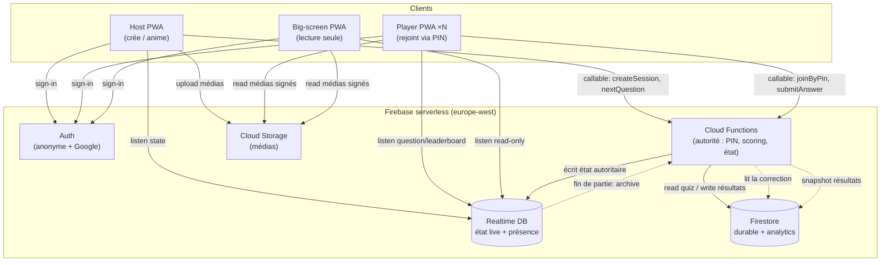
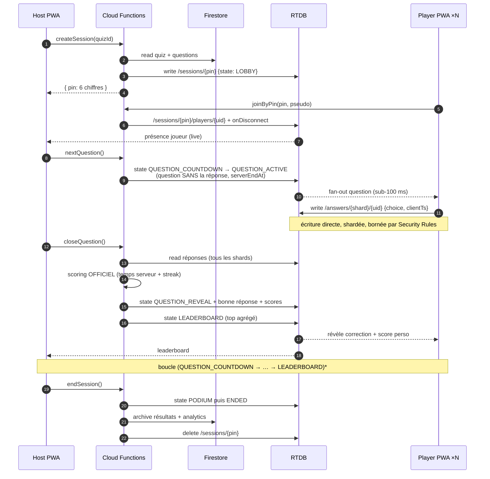
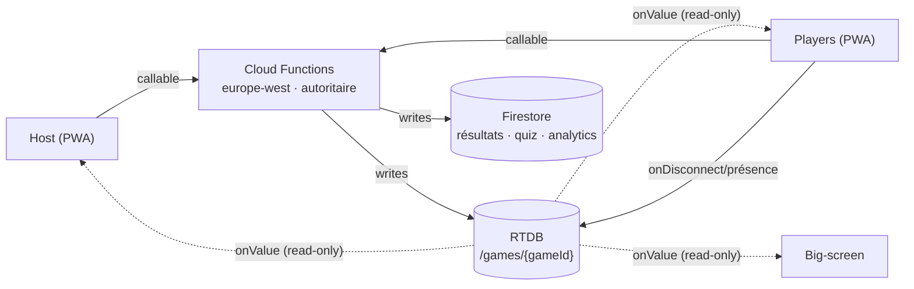
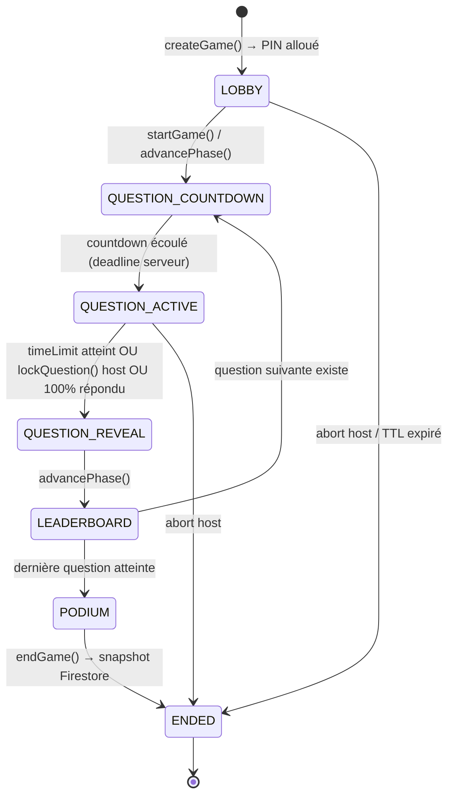
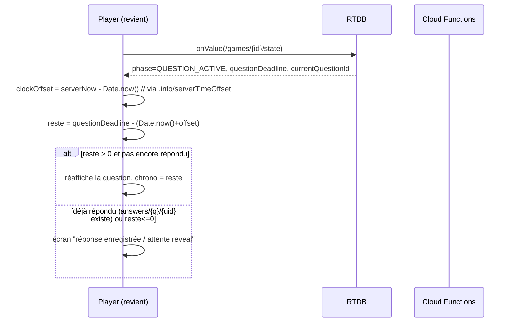
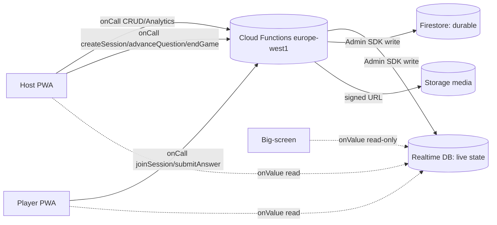
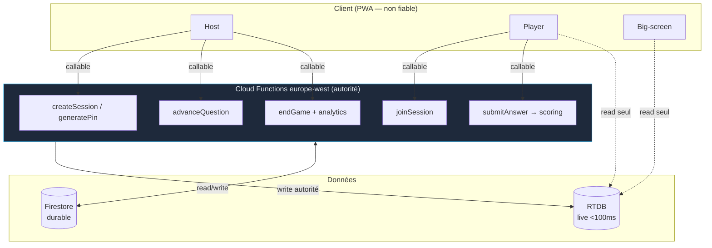
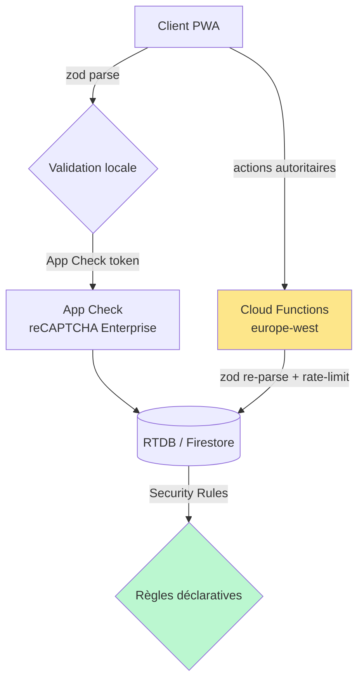
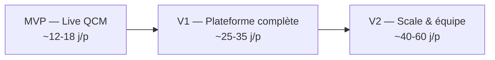

# Mister-qowa — Dossier de conception

> PWA de quiz interactif temps réel (type Kahoot), mobile-first, adaptée au parc miss-*/mister-* : **frontend React 19 sur GitHub Pages + backend Firebase serverless** (Firestore + Realtime Database + Auth + Cloud Functions). La section **0 (décisions consolidées) fait foi** et prime sur toute divergence des sections détaillées.

## Sommaire
- [0. Décisions consolidées (font foi)](00-decisions-consolidees.md)
- [1. Architecture technique](01-architecture.md)
- [2. Modèle de données](02-modele-donnees.md)
- [3. Protocole temps réel & moteur de jeu](03-protocole-temps-reel.md)
- [4. API & contrats](04-api.md)
- [5. UX / Wireframes](05-ux-wireframes.md)
- [6. Code exemple — Frontend](06-frontend.md)
- [7. Code exemple — Backend](07-backend.md)
- [8. Déploiement, sécurité, analytics & roadmap](08-deploiement-roadmap.md)


---

## 0. Décisions consolidées (font foi)

> Ce document **tranche** les divergences trouvées par les 2 revues adverses (24 issues) sur le brouillon
> multi-experts. **En cas de contradiction avec une section 1–8, ce document prime.** C'est lui la spec
> d'implémentation ; les sections détaillées sont la matière, à lire à travers ces décisions.

### Invariants verrouillés

| # | Décision | Pourquoi (issue résolue) |
|---|---|---|
| **D1** | **Clé canonique de l'état live = `sessionId`** (id stable). RTDB racine **`/sessions/{sessionId}`**. Index inverse **`/pins/{pin} → sessionId`**. Le PIN est un *alias de jointure éphémère*, jamais une clé d'arbre. | Bloquant : sections divergeaient entre `/sessions/{pin}`, `/games/{gameId}`, `/games/{pin}` → front & back incompatibles. |
| **D2** | **Soumission = écriture RTDB directe gardée par Rules** (chemin chaud, faible latence, pas de cold-start). Le callable `submitAnswer` n'est qu'un **fallback** documenté. Un seul jeu de Rules. | Bloquant : deux modèles (callable vs écriture directe) avec Rules contradictoires (`.write:false` vs `.write:auth.uid===$pid`). |
| **D3** | Le nœud réponse ne contient que **`{ choice, serverTs }`**. `serverTs` **forcé** par Rule `.validate: newData.child('serverTs').val() === now`. **`clientTs` supprimé** du calcul. Fenêtre : `.validate: now < currentQuestion.endsAt`. `$other: { .validate: false }` sur tout nœud client. | Bloquant : `clientTs` falsifiable → score max gratuit ; champs arbitraires (`awarded`) injectables. |
| **D4** | **Sharding partout** : `/sessions/{sessionId}/answers/{questionId}/{shardId}/{uid}`, `shardId = hash(uid)%20`, **appliqué dans les Rules aussi**. | Bloquant : sharding annoncé en 1.5 mais absent du code/Rules → point chaud, fan-in qui frôle ~1000 writes/s. |
| **D5** | **Scoring découplé de la soumission.** La soumission n'écrit que la réponse brute. Au **REVEAL**, la Function `closeQuestion` lit tous les shards, calcule les scores en **une passe déterministe & idempotente**, écrit `scores`+`leaderboard` en **multi-path update atomique**. `awarded`/`correct`/`responseTimeMs` ne sont **jamais** dans `/answers`. | Bloquant + majeur : double write-rate (2 transactions/réponse) ; déconnexion en vol → réponse sans score ; leaderboard faux non détecté. |
| **D6** | **`answeredCount` (jauge X/N) non écrit par réponse** : soit dérivé au REVEAL, soit **sharded counter** RTDB (N compteurs, somme en lecture). **Throttle/debounce serveur** du leaderboard live (pas de fan-out continu du top complet). | Majeur : Rules ne peuvent pas agréger ; doc chaud single-node ; fan-out continu = coût ×10–50. |
| **D7** | **PIN = 8 chiffres (10⁸)** ou base32 6 car. (~10⁹). `joinSession` rate-limité par **App Check** + compteur `/joinAttempts/{pin}` (verrou **par PIN** après N échecs globaux). App Check **obligatoire** avant `joinSession`. | Majeur : 6 chiffres → densité de collision élevée à l'échelle ; rate-limit par `uid` inopérant (auth anonyme illimitée). |
| **D8** | **Rupture de stack assumée** : mister-qowa introduit Firebase **Auth (anonyme+Google), Firestore, Functions, Storage, App Check** — **absents de mister-puzzle** (RTDB seul, sans auth). Ce n'est **pas** une continuité parc. Le `RateLimiter` client = **UX seulement** (anti double-clic), jamais une défense serveur. Rate-limit autoritaire = compteur RTDB transactionnel + App Check + quotas Functions. | Majeur : le dossier présentait à tort l'auth comme « repris du parc » ; RateLimiter client cité comme sécurité (trompeur). |
| **D9** | **Contrats zod uniques** = package **`@mister-qowa/contracts`** (frontière de confiance). Littéraux de type figés : **`'multiple_choice' \| 'true_false' \| 'free_text' \| 'poll'`**. Une seule forme `SubmitAnswer`. `normalizeFreeText` centralisée (client+Functions), respecte `caseSensitive`. **Ne pas hasher** les réponses libres « pour la sécurité » (faux sens) : ne jamais exposer `/answers`. | Majeur : ≥4 jeux de littéraux divergents (`mcq`/`multiple`/`multiple_choice`) → payloads rejetés ; normalisation dupliquée ; `caseSensitive` ignoré. |
| **D10** | **Streak unique** dans `engine/scoring.ts` (source de vérité **importée** par les Functions, pas redéfinie), **avec cap** : `mult = 1 + (streakBonusPct/100) * min(max(streak,0), STREAK_CAP)`, `STREAK_CAP=5`. Tableau d'exemples recalculé + test asserant chaque ligne. | Majeur : 4 formules divergentes (cap 5 vs sans cap) → 1500 vs 2000 pts pour le même scénario. |
| **D11** | **Export CSV `exportResults`** : vérifie l'ID token (`admin.auth().verifyIdToken`) + `uid === ownerId`, sinon **403**. Jamais livré sans auth. | Mineur (mais fuite RGPD) : auth « omise pour lisibilité » sur le seul endpoint qui sort des données perso en masse. |
| **D12** | **Abonnements client étroits** : le joueur n'écoute que `state`, `current`, `leaderboard/top` — **jamais** l'arbre complet (`players`). Abonnement complet réservé Host/Big-screen. `useGameSession` corrigé. | Mineur : `useGameSession` écoutait `games/{pin}` entier (1000+ joueurs) → re-télécharge/re-valide tout à chaque mutation, viole la s.1.5. |

### Périmètre MVP (écart vs brief, assumé)

La brief exige 4 types + médias en *features obligatoires*. **Écart volontaire** : le MVP valide d'abord la **boucle live**.

- **MVP** : live + **QCM + vrai/faux**, lobby PIN, scoring autoritaire (vitesse+justesse), leaderboard live, podium, feedback. **`endGame` + snapshot Firestore `results/{gameId}` inclus dès le MVP** (persistance immédiate, pour ne pas perdre l'historique). Auth anonyme + App Check + émulateurs câblés.
- **V1** : `free_text` + `poll`, **médias** (Storage), mode **async/solo**, **analytics** (par joueur/question) + **export CSV**, streak, comptes host Google, banque de questions.
- **V2** : mode **équipe** complet (entité `teams {teamId, sessionId, name, color}` + endpoints), **génération IA**, **tournoi**, réactions emoji à l'échelle, et bascule **self-hosted** (NestJS + Socket.io + PostgreSQL + Redis) si le coût/concurrence Firebase l'impose.

Tout élément hors-MVP est tagué **[V1]/[V2]** dans les wireframes (s.5) et la roadmap (s.8).

### Chiffres réalistes (corrigés)

- **Scalabilité** : 1 session de 1000 joueurs est **à la limite d'une instance RTDB** (~1000 writes/s sustained). Le sharding (D4) + le découplage scoring (D5) gardent la marge. **Multi-instance/base dès qu'il y a plusieurs sessions concurrentes** (pas en V2).
- **Coût** : **~0,50–2 $/session de 1000 joueurs** (et non 0,05 $) — RTDB facture connexions simultanées + temps connecté + download de chaque nœud abonné fan-outé ; min-instances Functions ≥1 facturé H24 (hors free tier).


---

## 1. Architecture technique

mister-qowa repose sur une architecture **serverless Firebase** : un seul frontend (PWA React 19) parle directement à des services Google managés, et toute décision **faisant autorité** (allocation du PIN, calcul des scores, avance des questions) transite par des **Cloud Functions**. Le principe directeur : séparer le **durable** (Firestore) du **live faible latence** (Realtime Database), et ne jamais faire confiance au client pour un calcul officiel.

### 1.1 Composants et responsabilités

| Composant | Rôle | Données / responsabilités | Pourquoi ici |
|---|---|---|---|
| **PWA (React 19 + Vite 8)** | Client Host, Player, Big-screen | UI, rendu temps réel, validation `zod` d'entrée, file offline, optimistic UI | Installable, offline shell (`vite-plugin-pwa`), déployée sur GitHub Pages |
| **Firebase Auth** | Identité | Anonyme (joueur invité + pseudo), Google OAuth (host) | `uid` stable réutilisé dans Security Rules RTDB/Firestore |
| **Firestore** | Stockage **durable** | Comptes host, quiz, questions, banque de questions, résultats de parties **terminées**, analytics agrégées | Requêtes, index, historique long terme, faible débit d'écriture |
| **Realtime Database (RTDB)** | État de jeu **live** | Lobby, question courante, présence joueurs, réponses, leaderboard live | Fan-out sub-100 ms, présence native (`onDisconnect`), tarif au volume transféré |
| **Cloud Functions (europe-west)** | Autorité serveur | Allocation PIN, **scoring officiel**, avance d'état (`LOBBY → … → ENDED`), agrégation des réponses, anti-triche | Le client ne calcule jamais le score ; secret de correction protégé |
| **Cloud Storage** | Médias | Images/vidéos des questions, uploads host | URLs signées, CDN intégré, règles d'accès par quiz |
| **Hosting** | Frontend | GitHub Pages (convention parc, `base="/mister-qowa/"`) | Firebase Hosting = alternative, non retenue |

### 1.2 Pourquoi RTDB pour le live et Firestore pour le durable

C'est le choix architectural central. Les deux bases coexistent, chacune sur son terrain :

- **RTDB = le live.** Modèle de tarification au **volume transféré** (et non au document lu), latence de propagation **sub-100 ms**, **fan-out** natif (une écriture host → push instantané à N abonnés sur le même chemin), et surtout **présence** via `onDisconnect()` — indispensable pour détecter un joueur qui ferme l'onglet. La limite de Firestore de **1 écriture/document/seconde** rend Firestore inapte à recevoir directement les réponses de 1000 joueurs sur un même chemin ; RTDB encaisse un flux de fan-in bien supérieur si on shardde (cf. 1.5).
- **Firestore = le durable.** Requêtes indexées (« mes quiz », « top 10 historique »), transactions multi-documents, rétention longue, et écritures **rares** (création de quiz, snapshot de résultats en fin de partie). On y déverse l'état live **une seule fois**, à `ENDED`, via Cloud Function.

> Règle mémo du parc : *RTDB pendant la partie, Firestore avant et après.* L'état volatile (`/sessions/{pin}`) vit dans RTDB le temps de la partie puis est archivé dans Firestore et **supprimé** de RTDB (le tarif au volume punit les arborescences qui traînent).

### 1.3 Diagramme d'architecture



Point clé : **les écritures d'état autoritaire ne viennent jamais du client** — elles passent par une Cloud Function. Le client n'a qu'un droit de **lecture** sur l'état de jeu et un droit d'**écriture restreint** sur sa propre réponse (validée par Security Rules + revérifiée côté Function).

### 1.4 Flux d'une partie live



Détail anti-triche essentiel : la **question est diffusée sans sa bonne réponse**, l'instant de fin (`serverEndAt`) est posé par la Function avec l'horloge serveur, et le **temps de réponse officiel est mesuré côté serveur** à la fermeture — le `clientTs` n'est qu'indicatif. Le client ne reçoit la correction qu'à `QUESTION_REVEAL`.

### 1.5 Scalabilité : 1000+ joueurs / session

Le goulot n'est pas le fan-out **host → joueurs** (une écriture, N lecteurs : RTDB excelle), mais le **fan-in joueurs → serveur** (N écritures simultanées) et l'agrégation.

**Sharding des réponses.** Écrire les 1000 réponses sous un même nœud `/answers/{uid}` crée de la contention et un listener host énorme. On **shardde** par hachage de l'`uid` :

```
/sessions/{pin}/answers/{shardId}/{uid}   // shardId = hash(uid) % N_SHARDS (ex. 20)
```

Chaque shard reçoit ~50 écritures/question : pas de hot-path, et la Function lit les 20 shards en parallèle à la fermeture. Le **host n'écoute pas les réponses brutes** — seulement un compteur agrégé (`answeredCount`) maintenu par les Security Rules / la Function, pour la jauge « X/1000 ont répondu ».

**Limite Firestore 1 write/doc/s → agrégation.** On n'écrit **rien par-réponse dans Firestore** pendant la partie. Le live vit en RTDB ; Firestore ne reçoit qu'un **snapshot unique** en fin de partie (résultats + analytics) via la Function. Si une analytique temps réel devenait nécessaire, on passerait par des **compteurs distribués** (sharded counters) ou par export RTDB → BigQuery, jamais par incrément direct sur un document chaud.

**Fan-out RTDB et structure plate.** RTDB descend toute l'arborescence d'un chemin abonné : on garde des nœuds **plats et étroits**. Le joueur n'écoute que `/sessions/{pin}/current` (question + état), pas `/answers`. Le leaderboard diffusé est **tronqué (top 50)** et recalculé par la Function, pas un tri client sur 1000 entrées.

**Présence.** `onDisconnect()` nettoie `/players/{uid}/online` à la coupure réseau ; un champ `lastSeen` (timestamp serveur) sert de heartbeat de secours. La présence coûte une petite écriture par joueur, pas un flux continu.

**Débits & quotas.** RTDB plafonne à ~**100 k connexions simultanées** et ~**1000 écritures/s** par instance de base. Une session de 1000 joueurs (~1000 connexions, pics de ~1000 écritures à chaque question) **tient sur une seule instance**, mais plusieurs **milliers** de sessions concurrentes imposent du **multi-shard de bases RTDB** (router les sessions sur plusieurs instances par préfixe de PIN).

### 1.6 Latence : chemins critiques et optimisations

| Chemin critique | Cible | Optimisation |
|---|---|---|
| Host « next » → question affichée joueur | < 200 ms | Écriture RTDB unique, structure plate, listener ciblé `/current` |
| Joueur tape → réponse enregistrée | < 100 ms | Écriture RTDB directe (pas de Function sur le chemin chaud), shardée |
| Décompte synchronisé entre tous | dérive < 50 ms | `serverEndAt` absolu + offset d'horloge via `/.info/serverTimeOffset` |
| Fermeture → reveal/scores | < 500 ms | Function europe-west **min instances ≥ 1** (anti cold-start), lecture parallèle des shards |

La soumission de réponse **ne passe pas par une Function** (latence + coût + cold-start) : écriture RTDB directe **bornée par Security Rules** (un seul vote, dans la fenêtre de temps), revérifiée à la fermeture. Le décompte n'est jamais piloté par un timer client local : chacun calcule `serverEndAt - (now + serverTimeOffset)`, ce qui élimine la dérive entre appareils.

### 1.7 Mode offline / async / solo

Le mode **async/solo** (auto-rythmé, sans host) court-circuite la machine à états live : le quiz complet (avec corrections) est chargé depuis Firestore, mis en cache par le service worker (`vite-plugin-pwa`), et **jouable hors-ligne**. Le scoring local affiche un résultat **provisoire** ; à la reconnexion, une Function **recalcule le score officiel** et l'archive (le client reste non-autoritaire, même en solo). Les réponses produites hors-ligne sont mises en **file locale** (même pattern que `offlinePieceQueue` de mister-puzzle) et rejouées au retour réseau. Le mode **live** n'a pas de vrai offline : sans connexion, le joueur est marqué absent par la présence et reprend au prochain `LEADERBOARD`.

### 1.8 Estimation de coût Firebase (1 session de 1000 joueurs)

Hypothèses : 1 partie de **20 questions**, 1000 joueurs, ~5 Ko de payload par question fan-outé, 1 réponse/joueur/question.

| Poste | Volume | Coût indicatif |
|---|---|---|
| RTDB — download (fan-out) | 1000 joueurs × 20 q × ~5 Ko ≈ **100 Mo** | ~0,01 $/Go → **≈ 0,001 $** |
| RTDB — upload (réponses + présence) | ~20 000 écritures × ~1 Ko ≈ **20 Mo** | négligeable |
| Cloud Functions | ~50 invocations (PIN, 20× close, archive…) | sous le **free tier** (2 M/mois) → **≈ 0 $** |
| Firestore | ~1000 writes d'archive + lectures quiz | **≈ 0,002 $** |
| Storage / CDN médias | dépend des images (qq Mo) | quelques centimes |

**Ordre de grandeur : < 0,05 $ pour une session live de 1000 joueurs**, dominé par le download RTDB. À l'échelle de **centaines de sessions/jour**, le coût reste de l'ordre de quelques dollars/jour — tant qu'on **purge l'état RTDB** en fin de partie et qu'on n'écrit pas par-réponse dans Firestore.

### 1.9 Alternative self-hosted et seuil de bascule

Firebase est privilégié (aligné mister-puzzle, zéro ops). La stack de référence de la brief — **NestJS + Socket.io + PostgreSQL + Redis** — reste le **« self-hosted V2 »** documenté : Socket.io pour le live (rooms = sessions), Redis adapter pour le fan-out multi-nœuds + présence, PostgreSQL pour le durable. On bascule quand l'un de ces seuils est franchi :

- **Concurrence** : on dépasse durablement ~**100 k connexions simultanées** ou plusieurs milliers de sessions concurrentes (le multi-shard RTDB devient plus coûteux à opérer qu'un cluster Socket.io + Redis qu'on dimensionne).
- **Coût** : le volume de download RTDB rend la facture supérieure au coût d'un cluster auto-hébergé.
- **Latence/contrôle** : besoin de WebSocket bidirectionnel fin, de logique serveur lourde par message, ou de souveraineté des données hors Google.

En deçà, le surcoût opérationnel d'un backend stateful (scaling WebSocket, présence distribuée, HA Postgres/Redis) ne se justifie pas face au serverless Firebase.

---

Fichiers de référence consultés (conventions parc, alignées sur cette section) : `D:\Src\GithubMisterGuiiuG\mister-puzzle\src\firebase.ts` (init RTDB via `getDatabase`), `D:\Src\GithubMisterGuiiuG\mister-puzzle\src\config\firebaseEnv.ts` (config web par env), `D:\Src\GithubMisterGuiiuG\mister-puzzle\database.rules.json` (style Security Rules RTDB + présence `members/lastSeen`), `D:\Src\GithubMisterGuiiuG\mister-puzzle\src\utils\offlinePieceQueue.ts` (pattern file offline).


---

## 2. Modèle de données

Cette section définit le modèle de données complet de mister-qowa selon la séparation **durable vs. live** verrouillée dans la brief : **Firestore** pour les données persistantes (comptes, contenu, parties terminées, analytics), **Realtime Database (RTDB)** pour l'état de jeu temps réel haute fréquence, et une variante relationnelle **PostgreSQL** pour le self-hosted V2. Tous les schémas applicatifs sont validés par **zod v4** (frontière client/Cloud Functions), identifiants en anglais.

### 2.1 Principe de séparation des stockages

| Critère | Firestore | RTDB |
|---|---|---|
| Nature | Document durable, requêtable, indexé | Arbre JSON, fan-out faible latence |
| Fréquence d'écriture | Faible (création/édition de contenu, fin de partie) | Très élevée (réponses, présence, leaderboard live) |
| Lecture | Requêtes filtrées/paginées | Abonnement temps réel sub-100 ms, `onDisconnect` |
| Source de vérité du score | Oui (snapshot final écrit par Cloud Function) | Non (état transitoire, recalculé serveur) |
| Coût à 1000+ joueurs | Élevé si écritures live (1 doc/réponse) | Optimisé (fan-out natif, facturation au volume) |

La règle structurante : **toute écriture à haute fréquence pendant une partie va dans RTDB** ; Firestore ne reçoit qu'un **snapshot final** (`games` + `gameResults`) produit par une Cloud Function à `ENDED`. Le client n'écrit jamais le score officiel.

### 2.2 Schéma Firestore (données durables)

Notation : `coll/{id}` = collection ; les champs marqués `🔒` ne sont jamais écrits par le client (Cloud Functions uniquement).

#### `users/{uid}`
Compte host (clé = `uid` Firebase Auth). Les invités anonymes n'ont **pas** de document `users`.

| Champ | Type | Notes |
|---|---|---|
| `uid` | `string` | = doc id, = Auth uid |
| `displayName` | `string` | |
| `email` | `string \| null` | null si compte non-Google |
| `photoURL` | `string \| null` | |
| `provider` | `'google' \| 'anonymous'` | |
| `role` | `'host' \| 'admin'` | défaut `host` |
| `createdAt` | `Timestamp` | |
| `lastSeenAt` | `Timestamp` | |
| `stats` | `map` | `🔒 { quizzesCreated, gamesHosted, totalPlayers }` agrégés par CF |

#### `quizzes/{quizId}`
Métadonnées du quiz (les questions sont en sous-collection pour pagination + permissions fines).

| Champ | Type | Notes |
|---|---|---|
| `quizId` | `string` | = doc id |
| `ownerUid` | `string` | → `users/{uid}` |
| `title` | `string` | 1–120 car. |
| `description` | `string` | ≤ 500 car. |
| `coverImageUrl` | `string \| null` | Firebase Storage |
| `visibility` | `'private' \| 'unlisted' \| 'public'` | |
| `language` | `string` | BCP-47 (`fr`, `en`…) |
| `tags` | `string[]` | ≤ 10 |
| `questionCount` | `number` | 🔒 dénormalisé (CF) |
| `defaultTimeLimitMs` | `number` | hérité par question |
| `defaultBasePoints` | `number` | |
| `streakBonusEnabled` | `boolean` | |
| `status` | `'draft' \| 'published'` | |
| `createdAt` / `updatedAt` | `Timestamp` | |

#### `quizzes/{quizId}/questions/{questionId}`
Question rattachée à un quiz (sous-collection). Discriminée par `type` (cf. zod §2.5).

| Champ | Type | Notes |
|---|---|---|
| `questionId` | `string` | = doc id |
| `order` | `number` | rang dans le quiz |
| `type` | `'multiple_choice' \| 'true_false' \| 'free_text' \| 'poll'` | discriminant |
| `prompt` | `string` | énoncé |
| `mediaUrl` | `string \| null` | image/vidéo Storage |
| `timeLimitMs` | `number` | |
| `basePoints` | `number` | 0 si `poll` |
| `options` | `Option[] \| null` | MC / vrai-faux / sondage |
| `correctOptionIds` | `string[] \| null` | null pour `poll` |
| `acceptedAnswers` | `string[] \| null` | `free_text` (formes normalisées) |
| `caseSensitive` | `boolean \| null` | `free_text` |
| `createdAt` / `updatedAt` | `Timestamp` | |

#### `questionBank/{questionId}`
Banque réutilisable, indépendante d'un quiz (import dans plusieurs quiz). Même forme que `questions` + `ownerUid`, `visibility`, `tags`, `usageCount 🔒`. Permet la recherche transverse.

#### `games/{gameId}` (parties TERMINÉES uniquement)
Écrit **une seule fois** par la Cloud Function de clôture (snapshot immuable de l'état live).

| Champ | Type | Notes |
|---|---|---|
| `gameId` | `string` | = doc id (≠ PIN, qui est éphémère) |
| `quizId` | `string` | → quiz source |
| `hostUid` | `string` | |
| `pin` | `string` | 🔒 PIN utilisé (historique) |
| `mode` | `'live' \| 'async' \| 'team'` | |
| `playerCount` | `number` | 🔒 |
| `startedAt` / `endedAt` | `Timestamp` | 🔒 |
| `questionSnapshots` | `array<map>` | 🔒 copie figée des questions jouées |
| `finalState` | `'ENDED' \| 'ABORTED'` | 🔒 |

#### `games/{gameId}/gameResults/{playerId}` (sous-collection)
Un document par joueur — résultat **officiel** figé.

| Champ | Type | Notes |
|---|---|---|
| `playerId` | `string` | = doc id |
| `nickname` | `string` | 🔒 |
| `uid` | `string \| null` | 🔒 si joueur authentifié |
| `teamId` | `string \| null` | 🔒 mode équipe |
| `totalScore` | `number` | 🔒 calculé serveur |
| `rank` | `number` | 🔒 |
| `correctCount` | `number` | 🔒 |
| `maxStreak` | `number` | 🔒 |
| `perQuestion` | `array<map>` | 🔒 `{ questionId, points, responseTimeMs, correct }` |

#### `analytics/{gameId}` (agrégats post-partie)
Écrit par CF : distribution des réponses, % de réussite par question, courbe d'engagement. Champs : `quizId`, `questionStats: map<questionId, { correctRate, avgResponseTimeMs, optionDistribution }>`, `dropoffByQuestion: number[]`, `computedAt: Timestamp`. Tout `🔒`.

#### Index Firestore (composites)

| Collection | Index | Usage |
|---|---|---|
| `quizzes` | `ownerUid ASC, updatedAt DESC` | « mes quiz » |
| `quizzes` | `visibility ASC, language ASC, updatedAt DESC` | catalogue public |
| `quizzes/*/questions` | `order ASC` | lecture ordonnée (single-field suffit) |
| `questionBank` | `ownerUid ASC, tags ARRAY, updatedAt DESC` | recherche perso par tag |
| `questionBank` | `visibility ASC, tags ARRAY` | banque publique |
| `games` | `hostUid ASC, endedAt DESC` | historique host |
| `games` | `quizId ASC, endedAt DESC` | parties d'un quiz |
| `games/*/gameResults` | `rank ASC` | classement final paginé |

### 2.3 Arbre RTDB de l'état live

Racine `/sessions/{pin}` où `{pin}` = PIN 6 chiffres (durée de vie = la partie ; supprimé à `ENDED+TTL`).

```
/sessions/{pin}
├── meta
│   ├── gameId            : string          // lien vers le futur doc games/
│   ├── quizId            : string
│   ├── hostUid           : string
│   ├── mode              : "live"|"async"|"team"
│   ├── state             : "LOBBY"|"QUESTION_COUNTDOWN"|"QUESTION_ACTIVE"
│   │                       |"QUESTION_REVEAL"|"LEADERBOARD"|"PODIUM"|"ENDED"
│   ├── currentQuestionIndex : number
│   ├── totalQuestions    : number
│   ├── locked            : boolean         // lobby fermé
│   └── serverNow         : number          // ServerValue.TIMESTAMP (sync horloge)
│
├── players/{playerId}                      // playerId = clé push() ou uid
│   ├── nickname          : string
│   ├── uid               : string|null
│   ├── teamId            : string|null
│   ├── joinedAt          : number
│   ├── connected         : boolean         // onDisconnect → false
│   ├── score             : number          // 🔒 miroir, écrit par CF
│   └── streak            : number          // 🔒
│
├── currentQuestion                         // une seule question exposée à la fois
│   ├── questionId        : string
│   ├── type              : string
│   ├── prompt            : string
│   ├── mediaUrl          : string|null
│   ├── options           : { [optId]: { text, mediaUrl? } }   // PAS de correctOptionIds ici (anti-triche)
│   ├── startedAt         : number          // ServerValue.TIMESTAMP
│   ├── endsAt            : number          // startedAt + timeLimitMs
│   └── revealed          : boolean         // true en QUESTION_REVEAL → expose la/les bonnes réponses
│
├── answers/{questionId}/{playerId}         // 🔒 lisible host/CF seulement
│   ├── optionIds         : string[]|null
│   ├── text              : string|null     // free_text
│   ├── submittedAt       : number          // ServerValue.TIMESTAMP
│   └── responseTimeMs    : number          // 🔒 recalculé/validé par CF
│
├── leaderboard                             // top N dénormalisé pour affichage live
│   └── {rank}            : { playerId, nickname, score, teamId? }
│
└── reactions                               // émojis éphémères (fun, non scorés)
    └── {pushId}          : { playerId, emoji, at }   // purgés par CF/TTL
```

**Justification de la forme pour le fan-out :**

- **`/sessions/{pin}` comme racine partagée** : tous les clients d'une partie s'abonnent au même sous-arbre. La diffusion d'un changement (`state`, `currentQuestion`) est un **fan-out natif RTDB** vers 1000+ sockets sans requête par client.
- **`currentQuestion` aplati et SANS bonnes réponses** : on n'expose qu'**une** question à la fois et on **omet `correctOptionIds`** (anti-triche : impossible d'inspecter le payload). Les réponses correctes ne descendent qu'à `revealed: true`. Énoncé aplati = un seul listener léger côté joueur.
- **`answers/{questionId}/{playerId}` partitionné par question** : chaque joueur n'écrit qu'à **son** chemin (`.write` scoping par `auth.uid`/clé), zéro contention ; le host/CF lit l'agrégat `answers/{questionId}`. Branche **protégée en lecture** côté joueur (Security Rules) → personne ne voit les réponses des autres avant le reveal.
- **`leaderboard` pré-calculé et dénormalisé** : le client ne trie pas 1000 joueurs ; la CF écrit un top N déjà ordonné → lecture O(N) constante, fan-out d'un petit nœud.
- **`players/{id}.connected` + `onDisconnect`** : présence native, pas de heartbeat applicatif. `score`/`streak` sont des **miroirs** écrits par CF (jamais par le joueur).
- **`reactions` en `push()`** : append-only à clé chronologique, purgé par TTL → pas de croissance non bornée du sous-arbre live.

> Sécurité (résumé, détaillée en section Security Rules) : un joueur ne peut écrire que `players/{self}` et `answers/{q}/{self}` ; `meta`, `currentQuestion`, `leaderboard`, et tous les champs `🔒` sont **read-only** côté client et écrits par Cloud Functions / host autorisé.

### 2.4 Diagramme ER (mermaid)

```mermaid
erDiagram
    USERS ||--o{ QUIZZES : "owns"
    USERS ||--o{ QUESTION_BANK : "owns"
    QUIZZES ||--o{ QUESTIONS : "contains"
    QUESTION_BANK ..o{ QUESTIONS : "imported into"
    USERS ||--o{ GAMES : "hosts"
    QUIZZES ||--o{ GAMES : "instantiated as"
    GAMES ||--o{ GAME_RESULTS : "produces"
    GAMES ||--|| ANALYTICS : "aggregated into"
    GAME_RESULTS }o--o| USERS : "may belong to"

    USERS {
        string uid PK
        string displayName
        string email
        string provider
        string role
        timestamp createdAt
    }
    QUIZZES {
        string quizId PK
        string ownerUid FK
        string title
        string visibility
        string status
        number questionCount
        timestamp updatedAt
    }
    QUESTIONS {
        string questionId PK
        string quizId FK
        number order
        string type
        string prompt
        number timeLimitMs
        number basePoints
    }
    QUESTION_BANK {
        string questionId PK
        string ownerUid FK
        string type
        string prompt
        number usageCount
    }
    GAMES {
        string gameId PK
        string quizId FK
        string hostUid FK
        string pin
        string mode
        number playerCount
        timestamp endedAt
    }
    GAME_RESULTS {
        string playerId PK
        string gameId FK
        string uid FK
        number totalScore
        number rank
        number maxStreak
    }
    ANALYTICS {
        string gameId PK
        string quizId FK
        timestamp computedAt
    }
```

### 2.5 Schémas zod v4

Validation à la frontière (formulaires d'édition, payloads Cloud Functions, écritures RTDB). zod v4 : `z.enum`, `z.discriminatedUnion`, `z.iso.datetime()`, `z.int()`.

```ts
import { z } from 'zod';

/* ---------- Primitives ---------- */
export const pinSchema = z.string().regex(/^\d{6}$/, 'PIN = 6 chiffres');
export const idSchema = z.string().min(1).max(128);
export const nicknameSchema = z.string().trim().min(1).max(20);

export const questionTypeSchema = z.enum([
  'multiple_choice',
  'true_false',
  'free_text',
  'poll',
]);

export const optionSchema = z.object({
  id: idSchema,
  text: z.string().min(1).max(120),
  mediaUrl: z.string().url().nullable().default(null),
});

/* ---------- Question : union discriminée des 4 types ---------- */
const questionBase = z.object({
  questionId: idSchema,
  order: z.int().nonnegative(),
  prompt: z.string().min(1).max(400),
  mediaUrl: z.string().url().nullable().default(null),
  timeLimitMs: z.int().min(5_000).max(120_000),
});

export const multipleChoiceSchema = questionBase.extend({
  type: z.literal('multiple_choice'),
  basePoints: z.int().min(0).max(2000),
  options: z.array(optionSchema).min(2).max(4),
  correctOptionIds: z.array(idSchema).min(1),
});

export const trueFalseSchema = questionBase.extend({
  type: z.literal('true_false'),
  basePoints: z.int().min(0).max(2000),
  options: z.array(optionSchema).length(2),
  correctOptionIds: z.array(idSchema).length(1),
});

export const freeTextSchema = questionBase.extend({
  type: z.literal('free_text'),
  basePoints: z.int().min(0).max(2000),
  acceptedAnswers: z.array(z.string().min(1)).min(1).max(20),
  caseSensitive: z.boolean().default(false),
});

export const pollSchema = questionBase.extend({
  type: z.literal('poll'),
  basePoints: z.literal(0).default(0), // sondage => 0 point
  options: z.array(optionSchema).min(2).max(4),
});

export const questionSchema = z.discriminatedUnion('type', [
  multipleChoiceSchema,
  trueFalseSchema,
  freeTextSchema,
  pollSchema,
]);
export type Question = z.infer<typeof questionSchema>;

/* ---------- Quiz ---------- */
export const quizSchema = z.object({
  quizId: idSchema,
  ownerUid: idSchema,
  title: z.string().trim().min(1).max(120),
  description: z.string().max(500).default(''),
  coverImageUrl: z.string().url().nullable().default(null),
  visibility: z.enum(['private', 'unlisted', 'public']).default('private'),
  language: z.string().min(2).max(10).default('fr'),
  tags: z.array(z.string().min(1).max(30)).max(10).default([]),
  defaultTimeLimitMs: z.int().min(5_000).max(120_000).default(20_000),
  defaultBasePoints: z.int().min(0).max(2000).default(1000),
  streakBonusEnabled: z.boolean().default(true),
  status: z.enum(['draft', 'published']).default('draft'),
});
export type Quiz = z.infer<typeof quizSchema>;

/* ---------- Player (RTDB) ---------- */
export const playerSchema = z.object({
  playerId: idSchema,
  nickname: nicknameSchema,
  uid: idSchema.nullable().default(null),
  teamId: idSchema.nullable().default(null),
  joinedAt: z.int().positive(),
  connected: z.boolean().default(true),
  score: z.int().nonnegative().default(0), // miroir, autorité CF
  streak: z.int().nonnegative().default(0),
});
export type Player = z.infer<typeof playerSchema>;

/* ---------- AnswerSubmission (client -> RTDB/CF) ---------- */
export const answerSubmissionSchema = z
  .object({
    pin: pinSchema,
    questionId: idSchema,
    playerId: idSchema,
    optionIds: z.array(idSchema).min(1).nullable().default(null), // MC/VF/poll
    text: z.string().trim().min(1).max(200).nullable().default(null), // free_text
    // submittedAt/responseTimeMs sont posés par le serveur (jamais par le client)
  })
  .refine((a) => a.optionIds !== null || a.text !== null, {
    message: 'Réponse vide : optionIds ou text requis',
  });
export type AnswerSubmission = z.infer<typeof answerSubmissionSchema>;

/* ---------- GameState (état de partie, machine à états) ---------- */
export const gameStateSchema = z.enum([
  'LOBBY',
  'QUESTION_COUNTDOWN',
  'QUESTION_ACTIVE',
  'QUESTION_REVEAL',
  'LEADERBOARD',
  'PODIUM',
  'ENDED',
]);
export type GameState = z.infer<typeof gameStateSchema>;

export const sessionMetaSchema = z.object({
  gameId: idSchema,
  quizId: idSchema,
  hostUid: idSchema,
  mode: z.enum(['live', 'async', 'team']).default('live'),
  state: gameStateSchema.default('LOBBY'),
  currentQuestionIndex: z.int().nonnegative().default(0),
  totalQuestions: z.int().positive(),
  locked: z.boolean().default(false),
});
export type SessionMeta = z.infer<typeof sessionMetaSchema>;
```

> Note anti-triche : `correctOptionIds`/`acceptedAnswers` font partie du schéma **côté Firestore/CF** mais ne sont **jamais sérialisés dans `/sessions/{pin}/currentQuestion`**. La validation de justesse est faite par la Cloud Function de scoring.

### 2.6 Variante relationnelle PostgreSQL (self-hosted V2)

DDL pour la stack alternative (NestJS + PostgreSQL + Redis). L'état live haute fréquence vivrait dans **Redis** (équivalent RTDB) ; PostgreSQL tient le durable. `jsonb` pour les payloads polymorphes (options, snapshots).

```sql
-- Extensions
CREATE EXTENSION IF NOT EXISTS "pgcrypto";   -- gen_random_uuid()

-- Enums
CREATE TYPE question_type AS ENUM ('multiple_choice','true_false','free_text','poll');
CREATE TYPE quiz_visibility AS ENUM ('private','unlisted','public');
CREATE TYPE game_mode     AS ENUM ('live','async','team');
CREATE TYPE game_final    AS ENUM ('ENDED','ABORTED');

-- Comptes host
CREATE TABLE users (
    uid          UUID PRIMARY KEY DEFAULT gen_random_uuid(),
    display_name TEXT NOT NULL,
    email        TEXT UNIQUE,
    photo_url    TEXT,
    provider     TEXT NOT NULL CHECK (provider IN ('google','anonymous')),
    role         TEXT NOT NULL DEFAULT 'host' CHECK (role IN ('host','admin')),
    created_at   TIMESTAMPTZ NOT NULL DEFAULT now(),
    last_seen_at TIMESTAMPTZ
);

-- Quiz
CREATE TABLE quizzes (
    quiz_id               UUID PRIMARY KEY DEFAULT gen_random_uuid(),
    owner_uid             UUID NOT NULL REFERENCES users(uid) ON DELETE CASCADE,
    title                 TEXT NOT NULL CHECK (char_length(title) BETWEEN 1 AND 120),
    description           TEXT NOT NULL DEFAULT '',
    cover_image_url       TEXT,
    visibility            quiz_visibility NOT NULL DEFAULT 'private',
    language              TEXT NOT NULL DEFAULT 'fr',
    tags                  TEXT[] NOT NULL DEFAULT '{}',
    default_time_limit_ms INT  NOT NULL DEFAULT 20000,
    default_base_points   INT  NOT NULL DEFAULT 1000,
    streak_bonus_enabled  BOOLEAN NOT NULL DEFAULT true,
    status                TEXT NOT NULL DEFAULT 'draft' CHECK (status IN ('draft','published')),
    created_at            TIMESTAMPTZ NOT NULL DEFAULT now(),
    updated_at            TIMESTAMPTZ NOT NULL DEFAULT now()
);

-- Questions (rattachées à un quiz) ; banque = quiz_id NULL + owner_uid renseigné
CREATE TABLE questions (
    question_id       UUID PRIMARY KEY DEFAULT gen_random_uuid(),
    quiz_id           UUID REFERENCES quizzes(quiz_id) ON DELETE CASCADE,
    owner_uid         UUID REFERENCES users(uid) ON DELETE CASCADE,  -- pour la banque
    "order"           INT  NOT NULL DEFAULT 0,
    type              question_type NOT NULL,
    prompt            TEXT NOT NULL,
    media_url         TEXT,
    time_limit_ms     INT  NOT NULL DEFAULT 20000,
    base_points       INT  NOT NULL DEFAULT 1000,
    options           JSONB,        -- [{id,text,mediaUrl}] ; NULL pour free_text
    correct_option_ids TEXT[],      -- NULL pour poll/free_text
    accepted_answers  TEXT[],       -- free_text uniquement
    case_sensitive    BOOLEAN,
    created_at        TIMESTAMPTZ NOT NULL DEFAULT now(),
    updated_at        TIMESTAMPTZ NOT NULL DEFAULT now(),
    -- cohérence par type
    CONSTRAINT poll_zero_points CHECK (type <> 'poll' OR base_points = 0),
    CONSTRAINT free_text_answers CHECK (type <> 'free_text' OR accepted_answers IS NOT NULL),
    CONSTRAINT choice_options    CHECK (type = 'free_text' OR options IS NOT NULL)
);

-- Parties terminées (snapshot immuable)
CREATE TABLE games (
    game_id            UUID PRIMARY KEY DEFAULT gen_random_uuid(),
    quiz_id            UUID NOT NULL REFERENCES quizzes(quiz_id) ON DELETE RESTRICT,
    host_uid           UUID NOT NULL REFERENCES users(uid) ON DELETE RESTRICT,
    pin                CHAR(6) NOT NULL,
    mode               game_mode NOT NULL DEFAULT 'live',
    player_count       INT NOT NULL DEFAULT 0,
    started_at         TIMESTAMPTZ NOT NULL,
    ended_at           TIMESTAMPTZ NOT NULL,
    question_snapshots JSONB NOT NULL,        -- copie figée des questions jouées
    final_state        game_final NOT NULL DEFAULT 'ENDED'
);

-- Résultats par joueur (officiels)
CREATE TABLE game_results (
    player_id        UUID PRIMARY KEY DEFAULT gen_random_uuid(),
    game_id          UUID NOT NULL REFERENCES games(game_id) ON DELETE CASCADE,
    uid              UUID REFERENCES users(uid) ON DELETE SET NULL,  -- joueur authentifié
    nickname         TEXT NOT NULL,
    team_id          TEXT,
    total_score      INT NOT NULL DEFAULT 0,
    rank             INT NOT NULL,
    correct_count    INT NOT NULL DEFAULT 0,
    max_streak       INT NOT NULL DEFAULT 0,
    per_question     JSONB NOT NULL DEFAULT '[]'  -- [{questionId,points,responseTimeMs,correct}]
);

-- Analytics (1-1 avec games)
CREATE TABLE analytics (
    game_id        UUID PRIMARY KEY REFERENCES games(game_id) ON DELETE CASCADE,
    quiz_id        UUID NOT NULL REFERENCES quizzes(quiz_id) ON DELETE CASCADE,
    question_stats JSONB NOT NULL,   -- {questionId: {correctRate,avgResponseTimeMs,optionDistribution}}
    dropoff        INT[]  NOT NULL DEFAULT '{}',
    computed_at    TIMESTAMPTZ NOT NULL DEFAULT now()
);

-- Index
CREATE INDEX idx_quizzes_owner_updated  ON quizzes (owner_uid, updated_at DESC);
CREATE INDEX idx_quizzes_public         ON quizzes (visibility, language, updated_at DESC);
CREATE INDEX idx_quizzes_tags           ON quizzes USING GIN (tags);
CREATE INDEX idx_questions_quiz_order   ON questions (quiz_id, "order");
CREATE INDEX idx_questions_bank_owner   ON questions (owner_uid) WHERE quiz_id IS NULL;
CREATE INDEX idx_games_host_ended       ON games (host_uid, ended_at DESC);
CREATE INDEX idx_games_quiz_ended       ON games (quiz_id, ended_at DESC);
CREATE INDEX idx_results_game_rank      ON game_results (game_id, rank);
CREATE UNIQUE INDEX uq_results_game_uid ON game_results (game_id, uid) WHERE uid IS NOT NULL;
```

**Correspondance des clés Firestore/RTDB → PostgreSQL :**

| Firestore / RTDB | PostgreSQL | Clé / index |
|---|---|---|
| `users/{uid}` | `users` | PK `uid` |
| `quizzes/{quizId}` | `quizzes` | PK `quiz_id`, FK `owner_uid` |
| `quizzes/*/questions/{id}` | `questions` (`quiz_id` non-null) | FK `quiz_id` + `idx_questions_quiz_order` |
| `questionBank/{id}` | `questions` (`quiz_id` NULL) | `idx_questions_bank_owner` |
| `games/{gameId}` | `games` | PK `game_id` |
| `games/*/gameResults/{id}` | `game_results` | FK `game_id` + `idx_results_game_rank` |
| `analytics/{gameId}` | `analytics` | PK/FK `game_id` (1-1) |
| `/sessions/{pin}` (live) | **Redis** (hors DDL) | clé `session:{pin}` |

> Le PIN n'est **jamais** une clé durable : éphémère dans RTDB/Redis pendant la partie, conservé seulement comme attribut historique (`games.pin`) après clôture.


---

## 3. Protocole temps réel & moteur de jeu

Cette section définit le contrat d'exécution d'une partie : la machine à états canonique, le découpage des responsabilités entre **host**, **serveur autoritaire** (Cloud Functions + RTDB) et **players**, la formule de scoring, la reconnexion, l'anti-triche, le mode équipe et les réactions emoji. Principe directeur, hérité de `mister-puzzle` : **le client n'écrit jamais une valeur de confiance**. Toute donnée sensible (PIN, avance d'état, réponse soumise, score) transite par une Cloud Function ou est verrouillée par les Security Rules ; le client se contente d'écouter (`onValue`) et d'afficher.

### 3.1 Topologie temps réel

On sépare le **durable** (Firestore) du **live** (RTDB), exactement comme la brief le verrouille.



- **RTDB `/games/{gameId}`** : état live (phase, question courante, présence, réponses chiffrées, leaderboard, réactions). Lecture libre des champs publics, **écriture interdite** sur les champs autoritaires (cf. 3.7).
- **Cloud Functions callables** (`europe-west1`) : `createGame`, `joinGame`, `startGame`, `advancePhase`, `submitAnswer`, `lockQuestion`, `endGame`. Elles seules détiennent le `serverTimestamp` de référence et écrivent `phase`, `currentQuestion`, `scores`.
- **Firestore** : snapshot final de la partie (`/sessions/{id}`), banque de questions, analytics — écrit par les Functions à la transition `PODIUM → ENDED`.

### 3.2 Machine à états de partie

État global stocké dans `/games/{gameId}/state` ; **seules les Cloud Functions y écrivent**. Le client lit `state.phase` et rend l'écran correspondant.



| Phase | Écrit par | Champ déclencheur | Affichage host | Affichage player |
|---|---|---|---|---|
| `LOBBY` | `createGame` | — | PIN + liste joueurs | pseudo + « en attente » |
| `QUESTION_COUNTDOWN` | `advancePhase` | `countdownDeadline` (3 s) | « Question N » | « Préparez-vous » |
| `QUESTION_ACTIVE` | `advancePhase` | `questionDeadline` | question + chrono | options cliquables |
| `QUESTION_REVEAL` | `advancePhase`/`lockQuestion` | `correctOptionId` | bonne réponse + distribution | juste/faux + points gagnés |
| `LEADERBOARD` | `advancePhase` | `leaderboard[]` | top 5 | rang + delta |
| `PODIUM` | `advancePhase` | `podium[1..3]` | podium animé | rang final |
| `ENDED` | `endGame` | `endedAt` | bilan + export | « merci » |

Chaque phase porte une **deadline serveur** (`*Deadline = serverTimestamp + durée`). Le client n'utilise jamais son horloge locale pour décider d'une transition : il calcule un offset (cf. 3.6) et n'affiche qu'un compte à rebours indicatif. La transition réelle est toujours écrite par une Function (déclenchée par le host, ou par une tâche `onSchedule`/`tasks` planifiée à la deadline pour le mode async).

### 3.3 Modèle de données RTDB

```
/games/{gameId}
  state:
    phase            : "QUESTION_ACTIVE"        # autoritaire (Functions)
    questionIndex    : 3
    currentQuestionId: "q_8h2k"
    countdownDeadline: 1733650000000            # ms epoch serveur
    questionDeadline : 1733650020000
    timeLimitMs      : 20000
    basePoints       : 1000
    correctOptionId  : null                     # null tant que phase != REVEAL
  pin: "402913"                                  # index inverse: /pins/402913 -> gameId
  mode: "live"                                   # live | async | team
  players/{uid}:
    pseudo   : "Zoé"
    teamId   : "rouge"                           # null hors mode équipe
    joinedAt : 1733649900000
    connected: true                              # géré par onDisconnect
    score    : 0                                 # autoritaire (Functions)
    streak   : 0
  answers/{questionId}/{uid}:                    # écrit UNIQUEMENT par submitAnswer (CF)
    optionId       : "b"
    answerHash     : "9f2c…"                     # réponse libre normalisée+hashée
    receivedAt     : 1733650013480               # serverTimestamp
    responseTimeMs : 13480
    awarded        : 380                          # points calculés serveur
    correct        : true
  leaderboard: [ {uid, pseudo, score, rank}, … ] # recomputé par CF au REVEAL
  reactions/{pushId}: { uid, emoji, at }         # éphémère, TTL court
```

Le nœud `answers` est **interdit en écriture directe** aux clients (Security Rules `.write: false`). C'est le pivot de l'anti-triche : un player ne peut pas écrire son `awarded` ni lire la réponse des autres avant le `REVEAL`.

### 3.4 Contrat d'événements (callables ↔ RTDB)

Toutes les entrées sont validées par **zod v4** dans la Function avant tout effet de bord. Schémas partagés client/serveur (mêmes définitions, importées des deux côtés).

```ts
// shared/schemas.ts — utilisé par le client (pré-validation UX) ET la CF (validation autoritaire)
import { z } from 'zod';

export const JoinGameInput = z.object({
  pin: z.string().regex(/^\d{6}$/),
  pseudo: z.string().trim().min(1).max(24),
  teamId: z.string().max(32).nullable().default(null),
});

export const SubmitAnswerInput = z.object({
  gameId: z.string().min(1).max(64),
  questionId: z.string().min(1).max(64),
  // exactement une des deux formes selon le type de question
  optionId: z.string().min(1).max(8).optional(),     // QCM / vrai-faux / sondage
  freeText: z.string().trim().min(1).max(120).optional(),
}).refine(d => !!d.optionId !== !!d.freeText, {
  message: 'optionId XOR freeText',
});
```

| Événement | Émetteur | Type | Effet serveur (Cloud Function autoritaire) |
|---|---|---|---|
| `createGame` | Host | callable | Alloue un PIN unique (transaction sur `/pins`), crée `/games/{id}`, phase `LOBBY`. |
| `joinGame` | Player | callable | Valide PIN + pseudo (anti-doublon), crée `/players/{uid}`, renvoie `gameId`. |
| `startGame` | Host | callable | `LOBBY → QUESTION_COUNTDOWN`, pose `countdownDeadline`. |
| `advancePhase` | Host | callable | Avance d'un cran (table 3.2). Au passage `ACTIVE→REVEAL`, **calcule tous les scores** et le leaderboard. |
| `lockQuestion` | Host | callable | Force `ACTIVE → REVEAL` avant la deadline (verrouille les réponses tardives). |
| `submitAnswer` | Player | callable | Cœur anti-triche : valide phase, deadline, unicité ; calcule `responseTimeMs` et `awarded` ; écrit `/answers`. |
| `reactEmoji` | Player/Host | callable ou write rules | Ajoute `/reactions/{push}` (rate-limité). |
| `endGame` | Host | callable | `PODIUM → ENDED`, snapshot vers Firestore, purge RTDB après TTL. |

> Les transitions de phase passent **toujours** par `advancePhase`/`lockQuestion` (jamais d'écriture directe du host sur `state`), ce qui garantit que le serveur recalcule les scores au bon moment et applique les mêmes règles en mode live et async.

### 3.5 Séquence d'un tour de question complet

```mermaid
sequenceDiagram
  autonumber
  participant H as Host
  participant CF as Cloud Functions
  participant DB as RTDB /games/{id}
  participant P1 as Player A
  participant P2 as Player B

  H->>CF: advancePhase(gameId)  // → COUNTDOWN
  CF->>DB: state.phase=QUESTION_COUNTDOWN, countdownDeadline=+3s
  DB-->>P1: onValue(state)
  DB-->>P2: onValue(state)

  Note over CF,DB: à la deadline, advancePhase → ACTIVE
  H->>CF: advancePhase(gameId)  // → ACTIVE
  CF->>DB: state.phase=QUESTION_ACTIVE, questionDeadline=+timeLimit
  DB-->>P1: question + options
  DB-->>P2: question + options

  P1->>CF: submitAnswer(optionId="b")
  CF->>CF: vérifie phase=ACTIVE, now<=deadline, pas de doublon
  CF->>CF: responseTimeMs = now - (deadline - timeLimit); awarded = scoring()
  CF->>DB: /answers/{q}/{P1} = {correct, awarded, receivedAt}
  CF-->>P1: { received: true }   // PAS de correct/score renvoyé ici

  P2->>CF: submitAnswer(optionId="c")  // faux
  CF->>DB: /answers/{q}/{P2} = {correct:false, awarded:0}
  CF-->>P2: { received: true }

  Note over CF: si 100% répondu OU deadline OU lockQuestion ⇒ REVEAL
  H->>CF: advancePhase(gameId)  // → REVEAL
  CF->>CF: agrège /answers, met à jour players.score & streak
  CF->>DB: state.correctOptionId="b", leaderboard recalculé
  DB-->>P1: REVEAL juste +380 pts
  DB-->>P2: REVEAL faux +0
  DB-->>H: distribution des réponses

  H->>CF: advancePhase(gameId)  // → LEADERBOARD
  CF->>DB: state.phase=LEADERBOARD, leaderboard[]
```

Point clé : la réponse du callable `submitAnswer` ne révèle **jamais** `correct`/`awarded` au moment de la soumission — seulement `{ received: true }`. La justesse n'est diffusée qu'à la phase `REVEAL`, pour tous en même temps. Cela empêche un joueur de déduire la bonne réponse en sondant l'API pendant que la question est encore active.

### 3.6 Formule de scoring (autoritaire serveur)

Identique à la brief, **calculée exclusivement dans `advancePhase` (REVEAL)** à partir des `receivedAt` serveur.

```
correct == false  OU  hors-temps        => awarded = 0
sondage (poll, sans bonne réponse)       => awarded = 0
correct == true :
  factor  = 1 - 0.5 * (responseTimeMs / timeLimitMs)     // ∈ [0.5, 1]
  awarded = round(basePoints * factor)                   // borné [basePoints/2, basePoints]
streak (optionnel, après calcul de base) :
  awarded = round(awarded * (1 + STREAK_BONUS * min(consecutiveCorrect, STREAK_CAP)))
```

```ts
// functions/scoring.ts — source de vérité unique
export function scoreAnswer(p: {
  correct: boolean;
  isPoll: boolean;
  responseTimeMs: number;
  timeLimitMs: number;
  basePoints: number;
  streak: number;             // bonnes réponses consécutives AVANT celle-ci
  streakBonus?: number;       // ex. 0.1 (=+10%/cran)
  streakCap?: number;         // ex. 5
}): number {
  if (p.isPoll || !p.correct) return 0;
  const clamped = Math.min(Math.max(p.responseTimeMs, 0), p.timeLimitMs);
  const factor = 1 - 0.5 * (clamped / p.timeLimitMs); // [0.5, 1]
  let pts = Math.round(p.basePoints * factor);
  const bonus = (p.streakBonus ?? 0) * Math.min(p.streak, p.streakCap ?? 0);
  pts = Math.round(pts * (1 + bonus));
  return pts;
}
```

**Exemples chiffrés** (`basePoints = 1000`, `timeLimitMs = 20000`) :

| Cas | `responseTimeMs` | correct | streak | Calcul | `awarded` |
|---|---|---|---|---|---|
| Réponse instantanée | 0 | ✓ | 0 | `1000 × (1 − 0) = 1000` | **1000** |
| Mi-temps | 10 000 | ✓ | 0 | `1000 × (1 − 0.25) = 750` | **750** |
| Au buzzer | 19 800 | ✓ | 0 | `1000 × (1 − 0.495) = 505` | **505** |
| Pile à la deadline | 20 000 | ✓ | 0 | `1000 × 0.5 = 500` (plancher) | **500** |
| Mauvaise réponse | 5 000 | ✗ | — | court-circuit | **0** |
| Hors-temps (tardive) | 21 000 | ✓ | — | rejetée (cf. 3.8) | **0** |
| Mi-temps + 3 streaks (10 %) | 10 000 | ✓ | 3 | `750 × (1 + 0.30) = 975` | **975** |
| Sondage | 8 000 | (n/a) | — | poll ⇒ 0 | **0** |

### 3.7 Reconnexion, présence et reprise d'état

La présence s'appuie sur le pattern `onDisconnect` déjà utilisé dans `mister-puzzle` (`joinMember` → `onDisconnect(memberRef).remove()`). Pour un quiz on **ne supprime pas** le joueur à la déconnexion (on garde son score), on bascule seulement `connected: false`.

```ts
// client player — présence robuste aux coupures réseau
import { ref, onValue, onDisconnect, set, serverTimestamp } from 'firebase/database';

function trackPresence(gameId: string, uid: string) {
  const connRef = ref(db, '.info/connected');           // pseudo-nœud RTDB
  const meRef = ref(db, `games/${gameId}/players/${uid}/connected`);
  return onValue(connRef, snap => {
    if (snap.val() !== true) return;                     // hors-ligne : rien à faire
    onDisconnect(meRef).set(false).then(() => set(meRef, true));
    // lastSeen tenu à jour pour le ménage côté serveur
    onDisconnect(ref(db, `games/${gameId}/players/${uid}/lastSeen`))
      .set(serverTimestamp());
  });
}
```

**Reprise d'état (state resync).** L'état vivant tenant entièrement dans `/games/{gameId}/state`, la reprise est triviale : au remount, le player se réabonne via `onValue(state)` et **rend la phase courante telle quelle**. Aucun rejouement n'est nécessaire.



Le décalage d'horloge se mesure avec le nœud Firebase `'.info/serverTimeOffset'`, ce qui rend le chrono fiable même si l'horloge du téléphone est fausse :

```ts
let clockOffset = 0;
onValue(ref(db, '.info/serverTimeOffset'), s => { clockOffset = s.val() ?? 0; });
const serverNow = () => Date.now() + clockOffset;
```

Côté serveur, une fonction planifiée balaie périodiquement les joueurs `connected:false` dont `lastSeen` dépasse un TTL (ex. 2 min) pour libérer les slots de lobby — analogue au `trimHistoryIfNeeded` de `mister-puzzle`.

### 3.8 Anti-triche & races (serveur autoritaire)

Toute la confiance repose sur `submitAnswer` (Cloud Function) + Security Rules. Le client **ne peut pas** : écrire `/answers`, lire les réponses des autres avant `REVEAL`, modifier son `score`, ni avancer la phase.

```ts
// functions/submitAnswer.ts (schéma — onCall, region europe-west1)
export const submitAnswer = onCall({ region: 'europe-west1' }, async (req) => {
  const uid = req.auth?.uid;
  if (!uid) throw new HttpsError('unauthenticated', 'login requis');
  const input = SubmitAnswerInput.parse(req.data);            // zod v4 autoritaire

  const stateSnap = await admin.database()
    .ref(`games/${input.gameId}/state`).get();
  const st = stateSnap.val();

  // 1. la question soumise est bien la question active
  if (st?.phase !== 'QUESTION_ACTIVE' || st.currentQuestionId !== input.questionId)
    throw new HttpsError('failed-precondition', 'question close');

  // 2. horloge SERVEUR uniquement — le client n'envoie aucun timestamp
  const now = Date.now();                                     // horloge CF, pas client
  if (now > st.questionDeadline)
    throw new HttpsError('deadline-exceeded', 'hors temps');  // réponse tardive ⇒ rejetée

  // 3. unicité atomique : première écriture gagne, double réponse rejetée
  const ansRef = admin.database()
    .ref(`games/${input.gameId}/answers/${input.questionId}/${uid}`);
  const tx = await ansRef.transaction(cur => (cur === null ? {
    optionId: input.optionId ?? null,
    answerHash: input.freeText ? normalizeAndHash(input.freeText) : null,
    receivedAt: now,
    responseTimeMs: now - (st.questionDeadline - st.timeLimitMs),
    locked: true,
  } : undefined /* abort: déjà répondu */));

  if (!tx.committed) throw new HttpsError('already-exists', 'déjà répondu');
  return { received: true };                                  // aucune info de justesse
});
```

Mesures de défense :

- **Horloge serveur exclusive.** `responseTimeMs` est dérivé du `now` de la Function et de `questionDeadline` (lui-même serveur). Le client n'envoie aucun timestamp → impossible de se déclarer « plus rapide ».
- **Réponse tardive (race « après le temps »).** Toute soumission `now > questionDeadline` est rejetée (`deadline-exceeded`). Même si l'UI a laissé cliquer à cause de latence, le serveur tranche. `lockQuestion` côté host pose en plus un verrou immédiat.
- **Double réponse (race).** `transaction(cur => cur === null ? … : undefined)` garantit l'unicité : la **première** écriture commit, les suivantes abortent (`already-exists`). Pas de dernière-réponse-gagne.
- **Pas de fuite de justesse.** `correct`/`awarded` ne sont calculés et écrits qu'au `REVEAL`, jamais renvoyés à la soumission → impossible de brute-forcer la bonne réponse via retries.
- **Validation zod v4** sur toutes les entrées + **Security Rules** verrouillant les nœuds sensibles (modèle directement repris des `.validate` de `database.rules.json` de `mister-puzzle`).
- **Rate limiting** par `uid` (réutilisation du `RateLimiter` de `src/utils/security.ts`, ou App Check) contre le spam de soumissions/réactions.
- **Réponse libre** : `normalizeAndHash` (trim, casse, accents, espaces) côté serveur → comparaison robuste sans exposer la valeur attendue.

```jsonc
// database.rules.json (extrait mister-qowa) — nœuds autoritaires en lecture seule
{
  "rules": {
    "games": {
      "$gameId": {
        "state":   { ".read": true,  ".write": false },   // Functions only
        "answers": { ".read": false, ".write": false },    // jamais lisible/écrivable côté client
        "players": {
          ".read": true,
          "$uid": {
            "connected": { ".write": "auth.uid === $uid", ".validate": "newData.isBoolean()" },
            "lastSeen":  { ".write": "auth.uid === $uid", ".validate": "newData.isNumber()" },
            "score":     { ".write": false }                // score = Functions only
          }
        },
        "reactions": { ".read": true, ".write": "auth != null" }
      }
    }
  }
}
```

### 3.9 Mode équipe

Le `teamId` est porté par chaque joueur (`/players/{uid}/teamId`). Le scoring individuel est inchangé ; le **score d'équipe est une agrégation recalculée par le serveur** au `REVEAL`, jamais par le client.

```ts
// dans advancePhase, après calcul des points individuels
const teamScores: Record<string, number> = {};
for (const [uid, p] of Object.entries(players)) {
  if (!p.teamId) continue;
  teamScores[p.teamId] = (teamScores[p.teamId] ?? 0) + p.score;
}
await stateRef.child('teamLeaderboard').set(
  Object.entries(teamScores)
    .map(([teamId, score]) => ({ teamId, score }))
    .sort((a, b) => b.score - a.score)
    .map((t, i) => ({ ...t, rank: i + 1 }))
);
```

- Le leaderboard `LEADERBOARD`/`PODIUM` affiche les équipes au lieu des individus quand `mode === 'team'`.
- Le streak peut être configuré **par joueur** (par défaut) ou **par équipe** (le streak collectif réinitialisé si un membre se trompe) — paramètre `streakScope: 'player' | 'team'`.
- L'équilibrage d'équipes (taille max, auto-assignation) est validé au `joinGame`.

### 3.10 Réactions emoji live

Canal éphémère à faible enjeu : haute fréquence, faible valeur, donc écriture client autorisée mais **rate-limitée** et purgée.

```ts
// client — émission d'une réaction
import { push, ref, serverTimestamp } from 'firebase/database';
const REACTIONS = ['👏', '😂', '😮', '🔥', '❤️'] as const;

async function sendReaction(gameId: string, uid: string, emoji: typeof REACTIONS[number]) {
  await push(ref(db, `games/${gameId}/reactions`), { uid, emoji, at: serverTimestamp() });
}
```

```ts
// client — consommation : on n'écoute que les enfants ajoutés (pas tout l'historique)
import { ref, query, limitToLast, onChildAdded } from 'firebase/database';

const reactionsQ = query(ref(db, `games/${gameId}/reactions`), limitToLast(30));
const unsub = onChildAdded(reactionsQ, snap => {
  const { emoji } = snap.val();
  floatEmoji(emoji); // animation framer-motion : montée + fade, retirée du DOM à la fin
});
```

- **Rate limit** : max ~3 réactions / 2 s par `uid` (validé en règle `.validate` sur `at`, ou via App Check / `RateLimiter`).
- **Purge** : `onChildAdded` + `limitToLast(30)` côté lecture ; une Function planifiée (ou `onDisconnect` du host à `endGame`) supprime `/reactions` pour éviter la croissance illimitée.
- **Whitelist** d'emojis (5 valeurs) validée serveur → pas d'injection de contenu arbitraire.
- Les réactions n'ont **aucun impact sur le score** : strictement cosmétiques, et donc volontairement hors du chemin autoritaire pour préserver la latence des soumissions de réponses.

---

Fichiers de référence consultés (alignement parc) : `D:/Src/GithubMisterGuiiuG/mister-puzzle/src/firebase.ts`, `D:/Src/GithubMisterGuiiuG/mister-puzzle/src/hooks/useSocket.ts` (patterns `ref`/`onValue`/`onDisconnect`/`update` multi-chemins), `D:/Src/GithubMisterGuiiuG/mister-puzzle/database.rules.json` (modèle de Security Rules `.validate`), `D:/Src/GithubMisterGuiiuG/mister-puzzle/src/utils/security.ts` (`RateLimiter`, `hashString`).


---

## 4. API & contrats

Cette section fixe le contrat d'API de mister-qowa. On distingue trois surfaces :

- **REST/HTTPS callable de gestion** (gestion CRUD hors-jeu, à faible débit) : authoring de quiz/questions, upload média, export analytics. Exposées comme **Cloud Functions `onCall`** (callable v2, région `europe-west1`) ou `onRequest` pour le CSV/stream binaire.
- **Cloud Functions autoritaires de jeu** (chaud, faible latence) : `createSession`, `joinSession`, `submitAnswer`, `advanceQuestion`, `endGame`. Le client n'écrit jamais le score officiel ni l'état de phase.
- **RTDB** : canal temps réel. Le client lit massivement, mais n'écrit que dans des sous-arbres étroits verrouillés par Security Rules ; le serveur (Functions avec Admin SDK) écrit tout le reste.

Toutes les entrées sont validées par **zod v4** côté Function. Convention d'erreur : on renvoie un `HttpsError` Firebase dont le `code` appartient à l'ensemble canonique (`invalid-argument`, `unauthenticated`, `permission-denied`, `not-found`, `failed-precondition`, `resource-exhausted`, `already-exists`, `deadline-exceeded`, `aborted`, `internal`), enrichi d'un `details` applicatif `{ appCode, message, fieldErrors? }`.



### 4.0 Conventions transverses

- **Auth** : tout `onCall` exige `request.auth`. Les routes d'authoring exigent un compte Google (`firebase.sign_in_provider !== 'anonymous'`) ; `joinSession`/`submitAnswer` acceptent l'anonyme.
- **Idempotence** : les mutations chaudes acceptent un `clientRequestId` (UUID v4) ; un rejeu renvoie le résultat mémorisé au lieu de réappliquer.
- **Horloge** : seul le serveur fait foi. Les durées (`responseTimeMs`) sont recalculées serveur à partir des timestamps RTDB, jamais lues du client.
- **Pagination** : curseur opaque `cursor` (base64 du dernier `docId` + champ de tri), `limit` ∈ [1, 100], défaut 20.
- **Enveloppe de réponse** : `{ ok: true, data }` ou `{ ok: false, error: { appCode, message, fieldErrors? } }` (le transport callable encapsule déjà ; l'enveloppe applicative vit dans `data`/`HttpsError.details`).

Schémas zod partagés (extrait `@mister-qowa/contracts`) :

```ts
import { z } from 'zod';

export const questionType = z.enum(['multiple_choice', 'true_false', 'free_text', 'poll']);

export const optionSchema = z.object({
  id: z.string().uuid(),
  text: z.string().min(1).max(120),
  isCorrect: z.boolean().default(false), // ignoré pour 'poll'
});

export const questionSchema = z
  .object({
    id: z.string().uuid(),
    type: questionType,
    prompt: z.string().min(1).max(500),
    options: z.array(optionSchema).max(4).default([]),
    acceptedAnswers: z.array(z.string().min(1).max(120)).max(20).default([]), // free_text
    timeLimitMs: z.number().int().min(5_000).max(120_000),
    basePoints: z.number().int().min(0).max(2_000),
    mediaId: z.string().uuid().nullable().default(null),
  })
  .superRefine((q, ctx) => {
    if (q.type === 'multiple_choice') {
      if (q.options.length < 2) ctx.addIssue({ code: 'custom', path: ['options'], message: 'min 2 options' });
      if (!q.options.some((o) => o.isCorrect)) ctx.addIssue({ code: 'custom', path: ['options'], message: 'need a correct option' });
    }
    if (q.type === 'true_false' && q.options.length !== 2)
      ctx.addIssue({ code: 'custom', path: ['options'], message: 'exactly 2 options' });
    if (q.type === 'free_text' && q.acceptedAnswers.length === 0)
      ctx.addIssue({ code: 'custom', path: ['acceptedAnswers'], message: 'need accepted answers' });
  });

export const quizSchema = z.object({
  id: z.string().uuid(),
  title: z.string().min(1).max(120),
  description: z.string().max(1_000).default(''),
  visibility: z.enum(['private', 'unlisted', 'public']).default('private'),
  tags: z.array(z.string().min(1).max(24)).max(10).default([]),
  questionIds: z.array(z.string().uuid()).max(200).default([]),
});
```

### 4.1 Endpoints REST / Cloud Functions callable (gestion)

Notation : `onCall` = appel via `httpsCallable(name)` (data JSON). `onRequest` = vrai HTTP (pour CSV/upload binaire). Tous les `path` `onRequest` sont préfixés `https://europe-west1-<projet>.cloudfunctions.net/api`.

#### Quiz — CRUD

| Méthode | Fonction / Chemin | Auth | Description |
|---|---|---|---|
| onCall | `quiz.create` | Google | Crée un quiz |
| onCall | `quiz.get` | Google (owner ou public) | Lit un quiz + ses questions |
| onCall | `quiz.list` | Google | Liste paginée des quiz du host |
| onCall | `quiz.update` | Google (owner) | Maj partielle (PATCH) |
| onCall | `quiz.delete` | Google (owner) | Suppression (soft delete) |

**`quiz.create`**
Payload (zod) :

```ts
export const quizCreateInput = quizSchema.omit({ id: true, questionIds: true }).extend({
  questions: z.array(questionSchema.omit({ id: true })).max(200).default([]),
});
```

Requête :

```json
{ "title": "Capitales d'Europe", "visibility": "private", "tags": ["geo"],
  "questions": [
    { "type": "multiple_choice", "prompt": "Capitale de la France ?",
      "options": [
        { "text": "Paris", "isCorrect": true }, { "text": "Lyon", "isCorrect": false },
        { "text": "Marseille", "isCorrect": false } ],
      "acceptedAnswers": [], "timeLimitMs": 20000, "basePoints": 1000, "mediaId": null } ] }
```

Réponse `200` :

```json
{ "ok": true, "data": { "id": "8e1c…", "title": "Capitales d'Europe",
  "questionIds": ["4af2…"], "createdAt": 1717840000000, "ownerId": "uid_host_42" } }
```

Erreurs : `invalid-argument` (zod `fieldErrors`), `unauthenticated`, `permission-denied` (compte anonyme), `resource-exhausted` (quota quiz/host).

**`quiz.update`** — PATCH partiel, validé par `quizSchema.partial().pick({ title, description, visibility, tags })`. `not-found` si quiz inexistant/soft-deleted, `permission-denied` si non-owner, `aborted` si conflit de version optimiste (`expectedRev`).

**`quiz.list`**

```json
// req
{ "cursor": null, "limit": 20, "filter": { "visibility": "private", "tag": "geo" } }
// res
{ "ok": true, "data": { "items": [ { "id": "8e1c…", "title": "…", "questionCount": 12 } ],
  "nextCursor": "eyJkb2NJZCI6…", "hasMore": true } }
```

#### Questions — CRUD & banque de questions

| Méthode | Fonction | Auth | Description |
|---|---|---|---|
| onCall | `question.upsert` | Google (owner du quiz) | Crée/maj une question dans un quiz |
| onCall | `question.delete` | Google (owner) | Retire une question |
| onCall | `question.reorder` | Google (owner) | Réordonne `questionIds` |
| onCall | `bank.search` | Google | Recherche dans la banque de questions (réutilisables) |
| onCall | `bank.import` | Google (owner) | Copie des questions de la banque vers un quiz |

**`question.upsert`**

```ts
export const questionUpsertInput = z.object({
  quizId: z.string().uuid(),
  question: questionSchema.partial({ id: true }), // id absent => create
  expectedRev: z.number().int().nonnegative().optional(),
});
```

Réponse : `{ ok: true, data: { questionId, rev } }`. Erreurs : `invalid-argument` (superRefine type/options), `not-found` (quiz), `permission-denied`, `aborted` (rev).

**`question.reorder`** : `{ quizId, orderedQuestionIds: string[] }` ; `failed-precondition` si l'ensemble ne correspond pas exactement aux IDs existants.

#### Média — upload

Le binaire ne transite pas par un callable. Modèle en deux temps : on demande une URL signée, le client `PUT` directement sur Storage, puis une Function de finalisation (déclenchée par Storage trigger ou callable) valide.

| Méthode | Fonction / Chemin | Auth | Description |
|---|---|---|---|
| onCall | `media.createUploadUrl` | Google | Renvoie une URL signée `PUT` + `mediaId` |
| PUT | (URL signée Storage) | URL signée | Upload binaire direct |
| onCall | `media.finalize` | Google | Valide taille/MIME, génère vignette, marque prêt |

**`media.createUploadUrl`**

```ts
export const mediaUploadInput = z.object({
  filename: z.string().min(1).max(200),
  contentType: z.enum(['image/png', 'image/jpeg', 'image/webp', 'video/mp4']),
  sizeBytes: z.number().int().min(1).max(50_000_000), // 50 MB plafond, contrôlé aussi par Storage Rules
});
```

```json
// res
{ "ok": true, "data": {
  "mediaId": "b21f…",
  "uploadUrl": "https://storage.googleapis.com/…&X-Goog-Signature=…",
  "storagePath": "media/uid_host_42/b21f….mp4",
  "expiresAt": 1717840600000 } }
```

Erreurs : `invalid-argument` (MIME/taille hors bornes), `resource-exhausted` (quota stockage/host). `media.finalize` renvoie `failed-precondition` si l'objet uploadé ne correspond pas au `contentType`/`sizeBytes` annoncés (anti-spoof).

#### Création de session (authoring, pré-jeu)

`session.create` prépare une partie à partir d'un quiz (snapshot immuable des questions) ; il **délègue** au contrat autoritaire `createSession` (§4.2) pour l'allocation du PIN. Distinct du démarrage live.

```ts
export const sessionCreateInput = z.object({
  quizId: z.string().uuid(),
  mode: z.enum(['live', 'async', 'team']).default('live'),
  options: z
    .object({
      streakBonusPct: z.number().min(0).max(100).default(0),
      shuffleQuestions: z.boolean().default(false),
      shuffleOptions: z.boolean().default(true),
      allowLateJoin: z.boolean().default(true),
      maxPlayers: z.number().int().min(1).max(2_000).default(1_000),
    })
    .default({}),
});
```

#### Export analytics / CSV

| Méthode | Fonction / Chemin | Auth | Description |
|---|---|---|---|
| onCall | `analytics.session` | Google (owner) | KPIs agrégés d'une session terminée (JSON) |
| onRequest GET | `/api/sessions/:sessionId/export.csv` | Google (Bearer ID token) | Stream CSV des réponses |
| onCall | `analytics.questionStats` | Google (owner) | Distribution des réponses par question |

**`analytics.session`** réponse :

```json
{ "ok": true, "data": {
  "sessionId": "S_3K9", "quizId": "8e1c…", "playerCount": 312,
  "completionRate": 0.94, "avgScore": 6420, "medianResponseMs": 4310,
  "byQuestion": [ { "questionId": "4af2…", "correctRate": 0.71, "avgResponseMs": 5120 } ] } }
```

**Export CSV** (`onRequest`, vrai HTTP pour streamer) :

```
GET /api/sessions/S_3K9/export.csv
Authorization: Bearer <Firebase ID token>
Accept: text/csv
→ 200 OK
Content-Type: text/csv; charset=utf-8
Content-Disposition: attachment; filename="session-S_3K9.csv"

playerId,nickname,questionId,answer,correct,responseMs,pointsAwarded,rank
p_001,Alice,4af2…,Paris,true,3120,920,1
```

Codes : `200` (stream), `401` (token absent/expiré), `403` (non-owner), `404` (session inconnue), `409`/`failed-precondition` (session non terminée → export refusé), `429` (rate limit export).

### 4.2 Contrat des Cloud Functions autoritaires (jeu)

Toutes en `onCall` v2, `europe-west1`, `enforceAppCheck: true`, mémoïsées par `clientRequestId`. Signatures TypeScript du contrat partagé :

```ts
import type { CallableRequest } from 'firebase-functions/v2/https';

// ---- Enveloppe générique ----
type Ok<T> = { ok: true; data: T };
type Err = { ok: false; error: { appCode: string; message: string; fieldErrors?: Record<string, string[]> } };
type Result<T> = Ok<T> | Err; // côté HttpsError.details pour le cas Err

type GameState = 'LOBBY' | 'QUESTION_COUNTDOWN' | 'QUESTION_ACTIVE' | 'QUESTION_REVEAL' | 'LEADERBOARD' | 'PODIUM' | 'ENDED';

// ---- createSession : Host crée la partie, serveur alloue le PIN ----
interface CreateSessionInput {
  quizId: string;
  mode: 'live' | 'async' | 'team';
  options: SessionOptions;
  clientRequestId: string; // UUID v4, idempotence
}
interface CreateSessionOutput {
  sessionId: string; // ex. "S_3K9"
  pin: string; // 6 chiffres, unique parmi sessions actives
  hostToken: string; // capability token pour les actions host
  rtdbPath: string; // ex. "/sessions/S_3K9"
  state: GameState; // 'LOBBY'
  expiresAt: number;
}
declare function createSession(req: CallableRequest<CreateSessionInput>): Promise<Result<CreateSessionOutput>>;

// ---- joinSession : Player rejoint via PIN ----
interface JoinSessionInput {
  pin: string; // 6 chiffres
  nickname: string; // 1..20, filtré (anti-insulte)
  teamId?: string; // requis si mode 'team'
  clientRequestId: string;
}
interface JoinSessionOutput {
  sessionId: string;
  playerId: string; // dérivé de auth.uid, stable
  rtdbPath: string; // sous-arbre lisible par ce joueur
  state: GameState;
  reconnect: boolean; // true si le uid était déjà présent
}
declare function joinSession(req: CallableRequest<JoinSessionInput>): Promise<Result<JoinSessionOutput>>;

// ---- submitAnswer : Player répond (serveur calcule le score) ----
interface SubmitAnswerInput {
  sessionId: string;
  questionId: string;
  // un seul des deux selon le type :
  selectedOptionId?: string; // multiple_choice / true_false
  freeText?: string; // free_text
  selectedPollOptionId?: string; // poll
  clientRequestId: string;
}
interface SubmitAnswerOutput {
  accepted: boolean; // false si hors-temps / déjà répondu / mauvaise phase
  // scoring révélé seulement à QUESTION_REVEAL côté RTDB, jamais ici en clair pendant ACTIVE :
  received: true; // ACK que le serveur a enregistré ; pas de correct/points pendant ACTIVE
}
declare function submitAnswer(req: CallableRequest<SubmitAnswerInput>): Promise<Result<SubmitAnswerOutput>>;

// ---- advanceQuestion : Host avance la machine à états ----
interface AdvanceQuestionInput {
  sessionId: string;
  hostToken: string;
  // transition demandée (le serveur valide la légalité depuis l'état courant) :
  to: 'QUESTION_COUNTDOWN' | 'QUESTION_ACTIVE' | 'QUESTION_REVEAL' | 'LEADERBOARD' | 'PODIUM';
  questionIndex?: number; // requis pour COUNTDOWN (quelle question)
  clientRequestId: string;
}
interface AdvanceQuestionOutput {
  state: GameState;
  questionIndex: number;
  serverDeadlineMs: number | null; // timestamp serveur de fin de QUESTION_ACTIVE
}
declare function advanceQuestion(req: CallableRequest<AdvanceQuestionInput>): Promise<Result<AdvanceQuestionOutput>>;

// ---- endGame : Host termine, serveur fige les résultats vers Firestore ----
interface EndGameInput {
  sessionId: string;
  hostToken: string;
  clientRequestId: string;
}
interface EndGameOutput {
  state: 'ENDED';
  finalLeaderboard: Array<{ playerId: string; nickname: string; score: number; rank: number }>;
  resultDocPath: string; // chemin Firestore du document durable
}
declare function endGame(req: CallableRequest<EndGameInput>): Promise<Result<EndGameOutput>>;
```

Erreurs typées par fonction :

| Fonction | Erreurs notables |
|---|---|
| `createSession` | `permission-denied` (anonyme), `not-found` (quiz), `resource-exhausted` (PIN épuisés / quota), `failed-precondition` (quiz vide) |
| `joinSession` | `not-found` (PIN inconnu), `failed-precondition` (`state !== LOBBY` et `allowLateJoin=false`), `resource-exhausted` (`maxPlayers` atteint), `already-exists` (nickname pris si unicité activée), `invalid-argument` (nickname filtré) |
| `submitAnswer` | `failed-precondition` (phase ≠ `QUESTION_ACTIVE` / hors-temps), `not-found` (session/question), `already-exists` (déjà répondu, non-idempotent), `deadline-exceeded` (deadline serveur dépassée) |
| `advanceQuestion` | `permission-denied` (`hostToken` invalide), `failed-precondition` (transition illégale dans la FSM), `aborted` (avance concurrente) |
| `endGame` | `permission-denied`, `failed-precondition` (déjà `ENDED`), `internal` (échec d'écriture Firestore — rollback RTDB) |

Exemple `submitAnswer` — requête/réponse :

```json
// httpsCallable('submitAnswer')(...)
{ "sessionId": "S_3K9", "questionId": "4af2…", "selectedOptionId": "opt_paris",
  "clientRequestId": "f1d2c3b4-…" }
```

```json
// data (succès, pendant QUESTION_ACTIVE — aucun score divulgué)
{ "ok": true, "data": { "accepted": true, "received": true } }
```

```json
// HttpsError.details (hors-temps)
{ "ok": false, "error": { "appCode": "ANSWER_DEADLINE", "message": "La fenêtre de réponse est fermée." } }
```

Note scoring (rappel verrouillé, **calculé ici, jamais côté client**) :
`points = round(basePoints * (1 - 0.5 * (responseTimeMs / timeLimitMs)))`, borné `[basePoints/2, basePoints]` ; faux ou hors-temps → `0` ; `poll` → `0`. `responseTimeMs = serverAnswerTs − serverQuestionActiveTs` (timestamps RTDB serveur, jamais le client). Streak : `points *= (1 + streakBonusPct/100 * consecutiveCorrect)` borné par `options.streakBonusPct`.

### 4.3 Contrat des chemins RTDB (qui écrit quoi)

Arbre sous `/sessions/{sessionId}` (état live éphémère ; purge TTL après `endGame`). Règle d'or : **le client n'écrit que sa présence et son intention de réponse brute ; tout ce qui fait autorité (phase, scores, leaderboard, révélation) est écrit par les Functions (Admin SDK) et lu seul par le client.**

```
/sessions/{sessionId}
  /meta            { pin, quizId, mode, hostUid, createdAt, expiresAt }     # W: server   R: host, big-screen
  /state           "LOBBY" | "QUESTION_COUNTDOWN" | … | "ENDED"             # W: server   R: all
  /current
    /questionIndex      number                                             # W: server   R: all
    /questionPublic     { type, prompt, options[{id,text}], mediaUrl,       # W: server   R: all
                          timeLimitMs }   # NB: pas de isCorrect ni acceptedAnswers pendant ACTIVE
    /activeStartedAt    serverTimestamp                                     # W: server   R: all
    /serverDeadlineMs   number                                             # W: server   R: all
  /reveal
    /{questionId}       { correctOptionIds[], distribution{optId:count} }   # W: server   R: all  (à REVEAL)
  /players
    /{playerId}
      /profile      { nickname, teamId?, joinedAt }                        # W: server   R: all
      /presence     { online: bool, lastSeen }                            # W: CLIENT (ce joueur) + onDisconnect   R: all
  /answers
    /{questionId}
      /{playerId}   { selectedOptionId? | freeText? , clientTs }           # W: CLIENT (ce joueur, 1×)  R: server only
  /scores
    /{playerId}     { total, lastDelta, streak, rank }                     # W: server   R: all
  /leaderboard
    /top            [ { playerId, nickname, score, rank } ]  (top N)        # W: server   R: all
```

Matrice d'autorité (résumé) :

| Chemin | Écrit par | Lu par | Garde (Security Rules) |
|---|---|---|---|
| `/state`, `/current/*`, `/reveal/*`, `/scores/*`, `/leaderboard/*`, `/meta`, `/players/*/profile` | **Serveur** (Admin SDK) | host, players, big-screen | `.write: false` pour tout client ; lecture conditionnée à l'appartenance à la session |
| `/players/{playerId}/presence` | **Client** = ce joueur uniquement + `onDisconnect()` | tous | `auth.uid === playerId`, schéma `{online:boolean,lastSeen:number}` |
| `/answers/{questionId}/{playerId}` | **Client** = ce joueur, **une seule fois** | **serveur uniquement** | `auth.uid === playerId && !data.exists() && root.../state === 'QUESTION_ACTIVE' && now < serverDeadlineMs` ; `.read: false` pour les clients |

Extrait Security Rules RTDB (cœur de l'invariant d'autorité) :

```json
{
  "rules": {
    "sessions": {
      "$sid": {
        ".read": "auth != null && (root.child('sessions/'+$sid+'/players/'+auth.uid).exists() || root.child('sessions/'+$sid+'/meta/hostUid').val() === auth.uid)",
        "state": { ".write": false },
        "current": { ".write": false },
        "reveal": { ".write": false },
        "scores": { ".write": false },
        "leaderboard": { ".write": false },
        "meta": { ".write": false },
        "players": {
          "$pid": {
            "profile": { ".write": false },
            "presence": {
              ".write": "auth.uid === $pid",
              ".validate": "newData.hasChildren(['online','lastSeen']) && newData.child('online').isBoolean()"
            }
          }
        },
        "answers": {
          ".read": false,
          "$qid": {
            "$pid": {
              ".write": "auth.uid === $pid && !data.exists() && root.child('sessions/'+$sid+'/state').val() === 'QUESTION_ACTIVE' && now < root.child('sessions/'+$sid+'/current/serverDeadlineMs').val()",
              ".validate": "newData.hasChildren(['clientTs'])"
            }
          }
        }
      }
    }
  }
}
```

Pourquoi `/answers` est écrit par le client mais **lu seulement par le serveur** : on garde le fan-in sub-100ms (le joueur pousse directement dans RTDB, pas de cold-start de Function sur le chemin chaud) tout en empêchant la triche par observation des réponses d'autrui. Le serveur lit `/answers`, recalcule `responseTimeMs` avec ses propres timestamps, applique le scoring, puis publie `/scores` et `/reveal`. `submitAnswer` (§4.2) reste le chemin **autoritaire alternatif** (ACK + idempotence + anti-rejeu) ; en mode haute concurrence on privilégie l'écriture RTDB directe gardée par les Rules, et la Function `onValue`/trigger consolide.

**Flux de bout en bout (une question)** :

```mermaid
sequenceDiagram
  participant H as Host
  participant CF as Cloud Function
  participant DB as RTDB
  participant P as Player
  H->>CF: advanceQuestion(to=QUESTION_ACTIVE, idx)
  CF->>DB: set /state=QUESTION_ACTIVE, /current/{...}, /activeStartedAt, /serverDeadlineMs
  DB-->>P: onValue(/state,/current) → affiche question + timer
  P->>DB: set /answers/{qid}/{pid} {selectedOptionId, clientTs}  (Rules: phase+deadline)
  H->>CF: advanceQuestion(to=QUESTION_REVEAL)
  CF->>DB: read /answers/{qid}/* ; compute scores (server clock)
  CF->>DB: set /reveal/{qid}, /scores/*, /leaderboard/top
  DB-->>P: onValue(/reveal,/scores) → correct/points révélés
  DB-->>H: onValue(/leaderboard) → classement
```

Cet enchaînement garantit les invariants verrouillés : PIN et scores alloués/calculés **côté serveur**, aucune divulgation de bonne réponse avant `QUESTION_REVEAL`, présence/`onDisconnect` gérés par le client, et FSM `LOBBY → (COUNTDOWN → ACTIVE → REVEAL → LEADERBOARD)* → PODIUM → ENDED` pilotée exclusivement par `advanceQuestion`/`endGame`.


---

## 5. UX / Wireframes

> Convention de lecture des wireframes : `█` = bloc plein / fond coloré, `[ … ]` = bouton tactile, `(…)` = champ de saisie, `◀▶` = navigation, `⏱` = chrono. Les wireframes **mobile** (Player) sont prioritaires (375 px de référence) ; les vues **desktop** (Host & Big-screen) sont conçues pour 1280 px+. Tous les flux respectent la machine à états verrouillée `LOBBY → (QUESTION_COUNTDOWN → QUESTION_ACTIVE → QUESTION_REVEAL → LEADERBOARD)* → PODIUM → ENDED`.

### 5.1 Système visuel (design system)

#### 5.1.1 Les 4 couleurs de réponse — couleur **+ forme** (jamais la couleur seule)

L'accessibilité impose qu'une réponse soit identifiable **sans percevoir la couleur** (daltonisme ~8 % des hommes). Chaque slot de réponse combine donc une **couleur vive**, une **forme géométrique** (icône `lucide-react`) et une **position** stable.

| Slot | Couleur (hex) | Forme / icône lucide | Position (mobile 2×2) | Contraste texte |
|------|---------------|----------------------|------------------------|-----------------|
| A | Rouge `#E2253B` | Triangle (`Triangle`) | haut-gauche | texte blanc, ratio ≥ 4.5:1 |
| B | Bleu `#1368CE` | Losange (`Diamond`) | haut-droite | texte blanc |
| C | Jaune `#F2B707` | Rond (`Circle`) | bas-gauche | **texte noir** (jaune clair) |
| D | Vert `#26890C` | Carré (`Square`) | bas-droite | texte blanc |

Pour **vrai/faux**, seuls deux slots sont utilisés : `Vrai = Vert/Carré` (`Check`), `Faux = Rouge/Triangle` (`X`). Pour le **sondage**, mêmes couleurs/formes mais aucun état « bonne réponse » au reveal (barres de répartition neutres).

> Règle verrouillée : la **forme** est toujours rendue à côté du libellé, **côté joueur ET côté big-screen**, pour que l'association forme↔réponse soit apprise une fois et réutilisée à chaque question.

#### 5.1.2 Tokens de design (Tailwind v4 `@theme`)

```css
/* src/index.css — extrait du design system mister-qowa */
@theme {
  /* Couleurs de réponse */
  --color-answer-a: #e2253b; /* rouge — Triangle */
  --color-answer-b: #1368ce; /* bleu  — Losange  */
  --color-answer-c: #f2b707; /* jaune — Rond     */
  --color-answer-d: #26890c; /* vert  — Carré    */

  /* Sémantique d'état */
  --color-correct: #26890c;
  --color-wrong: #e2253b;
  --color-host-bg: #2d0b59; /* violet host/big-screen */

  /* Cibles tactiles & rythme */
  --size-tap-min: 3rem; /* 48px — minimum tactile WCAG 2.5.5 */
  --radius-card: 1rem;
}

/* Respect global de reduced-motion : neutralise toute animation
   résiduelle (CSS) si JS ne l'a pas déjà fait via framer-motion. */
@media (prefers-reduced-motion: reduce) {
  *,
  *::before,
  *::after {
    animation-duration: 0.01ms !important;
    transition-duration: 0.01ms !important;
  }
}
```

---

### 5.2 HOST — Desktop (animation de la partie)

#### 5.2.1 Création de quiz (dashboard)

```
┌──────────────────────────────────────────────────────────────────────┐
│  mister-qowa            [🔍 Rechercher un quiz]      (👤 Léa ▾)        │ ← Navbar lucide
├──────────────────────────────────────────────────────────────────────┤
│  MES QUIZ                                       [ + Nouveau quiz ]     │
│  ────────────────────────────────────────────────────────────────     │
│  ┌────────────────┐ ┌────────────────┐ ┌────────────────┐             │
│  │ ▦ vignette     │ │ ▦ vignette     │ │  + Importer    │             │
│  │ Capitales 🌍   │ │ Sciences ⚛     │ │  depuis banque │             │
│  │ 12 questions   │ │ 8 questions    │ │  de questions  │             │
│  │ [Lancer▸][⋯]   │ │ [Lancer▸][⋯]   │ │                │             │
│  └────────────────┘ └────────────────┘ └────────────────┘             │
└──────────────────────────────────────────────────────────────────────┘
```
*Commentaire : `[Lancer▸]` déclenche la Cloud Function `allocatePin` (PIN 6 chiffres) et fait passer la partie en `LOBBY`. La banque de questions Firestore est réutilisable entre quiz.*

#### 5.2.2 Éditeur de question

```
┌──────────────────────────────────────────────────────────────────────┐
│ ◀ Retour     Quiz « Capitales »  ·  Question 3/12     [ Enregistrer ] │
├───────────────┬──────────────────────────────────────────────────────┤
│  QUESTIONS     │  Type : (●) Choix multiple ( ) V/F ( ) Libre ( ) Sond.│
│  1 ▦ Intro     │  ┌────────────────────────────────────────────────┐  │
│  2 ▦ Europe    │  │ ( Quelle est la capitale de l'Australie ?     )│  │
│ ▶3 ▦ Océanie◀  │  └────────────────────────────────────────────────┘  │
│  4 + ajouter   │  [ 🖼 Ajouter média (image/vidéo → Firebase Storage)] │
│                │                                                      │
│                │  ▲Rouge  ( Sydney            )      ( ) bonne rép.   │
│                │  ◆Bleu   ( Canberra          )      (●) bonne rép. ✓ │
│                │  ●Jaune  ( Melbourne         )      ( ) bonne rép.   │
│                │  ■Vert   ( Perth             )      ( ) bonne rép.   │
│                │                                                      │
│                │  ⏱ Temps limite : [ 20 s ▾ ]   Points : [1000 ▾]    │
│                │  Série (streak) : [✓] bonus +10%/bonne réponse       │
└───────────────┴──────────────────────────────────────────────────────┘
```
*Commentaire : la **forme** précède chaque champ de réponse — l'host visualise dès l'édition l'association couleur↔forme que verront les joueurs. Validation `zod` à l'enregistrement (au moins 1 bonne réponse pour QCM/V-F, 0 pour sondage).*

#### 5.2.3 Lobby (avec PIN)

```
┌──────────────────────────────────────────────────────────────────────┐
│                          R E J O I G N E Z   S U R                     │
│                          mister-guiiug.github.io/mister-qowa           │
│                                                                        │
│                    PIN : █ 4  8  2  9  1  7 █     [ ▭ QR ]             │
│                                                                        │
│   Joueurs connectés : 247                       [ ▶ Démarrer la partie]│
│   ┌───────┐┌───────┐┌───────┐┌───────┐┌───────┐┌───────┐              │
│   │ 🦊 Zoé ││ 🐼 Sam││ 🦁 Max││ 🐙 Lou││ 🦉 Ana││  +242 ││ ← entrée    │
│   └───────┘└───────┘└───────┘└───────┘└───────┘└───────┘   animée     │
└──────────────────────────────────────────────────────────────────────┘
```
*Commentaire : présence live via **RTDB** (`onDisconnect` retire le joueur). Chaque avatar entre avec un `spring` framer-motion (voir 5.5). Le compteur « +242 » évite de monter 1000+ nœuds DOM (virtualisation au-delà de ~30 vignettes).*

#### 5.2.4 Écran question / reveal / leaderboard (Host)

```
QUESTION_ACTIVE                          QUESTION_REVEAL
┌────────────────────────────┐          ┌────────────────────────────┐
│ Q3/12          ⏱ ◓ 14s     │          │ Bonne réponse : ◆ Canberra │
│ Capitale de l'Australie ?  │          │                            │
│                            │          │ ▲ Sydney    ███ 38%        │
│   ▲ Sydney     ◆ Canberra  │   ───▶   │ ◆ Canberra  █████ 51% ✓    │
│   ● Melbourne  ■ Perth      │          │ ● Melbourne ██ 7%          │
│                            │          │ ■ Perth     █ 4%           │
│ Réponses reçues : 198/247  │          │      [ ▶ Classement ]      │
└────────────────────────────┘          └────────────────────────────┘
```
*Commentaire : côté host on **n'affiche pas** les libellés sur le big-screen pendant `QUESTION_ACTIVE` si l'on veut forcer les joueurs à lire leur propre écran — option configurable. Les % de répartition viennent de l'agrégat RTDB ; le « ✓ » officiel vient de la Cloud Function (le client ne décide jamais).*

#### 5.2.5 Leaderboard & Podium (Host)

```
LEADERBOARD (top 5)                      PODIUM (ENDED)
┌────────────────────────────┐          ┌────────────────────────────┐
│  CLASSEMENT                │          │            🏆              │
│  ① 🦊 Zoé      8 420  ▲+2  │          │          ┌────┐            │
│  ② 🐼 Sam      8 110  ▼−1  │          │     ┌────┤ 🦊 │            │
│  ③ 🦁 Max      7 905  ▲+3  │          │  ┌──┤ 🐼 │Zoé │            │
│  ④ 🐙 Lou      7 640  =    │          │  │② │Sam │8420│            │
│  ⑤ 🦉 Ana      7 200  ▲+1  │          │  │③ │8110│    │            │
│        [ ▶ Question suivante ]│        │  │Max│    │    │            │
└────────────────────────────┘          └──┴───┴────┴────┴───────────┘
```
*Commentaire : flèches `▲ ▼ =` + couleur = double encodage du mouvement de rang (pas seulement la couleur). Les barres montent avec un `layout` framer-motion (réordonnancement animé, voir 5.5).*

---

### 5.3 PLAYER — Mobile (parcours complet, mobile-first)

```
1. REJOINDRE              2. PSEUDO                3. ATTENTE (lobby)
┌───────────────┐         ┌───────────────┐        ┌───────────────┐
│   mister-qowa │         │   mister-qowa │        │   mister-qowa │
│      🎯       │         │               │        │               │
│               │         │  Ton pseudo : │        │  🦊 Zoé       │
│  ┌─────────┐  │         │ ┌───────────┐ │        │               │
│  │ _ _ _ _ _ _│ │       │ │( Zoé      )│ │        │   En attente  │
│  └─────────┘  │         │ └───────────┘ │        │   du host…    │
│  Entre le PIN │         │  🦊 🐼 🦁 🐙   │        │   ● ● ●       │ ← dots
│               │         │  (avatar)     │        │   pulsés      │
│ [ Rejoindre ▸]│         │ [ C'est parti]│        │  247 joueurs  │
└───────────────┘         └───────────────┘        └───────────────┘
   clavier num.              Auth anonyme            présence RTDB
```

```
4. RÉPONSE (1 clic)       5a. FEEDBACK JUSTE       5b. FEEDBACK FAUX
┌───────────────┐         ┌───────────────┐        ┌───────────────┐
│ Q3   ⏱ ◓ 12s  │         │███████████████│        │███████████████│
│               │         │███   ✓   ██████│        │███   ✗   ██████│
│ ┌─────┬─────┐ │         │██  CORRECT ! ██│        │██   RATÉ…    █│
│ │▲    │◆    │ │         │███████████████│        │███████████████│
│ │Rouge│Bleu │ │         │  + 920 points │        │   + 0 point   │
│ ├─────┼─────┤ │         │  🔥 série ×3   │        │ Bonne rép. :  │
│ │●    │■    │ │         │               │        │  ◆ Canberra   │
│ │Jaune│Vert │ │         │  Rang : 1ᵉʳ ▲ │        │  Rang : 14ᵉ ▼ │
│ └─────┴─────┘ │         └───────────────┘        └───────────────┘
└───────────────┘          fond VERT + ✓             fond ROUGE + ✗
```

```
6. SON RANG (inter-Q)     7. PODIUM (fin)
┌───────────────┐         ┌───────────────┐
│   Tu es       │         │      🏆        │
│      4ᵉ       │         │   Tu finis     │
│   sur 247     │         │      2ᵉ !      │
│               │         │   ┌─────┐      │
│  7 640 pts    │         │   │ 🐼  │ 🎉   │
│  ▲ +3 places  │         │   └─────┘      │
│               │         │  8 110 points  │
│ Plus que 9 Q  │         │ [ Rejouer ][↗] │
└───────────────┘         └───────────────┘
```
*Commentaires clés (mobile) :*
- *Grille de réponse **plein écran 2×2** : chaque tuile fait ≥ 48 % de la largeur et ≥ 25 % de la hauteur → cible tactile très au-dessus du minimum WCAG (48 px). **Un seul tap** envoie la réponse via RTDB (write `answers/{gameId}/{playerId}`), puis l'écran passe en « réponse envoyée » verrouillé (pas de double-soumission).*
- *Le téléphone **ne calcule pas** le score : il affiche `+points` / `rang` **après** la décision de la Cloud Function (poussée par RTDB). En attendant, état « ⏳ … ».*
- *Feedback **multi-canal** : couleur de fond **+** icône `✓/✗` **+** texte « CORRECT / RATÉ » **+** vibration (`navigator.vibrate`, court=juste, double=faux) — désactivable, jamais le seul signal.*
- *Le **streak** 🔥 est un élément de gamification (mascotte/emoji autorisé dans le **contenu**, conformément à la convention : lucide pour l'UI, emoji pour le contenu/mascotte).*

---

### 5.4 BIG-SCREEN — Desktop partagé (lecture seule de l'état host)

```
┌──────────────────────────────────────────────────────────────────────┐
│  mister-qowa                                            PIN 482917     │
│                                                                        │
│              Q3/12 · Capitale de l'Australie ?         ⏱ ◓◓◓◑ 14      │
│   ┌──────────────────────────┐   ┌──────────────────────────┐         │
│   │ ▲  SYDNEY                │   │ ◆  CANBERRA              │         │
│   └──────────────────────────┘   └──────────────────────────┘         │
│   ┌──────────────────────────┐   ┌──────────────────────────┐         │
│   │ ●  MELBOURNE             │   │ ■  PERTH                 │         │
│   └──────────────────────────┘   └──────────────────────────┘         │
│                                                                        │
│   ████████████████  Réponses : 198 / 247        🦊 Zoé mène (8420)    │
└──────────────────────────────────────────────────────────────────────┘
```
*Commentaire : le big-screen est un **abonné en lecture seule** de la RTDB (`games/{gameId}/state`). Il ne possède aucune action ; toute transition d'état est décidée par le host (via Cloud Function). Grandes typographies, fortes tailles, contraste élevé — pensé pour être lu à 5–10 m. Le QR/PIN reste affiché en `LOBBY` puis se réduit en coin pour les retardataires.*

---

### 5.5 Animations framer-motion

Toutes les animations sont **désactivées/raccourcies** si `prefers-reduced-motion: reduce` (hook `useReducedMotion`, déjà présent dans le parc : `src/hooks/useReducedMotion.ts`). Pattern : on calcule des `variants` conditionnels et on coupe `transition` à `duration: 0`.

```tsx
// src/animations/qowaMotion.ts — variants centralisés
import type { Variants, Transition } from 'framer-motion';

// Spring « rebond » réutilisé (entrée joueur, tuiles de réponse)
export const springPop: Transition = {
  type: 'spring',
  stiffness: 380,
  damping: 22,
};

// Entrée d'un avatar dans le lobby (stagger côté parent)
export const avatarVariants: Variants = {
  hidden: { opacity: 0, scale: 0.4, y: 12 },
  show: { opacity: 1, scale: 1, y: 0, transition: springPop },
};

// Transition entre 2 questions (slide horizontal type carrousel)
export const questionVariants: Variants = {
  enter: (dir: number) => ({ x: dir > 0 ? 300 : -300, opacity: 0 }),
  center: { x: 0, opacity: 1 },
  exit: (dir: number) => ({ x: dir > 0 ? -300 : 300, opacity: 0 }),
};
```

```tsx
// Exemple : grille de réponse joueur, respect du reduced-motion
import { motion } from 'framer-motion';
import { useReducedMotion } from '../hooks/useReducedMotion';
import { springPop } from '../animations/qowaMotion';

export function AnswerTile({ slot, onPick }: AnswerTileProps) {
  const reduced = useReducedMotion();
  return (
    <motion.button
      type="button"
      onClick={onPick}
      aria-label={`Réponse ${slot.letter} : ${slot.label}`}
      className="answer-tile" /* couleur via --color-answer-* */
      whileTap={reduced ? undefined : { scale: 0.94 }}
      animate={reduced ? false : { scale: 1 }}
      transition={reduced ? { duration: 0 } : springPop}
    >
      <slot.ShapeIcon aria-hidden /> {/* forme lucide, redondante à la couleur */}
      <span>{slot.label}</span>
    </motion.button>
  );
}
```

| Moment | Animation | Détail framer-motion | Si reduced-motion |
|--------|-----------|----------------------|-------------------|
| **Transition de question** | Slide carrousel + fondu | `AnimatePresence mode="wait"` + `questionVariants` (custom `dir`) | Fondu seul, `duration: 0.01` |
| **Compte à rebours** | Anneau qui se vide + pulse à ≤ 3 s | `motion.circle` sur `strokeDashoffset` ; `scale:[1,1.08,1]` en boucle à 3 s | Anneau statique, chiffre qui change |
| **Tuile tapée** | `whileTap scale 0.94` + flash | `springPop` | Pas de scale, focus-ring CSS |
| **Reveal bonne réponse** | Barres % qui grandissent (`scaleX`), ✓ qui apparaît en `springPop` | `initial scaleX:0 → animate scaleX:pct` (`transformOrigin:left`) | Barres déjà à leur taille |
| **Montée du leaderboard** | Réordonnancement animé des lignes | `layout` + `LayoutGroup` (FLIP automatique) | `layout={false}`, saut instantané |
| **Podium** | 3e puis 2e puis 1re marche montent en `stagger`, confettis 🎉 | `staggerChildren: 0.25`, `spring` sur `height` ; confettis désactivables | Marches affichées d'emblée, pas de confettis |
| **Feedback juste/faux** | Fond plein qui « pop » (`scale 0.9→1`) + icône | `springPop`, vibration en parallèle | Changement de fond instantané |

*Note perf 1000+ joueurs : les animations lourdes (confettis, stagger massif) tournent **uniquement** sur Host/Big-screen ; le **mobile joueur** reste minimal (1 tuile tapée, 1 transition de feedback) pour préserver la batterie et le frame-rate sur entrée de gamme.*

---

### 5.6 Gamification

- **Série (streak) 🔥** : badge incrémental + bonus de points serveur (`+x %`, paramétrable par question). Affiché côté joueur au feedback et côté host au leaderboard.
- **Vitesse récompensée** : le scoring Kahoot (verrouillé) rend la rapidité visible — micro-texte « ⚡ Réponse rapide ! » quand `responseTimeMs < timeLimitMs/2`.
- **Avatars animaliers** : choisis à l'inscription, persistés au pseudo (réutilisation des utilitaires `pseudo` du parc), porteurs d'identité tout au long de la partie.
- **Variation de rang** : flèches `▲▼=` + delta de places à chaque inter-question, micro-récit (« +3 places ! ») pour entretenir la tension.
- **Podium festif** : confettis + marches animées + bouton **Rejouer / Partager** (lien `REPO_URL`, sponsor Buy Me a Coffee via `src/links.ts`).
- **Mode async/solo & équipe** : en solo, barre de progression « Q x/12 » auto-rythmée ; en équipe, le feedback joueur affiche **aussi** le score agrégé de l'équipe.

---

### 5.7 Accessibilité (transverse, non négociable)

| Exigence | Mise en œuvre mister-qowa |
|----------|---------------------------|
| **Couleur jamais seule** | Chaque réponse = couleur **+ forme lucide** (`Triangle/Diamond/Circle/Square`) + position fixe ; feedback = fond **+ icône `✓/✗`** + texte. |
| **Contraste** | Texte/fond ≥ 4.5:1 (jaune → **texte noir**) ; big-screen visé AAA (≥ 7:1). Support `prefers-contrast: high` (hook parc `usePrefersHighContrast`). |
| **Cibles tactiles** | Tuiles réponse ≥ 48 px (en pratique ~½ écran) ; tout bouton ≥ `--size-tap-min` (48 px) ; espacement anti-mistap. |
| **Reduced-motion** | `useReducedMotion` coupe slides, confettis, pulses, réordonnancements (table 5.5). Aucune information portée *uniquement* par le mouvement. |
| **Lecteurs d'écran** | `aria-label` sur chaque tuile (« Réponse B : Canberra ») ; chrono en `aria-live="polite"` à intervalles (pas chaque seconde) ; résultat annoncé via `A11yAnnouncer` (composant parc) : « Correct, +920 points, 1er ». |
| **Clavier (host/big-screen desktop)** | Navigation `Tab`, raccourcis host (Espace = question suivante), `useFocusTrap`/`useEscapeHandler` (hooks parc) pour les modales d'édition. |
| **Daltonisme** | Palette rouge/bleu/jaune/vert testée Deuteranopia/Protanopia ; les **formes** lèvent toute ambiguïté résiduelle. |
| **Time-out équitable** | Le chrono visuel (anneau) + textuel ; option host « rallonger le temps » ; jamais de pénalité de *layout shift* sur petit écran (hauteurs réservées). |

> Synthèse : le triptyque **couleur + forme + position** côté réponses, et **fond + icône + texte (+ vibration)** côté feedback, garantit qu'un joueur daltonien, malvoyant ou en `reduced-motion` joue à armes égales — exigence directement câblée dans les composants `AnswerTile`, `CountdownRing`, `FeedbackOverlay` et `Leaderboard`.

Fichiers de référence consultés (parc, pour alignement des patterns) : `D:/Src/GithubMisterGuiiuG/mister-puzzle/src/hooks/useReducedMotion.ts` et `D:/Src/GithubMisterGuiiuG/mister-puzzle/src/hooks/useAccessibility.tsx`.


---

## 6. Code exemple — Frontend

### 6.1 Arborescence `src/` proposée

Calquée sur la structure réelle du parc (`mister-puzzle` / `miss-genius`) : un module `firebase.ts` racine, des `hooks/` d'abonnement temps réel, un `store/` Zustand, et un cœur métier pur (`engine/`) isolé et testable hors React.

```text
src/
├── App.tsx
├── main.tsx
├── firebase.ts                    # initializeApp + getDatabase/getFirestore/getAuth
├── config/
│   └── firebaseEnv.ts             # validation des VITE_FIREBASE_* (comme le parc)
├── shared/
│   └── schemas/
│       ├── game.ts                # zod : GameState, Player, Answer, machine à états
│       ├── question.ts            # zod : Question (QCM, V/F, libre, sondage)
│       └── index.ts
├── engine/
│   ├── scoring.ts                 # MOTEUR DE SCORING — module pur, zéro dépendance React/Firebase
│   ├── scoring.test.ts            # test Vitest
│   └── normalizeFreeText.ts       # normalisation réponse libre (réutilisé client + Functions)
├── store/
│   └── useGameStore.ts            # store Zustand de session (rôle, pin, état UI local)
├── hooks/
│   ├── useGameSession.ts          # abonnement RTDB temps réel à games/{pin}
│   ├── usePlayerPresence.ts       # onDisconnect / présence joueur
│   └── useServerNow.ts            # offset horloge serveur (sync countdown)
├── features/
│   ├── host/                      # écrans Host (création, pilotage)
│   ├── player/                    # écrans Player (join, répondre)
│   └── bigscreen/                 # affichage partagé (lecture seule)
├── components/
│   ├── AnswerGrid.tsx             # grille de réponse 1-clic (framer-motion)
│   ├── Leaderboard.tsx            # classement animé (layout/reorder)
│   └── Countdown.tsx              # compte à rebours synchronisé serveur
├── links.ts                       # REPO_URL + SPONSOR_URL (convention parc)
├── index.css
└── vite-env.d.ts
```

### 6.2 Schémas zod partagés (`shared/schemas/`)

Les schémas sont la frontière de confiance : **réutilisés à l'identique côté client (validation des inputs) et côté Cloud Functions** (re-validation avant écriture autoritaire). zod v4.

```typescript
// src/shared/schemas/question.ts
import { z } from 'zod';

export const QuestionKind = z.enum(['mcq', 'truefalse', 'freetext', 'poll']);
export type QuestionKind = z.infer<typeof QuestionKind>;

const optionSchema = z.object({
  id: z.string().min(1),
  label: z.string().min(1).max(120),
  /** Absent/null pour les sondages (aucune bonne réponse). */
  correct: z.boolean().optional(),
});

export const questionSchema = z
  .object({
    id: z.string().min(1),
    kind: QuestionKind,
    prompt: z.string().min(1).max(300),
    /** 2 à 4 options pour un QCM ; ignoré pour freetext. */
    options: z.array(optionSchema).min(2).max(4).optional(),
    /** Réponses acceptées (normalisées) pour le type freetext. */
    acceptedAnswers: z.array(z.string().min(1)).max(10).optional(),
    timeLimitMs: z.int().min(5_000).max(120_000),
    basePoints: z.int().min(0).max(2000),
    mediaUrl: z.url().optional(), // Firebase Storage
  })
  .refine(q => q.kind !== 'freetext' || (q.acceptedAnswers?.length ?? 0) > 0, {
    message: 'Une question libre exige au moins une réponse acceptée.',
    path: ['acceptedAnswers'],
  });

export type Question = z.infer<typeof questionSchema>;
```

```typescript
// src/shared/schemas/game.ts
import { z } from 'zod';

/** Machine à états verrouillée de la partie. */
export const GamePhase = z.enum([
  'LOBBY',
  'QUESTION_COUNTDOWN',
  'QUESTION_ACTIVE',
  'QUESTION_REVEAL',
  'LEADERBOARD',
  'PODIUM',
  'ENDED',
]);
export type GamePhase = z.infer<typeof GamePhase>;

export const GameMode = z.enum(['live', 'async', 'team']);
export type GameMode = z.infer<typeof GameMode>;

export const playerSchema = z.object({
  uid: z.string().min(1),
  nickname: z.string().min(1).max(24),
  teamId: z.string().optional(),
  score: z.int().min(0).default(0),
  streak: z.int().min(0).default(0),
  joinedAt: z.int(),
});
export type Player = z.infer<typeof playerSchema>;

/** Réponse soumise par un joueur (input client → re-validé par la Function). */
export const submitAnswerSchema = z.object({
  pin: z.string().regex(/^\d{6}$/, 'PIN à 6 chiffres'),
  questionIndex: z.int().min(0),
  /** id d'option (QCM / V/F) OU texte brut (freetext). */
  answer: z.union([z.string().min(1).max(200), z.boolean()]),
  /** Horodatage client, recalé sur l'horloge serveur côté Function. */
  clientSentAt: z.int(),
});
export type SubmitAnswer = z.infer<typeof submitAnswerSchema>;

/** Vue live de la partie, telle que diffusée par RTDB sous games/{pin}. */
export const gameStateSchema = z.object({
  pin: z.string().regex(/^\d{6}$/),
  hostUid: z.string().min(1),
  phase: GamePhase,
  mode: GameMode,
  currentQuestionIndex: z.int().min(-1),
  totalQuestions: z.int().min(0),
  /** Échéances en temps serveur (ms epoch) pour synchroniser les countdowns. */
  phaseEndsAt: z.int().nullable(),
  players: z.record(z.string(), playerSchema).default({}),
  updatedAt: z.int(),
});
export type GameState = z.infer<typeof gameStateSchema>;
```

### 6.3 Moteur de scoring (module pur testable, `engine/scoring.ts`)

Pur, sans dépendance React ni Firebase : **importé tel quel par les Cloud Functions** (le client ne calcule jamais le score officiel ; il peut s'en servir pour une estimation d'affichage optimiste). Implémente exactement la formule verrouillée.

```typescript
// src/engine/scoring.ts

/** Bornes d'un round de scoring, dérivées d'une Question. */
export interface ScoringInput {
  correct: boolean;
  /** Délai de réponse mesuré côté serveur (ms). */
  responseTimeMs: number;
  /** Temps limite de la question (ms). */
  timeLimitMs: number;
  basePoints: number;
  /** Bonnes réponses consécutives AVANT celle-ci (pour le bonus de série). */
  currentStreak: number;
  /** +x % par bonne réponse consécutive. 0 = bonus désactivé. */
  streakBonusPct?: number;
  /** Le sondage ne rapporte jamais de point. */
  isPoll?: boolean;
}

export interface ScoringResult {
  /** Points officiels attribués (entier ≥ 0). */
  points: number;
  /** Nouvelle valeur de série après ce round. */
  nextStreak: number;
}

const clamp = (value: number, min: number, max: number): number =>
  Math.min(Math.max(value, min), max);

/**
 * Scoring type Kahoot, FAISANT AUTORITÉ.
 * - faux / hors-temps / sondage => 0 point, série remise à 0.
 * - juste => round(basePoints * (1 - 0.5 * (responseTimeMs / timeLimitMs))),
 *   borné à [basePoints/2, basePoints], puis bonus de série appliqué.
 */
export function computeScore(input: ScoringInput): ScoringResult {
  const {
    correct,
    responseTimeMs,
    timeLimitMs,
    basePoints,
    currentStreak,
    streakBonusPct = 0,
    isPoll = false,
  } = input;

  const outOfTime = responseTimeMs > timeLimitMs || responseTimeMs < 0;
  if (isPoll || !correct || outOfTime) {
    return { points: 0, nextStreak: 0 };
  }

  // Fraction de temps écoulée, bornée [0,1] pour neutraliser tout jitter réseau.
  const elapsed = clamp(responseTimeMs / timeLimitMs, 0, 1);
  const speedScore = basePoints * (1 - 0.5 * elapsed);
  const bounded = clamp(speedScore, basePoints / 2, basePoints);

  const nextStreak = currentStreak + 1;
  // Bonus appliqué sur les séries ≥ 2 (la 1re bonne réponse ne bonifie pas).
  const multiplier = 1 + (streakBonusPct / 100) * Math.max(currentStreak, 0);

  return { points: Math.round(bounded * multiplier), nextStreak };
}
```

```typescript
// src/engine/scoring.test.ts
import { describe, it, expect } from 'vitest';
import { computeScore } from './scoring';

const base = {
  correct: true,
  timeLimitMs: 20_000,
  basePoints: 1000,
  currentStreak: 0,
} as const;

describe('computeScore', () => {
  it('réponse instantanée → points pleins (basePoints)', () => {
    const r = computeScore({ ...base, responseTimeMs: 0 });
    expect(r.points).toBe(1000);
    expect(r.nextStreak).toBe(1);
  });

  it('réponse à mi-temps → 75 % des points', () => {
    // 1000 * (1 - 0.5 * 0.5) = 750
    expect(computeScore({ ...base, responseTimeMs: 10_000 }).points).toBe(750);
  });

  it('réponse à la dernière ms → plancher basePoints/2', () => {
    expect(computeScore({ ...base, responseTimeMs: 20_000 }).points).toBe(500);
  });

  it('mauvaise réponse → 0 point et série remise à 0', () => {
    const r = computeScore({ ...base, correct: false, responseTimeMs: 1000, currentStreak: 3 });
    expect(r).toEqual({ points: 0, nextStreak: 0 });
  });

  it('hors-temps → 0 point même si correct', () => {
    expect(computeScore({ ...base, responseTimeMs: 25_000 }).points).toBe(0);
  });

  it('sondage → jamais de point', () => {
    expect(computeScore({ ...base, isPoll: true, responseTimeMs: 0 }).points).toBe(0);
  });

  it('bonus de série : +10 %/réponse, appliqué sur la série en cours', () => {
    // currentStreak=2 → multiplicateur 1 + 0.10*2 = 1.2 ; 1000 * 1.2 = 1200
    const r = computeScore({
      ...base,
      responseTimeMs: 0,
      currentStreak: 2,
      streakBonusPct: 10,
    });
    expect(r.points).toBe(1200);
    expect(r.nextStreak).toBe(3);
  });
});
```

### 6.4 Store Zustand de session (`store/useGameStore.ts`)

Le store détient **l'état local au client** (rôle, PIN saisi, sélection UI, soumission en cours) — la source de vérité de la partie reste RTDB, exposée par `useGameSession`. On respecte la règle du parc : **pas de `.filter`/`.map` dans un sélecteur** (sinon boucle `useSyncExternalStore` → page blanche) ; on sélectionne des champs scalaires.

```typescript
// src/store/useGameStore.ts
import { create } from 'zustand';

export type Role = 'host' | 'player' | 'bigscreen';

interface GameUIState {
  role: Role | null;
  pin: string | null;
  nickname: string;
  /** Index de l'option choisie pour la question courante (UI optimiste). */
  selectedAnswerId: string | null;
  /** Verrou anti double-soumission tant que la Function n'a pas répondu. */
  submitting: boolean;

  setRole: (role: Role) => void;
  joinAs: (pin: string, nickname: string) => void;
  /** Appelé à chaque QUESTION_ACTIVE pour repartir d'une UI vierge. */
  resetForQuestion: () => void;
  selectAnswer: (answerId: string) => void;
  setSubmitting: (submitting: boolean) => void;
  leave: () => void;
}

export const useGameStore = create<GameUIState>(set => ({
  role: null,
  pin: null,
  nickname: '',
  selectedAnswerId: null,
  submitting: false,

  setRole: role => set({ role }),
  joinAs: (pin, nickname) => set({ role: 'player', pin, nickname }),
  resetForQuestion: () => set({ selectedAnswerId: null, submitting: false }),
  selectAnswer: answerId => set({ selectedAnswerId: answerId }),
  setSubmitting: submitting => set({ submitting }),
  leave: () =>
    set({ role: null, pin: null, selectedAnswerId: null, submitting: false }),
}));

// Sélecteurs stables : champs scalaires uniquement (jamais de filter/map ici).
export const selectPin = (s: GameUIState) => s.pin;
export const selectIsHost = (s: GameUIState) => s.role === 'host';
export const selectHasAnswered = (s: GameUIState) =>
  s.selectedAnswerId !== null;
```

### 6.5 Hook `useGameSession` (abonnement RTDB temps réel)

Calqué sur `usePuzzle` réel (`ref` → `onValue` → cleanup `off`), mais durci par **validation zod du payload** : un état RTDB malformé est rejeté plutôt que de planter le rendu. Faible latence : RTDB pousse chaque mutation d'état (`phase`, `phaseEndsAt`, `players`) sous les 100 ms.

```typescript
// src/hooks/useGameSession.ts
import { useEffect, useState } from 'react';
import { ref, onValue, off } from 'firebase/database';
import { db } from '../firebase';
import { gameStateSchema, type GameState } from '../shared/schemas/game';

interface SessionResult {
  game: GameState | null;
  loading: boolean;
  error: string | null;
}

/** Abonnement live à games/{pin}. `null` => partie inexistante/fermée. */
export function useGameSession(pin: string | null): SessionResult {
  const [game, setGame] = useState<GameState | null>(null);
  const [loading, setLoading] = useState(false);
  const [error, setError] = useState<string | null>(null);

  useEffect(() => {
    /* État synchronisé sur le cycle onValue/cleanup (cf. parc). */
    /* eslint-disable react-hooks/set-state-in-effect */
    if (!pin) {
      setGame(null);
      setLoading(false);
      setError(null);
      return;
    }

    setLoading(true);
    setError(null);
    const gameRef = ref(db, `games/${pin}`);

    const unsubscribe = onValue(
      gameRef,
      snapshot => {
        setLoading(false);
        const raw = snapshot.val();
        if (!raw) {
          setGame(null);
          return;
        }
        const parsed = gameStateSchema.safeParse(raw);
        if (parsed.success) {
          setGame(parsed.data);
          setError(null);
        } else {
          // On garde le dernier état valide, mais on signale l'incohérence.
          setError('État de partie invalide reçu du serveur.');
        }
      },
      err => {
        setLoading(false);
        setGame(null);
        setError(err instanceof Error ? err.message : String(err));
      }
    );

    return () => {
      off(gameRef, 'value', unsubscribe);
    };
    /* eslint-enable react-hooks/set-state-in-effect */
  }, [pin]);

  return { game, loading, error };
}
```

### 6.6 Composants clés

#### `AnswerGrid` — réponse en 1 clic (framer-motion)

Grille mobile-first 1×N / 2×2 adaptée au nombre d'options. Verrou après le premier tap (anti double-réponse), feedback haptique optionnel, désactivation hors `QUESTION_ACTIVE`. La soumission part vers une Cloud Function (callable) — jamais un calcul de score local.

```tsx
// src/components/AnswerGrid.tsx
import { motion } from 'framer-motion';
import { Triangle, Diamond, Circle, Square } from 'lucide-react';
import { useGameStore } from '../store/useGameStore';

interface Option {
  id: string;
  label: string;
}
interface AnswerGridProps {
  options: Option[];
  disabled: boolean;
  onSubmit: (optionId: string) => void;
}

const SHAPES = [Triangle, Diamond, Circle, Square];
const COLORS = ['bg-red-500', 'bg-blue-500', 'bg-amber-500', 'bg-emerald-500'];

export function AnswerGrid({ options, disabled, onSubmit }: AnswerGridProps) {
  const selectedAnswerId = useGameStore(s => s.selectedAnswerId);
  const submitting = useGameStore(s => s.submitting);
  const selectAnswer = useGameStore(s => s.selectAnswer);

  const locked = disabled || submitting || selectedAnswerId !== null;

  function handlePick(id: string) {
    if (locked) return;
    selectAnswer(id); // UI optimiste immédiate
    navigator.vibrate?.(20);
    onSubmit(id); // déclenche la Function callable
  }

  return (
    <div
      className="grid gap-3 p-3"
      style={{ gridTemplateColumns: options.length <= 2 ? '1fr' : '1fr 1fr' }}
      role="group"
      aria-label="Choix de réponse"
    >
      {options.map((opt, i) => {
        const Shape = SHAPES[i % SHAPES.length];
        const isPicked = selectedAnswerId === opt.id;
        return (
          <motion.button
            key={opt.id}
            type="button"
            disabled={locked}
            onClick={() => handlePick(opt.id)}
            whileTap={{ scale: 0.96 }}
            animate={{ opacity: locked && !isPicked ? 0.45 : 1 }}
            className={`${COLORS[i % COLORS.length]} flex min-h-24 items-center
              gap-3 rounded-2xl px-4 text-left text-lg font-semibold text-white
              shadow-lg ring-white/60 disabled:cursor-not-allowed
              ${isPicked ? 'ring-4' : ''}`}
          >
            <Shape className="size-7 shrink-0" aria-hidden />
            <span>{opt.label}</span>
          </motion.button>
        );
      })}
    </div>
  );
}
```

#### `Leaderboard` — classement animé (réordonnancement framer-motion)

`layout` anime les changements de rang ; `AnimatePresence` gère les entrées/sorties. On dérive et trie la liste **dans le composant** (pas dans un sélecteur Zustand), conformément à la règle du parc.

```tsx
// src/components/Leaderboard.tsx
import { motion, AnimatePresence } from 'framer-motion';
import { Crown } from 'lucide-react';
import type { Player } from '../shared/schemas/game';

interface LeaderboardProps {
  players: Record<string, Player>;
  limit?: number;
}

export function Leaderboard({ players, limit = 8 }: LeaderboardProps) {
  // Tri/slice dans le rendu, pas dans un sélecteur (évite la boucle store).
  const ranked = Object.values(players)
    .sort((a, b) => b.score - a.score)
    .slice(0, limit);

  return (
    <ol className="flex flex-col gap-2 p-3" aria-label="Classement">
      <AnimatePresence initial={false}>
        {ranked.map((player, index) => (
          <motion.li
            key={player.uid}
            layout
            initial={{ opacity: 0, y: 12 }}
            animate={{ opacity: 1, y: 0 }}
            exit={{ opacity: 0, scale: 0.95 }}
            transition={{ type: 'spring', stiffness: 500, damping: 40 }}
            className="flex items-center justify-between rounded-xl
              bg-white/90 px-4 py-3 shadow dark:bg-slate-800/90"
          >
            <span className="flex items-center gap-3">
              <span className="w-6 text-center font-bold tabular-nums">
                {index + 1}
              </span>
              {index === 0 && (
                <Crown className="size-5 text-amber-400" aria-label="Leader" />
              )}
              <span className="font-medium">{player.nickname}</span>
            </span>
            <motion.span
              key={player.score} // re-anime à chaque variation de score
              initial={{ scale: 1.3 }}
              animate={{ scale: 1 }}
              className="font-bold tabular-nums"
            >
              {player.score}
            </motion.span>
          </motion.li>
        ))}
      </AnimatePresence>
    </ol>
  );
}
```

#### `Countdown` — compte à rebours synchronisé serveur

S'appuie sur `phaseEndsAt` (temps serveur, ms epoch) plutôt que sur une durée locale : tous les clients voient la **même** échéance, sans dérive d'horloge. L'anneau SVG se vide en continu via `requestAnimationFrame`.

```tsx
// src/components/Countdown.tsx
import { useEffect, useRef, useState } from 'react';

interface CountdownProps {
  /** Échéance en temps serveur (ms epoch). */
  endsAt: number;
  totalMs: number;
  /** Offset horloge serveur−client (fourni par useServerNow). */
  serverOffsetMs?: number;
  onExpire?: () => void;
}

export function Countdown({
  endsAt,
  totalMs,
  serverOffsetMs = 0,
  onExpire,
}: CountdownProps) {
  const [remaining, setRemaining] = useState(totalMs);
  const firedRef = useRef(false);

  useEffect(() => {
    firedRef.current = false;
    let raf = 0;
    const tick = () => {
      const serverNow = Date.now() + serverOffsetMs;
      const left = Math.max(0, endsAt - serverNow);
      setRemaining(left);
      if (left <= 0 && !firedRef.current) {
        firedRef.current = true;
        onExpire?.();
        return;
      }
      raf = requestAnimationFrame(tick);
    };
    raf = requestAnimationFrame(tick);
    return () => cancelAnimationFrame(raf);
  }, [endsAt, serverOffsetMs, onExpire]);

  const ratio = totalMs > 0 ? remaining / totalMs : 0;
  const seconds = Math.ceil(remaining / 1000);
  const R = 46;
  const circumference = 2 * Math.PI * R;

  return (
    <div
      className="relative grid size-28 place-items-center"
      role="timer"
      aria-label={`${seconds} secondes restantes`}
    >
      <svg className="absolute size-full -rotate-90" viewBox="0 0 100 100">
        <circle cx="50" cy="50" r={R} className="fill-none stroke-slate-200" strokeWidth="8" />
        <circle
          cx="50"
          cy="50"
          r={R}
          className="fill-none stroke-indigo-500 transition-[stroke-dashoffset] duration-100"
          strokeWidth="8"
          strokeLinecap="round"
          strokeDasharray={circumference}
          strokeDashoffset={circumference * (1 - ratio)}
        />
      </svg>
      <span className="text-3xl font-bold tabular-nums">{seconds}</span>
    </div>
  );
}
```

### 6.7 Extrait `vite.config.ts` (base + manifest PWA)

Aligné sur le parc : `base="/mister-qowa/"` (surchargeable par `VITE_BASE_PATH` pour Lighthouse CI), plugin SEO `dev-wpa-config`, `vite-plugin-pwa` en `registerType: 'prompt'`, et un `manualChunks` séparant `firebase` du reste (gros poids réseau).

```typescript
// vite.config.ts (extrait)
import { defineConfig } from 'vite';
import react from '@vitejs/plugin-react';
import tailwindcss from '@tailwindcss/vite';
import { VitePWA } from 'vite-plugin-pwa';
import { pwaSeoPlugin } from '@mister-guiiug/dev-wpa-config/vite-pwa-base';

const base = process.env.VITE_BASE_PATH ?? '/mister-qowa/';

export default defineConfig({
  base,
  build: {
    sourcemap: true,
    rollupOptions: {
      output: {
        manualChunks(id) {
          if (!id.includes('node_modules')) return;
          const n = id.replace(/\\/g, '/');
          if (n.includes('/@firebase/') || n.includes('/firebase/')) return 'firebase';
          if (n.includes('/react-dom/') || n.includes('/node_modules/react/')) return 'react-vendor';
          if (n.includes('/framer-motion/')) return 'motion';
          if (n.includes('/lucide-react/')) return 'lucide';
          if (n.includes('/zustand/')) return 'zustand';
          return 'vendor';
        },
      },
    },
  },
  plugins: [
    pwaSeoPlugin({ siteName: 'Mister Qowa', basePath: base, logoPath: '/logo.svg' }),
    react(),
    tailwindcss(),
    VitePWA({
      registerType: 'prompt',
      includeAssets: ['favicon.ico', 'favicon.svg', 'pwa-192x192.png', 'pwa-512x512.png'],
      manifest: {
        name: 'Mister Qowa',
        short_name: 'Qowa',
        description: 'Quiz interactifs en temps réel : créez, animez, jouez à plusieurs.',
        start_url: base,
        scope: base,
        theme_color: '#4f46e5',
        background_color: '#0f172a',
        display: 'standalone',
        orientation: 'portrait',
        icons: [
          { src: 'pwa-192x192.png', sizes: '192x192', type: 'image/png' },
          { src: 'pwa-512x512.png', sizes: '512x512', type: 'image/png' },
          { src: 'pwa-512x512.png', sizes: '512x512', type: 'image/png', purpose: 'maskable' },
        ],
      },
    }),
  ],
});
```


---

## 7. Code exemple — Backend

Cette section fournit du code réel et déployable pour les deux variantes : la cible **Firebase serverless** (recommandée) et l'**équivalent self-hosted NestJS + Socket.io** (variante V2). Le principe directeur est invariant : **le client ne calcule jamais le score officiel ni l'état faisant autorité**. Toute mutation sensible (allocation du PIN, scoring, avance des questions) passe par une frontière de confiance — Cloud Functions d'un côté, gateway authentifiée de l'autre.

### 7.1 Frontière de confiance et répartition des données



Règle d'or appliquée par les Security Rules : **les clients lisent RTDB, mais seules les Functions y écrivent** les nœuds sensibles (`scores`, `currentQuestion`, `phase`). Les joueurs ne peuvent écrire que leur propre présence et leur propre réponse *brute* (pas le score).

---

### 7.2 Firestore Security Rules

Firestore stocke le durable : comptes host, quiz/questions (avec la bonne réponse — **jamais exposée au player**), et résultats archivés. Les Rules empêchent un joueur de lire les réponses correctes et d'altérer les sessions.

```javascript
rules_version = '2';

service cloud.firestore {
  match /databases/{database}/documents {

    function isSignedIn() {
      return request.auth != null;
    }
    function isHost(hostId) {
      return isSignedIn() && request.auth.uid == hostId;
    }
    // Un host « vérifié » = compte Google, pas un invité anonyme.
    function isVerifiedHost() {
      return isSignedIn() && request.auth.token.firebase.sign_in_provider == 'google.com';
    }

    // --- Comptes host : chacun ne lit/écrit que son propre profil ---
    match /hosts/{hostId} {
      allow read, write: if isHost(hostId);
    }

    // --- Quiz : créés/édités par leur propriétaire host vérifié ---
    match /quizzes/{quizId} {
      allow read: if isSignedIn()
        && (resource.data.visibility == 'public' || isHost(resource.data.ownerId));

      allow create: if isVerifiedHost()
        && request.resource.data.ownerId == request.auth.uid
        && request.resource.data.title is string
        && request.resource.data.title.size() >= 1
        && request.resource.data.title.size() <= 120;

      allow update, delete: if isHost(resource.data.ownerId);

      // Questions : la bonne réponse vit ici et n'est JAMAIS lisible par un player.
      // Seul le host propriétaire lit/écrit. Le scoring se fait côté Functions (admin SDK,
      // qui contourne les Rules), donc les players n'ont aucun besoin de lecture ici.
      match /questions/{questionId} {
        allow read, write: if isHost(get(/databases/$(database)/documents/quizzes/$(quizId)).data.ownerId);
      }
    }

    // --- Sessions (méta durable, miroir du live RTDB) ---
    // Création/maj : Cloud Functions uniquement (admin SDK). Lecture : participants.
    match /sessions/{sessionId} {
      allow read: if isSignedIn();
      allow write: if false; // verrouillé : seules les Functions écrivent

      // Résultats archivés d'une partie terminée : lecture seule pour tous les signés.
      match /results/{playerId} {
        allow read: if isSignedIn();
        allow write: if false;
      }
    }

    // --- Analytics agrégées : lecture host propriétaire, écriture Functions ---
    match /analytics/{analyticsId} {
      allow read: if isHost(resource.data.ownerId);
      allow write: if false;
    }
  }
}
```

Points clés :
- `allow write: if false` sur `sessions` et `analytics` : **impossible** pour un client d'inventer une session ou de trafiquer une stat. C'est l'admin SDK des Functions qui écrit (il contourne les Rules).
- La sous-collection `questions` (qui contient `correctAnswer`) n'est lisible **que** par le host. Un player ne peut donc pas tricher en lisant la base.

---

### 7.3 Realtime Database Rules

RTDB porte l'état live. C'est ici que se joue la sécurité fine du gameplay : un player ne peut écrire **que** sa présence et sa réponse brute sous **sa propre** clé `uid` ; il ne peut **jamais** toucher `scores`, `phase`, ni `currentQuestionIndex`. La forme reprend le style validé du parc (mister-puzzle : `.write` conditionnel + `.validate` strict).

```json
{
  "rules": {
    "sessions": {
      "$sessionId": {
        ".read": "auth != null",

        "meta": {
          ".write": false,
          "pin":     { ".validate": "newData.isString() && newData.val().matches(/^[0-9]{6}$/)" },
          "hostUid": { ".validate": "newData.isString()" },
          "phase":   { ".validate": "newData.val().matches(/^(LOBBY|QUESTION_COUNTDOWN|QUESTION_ACTIVE|QUESTION_REVEAL|LEADERBOARD|PODIUM|ENDED)$/)" }
        },

        "currentQuestion": { ".write": false },

        "scores":          { ".write": false },

        "leaderboard":     { ".write": false },

        "players": {
          "$uid": {
            ".write": "auth != null && auth.uid == $uid",
            ".validate": "newData.hasChildren(['nickname', 'joinedAt'])",
            "nickname": {
              ".validate": "newData.isString() && newData.val().length >= 1 && newData.val().length <= 20"
            },
            "joinedAt":  { ".validate": "newData.isNumber()" },
            "lastSeen":  { ".validate": "newData.isNumber()" },
            "connected": { ".validate": "newData.isBoolean()" },
            "teamId":    { ".validate": "!newData.exists() || (newData.isString() && newData.val().length <= 40)" },
            "$other":    { ".validate": false }
          }
        },

        "answers": {
          "$questionId": {
            "$uid": {
              ".write": "auth != null && auth.uid == $uid && !data.exists()",
              ".validate": "newData.hasChildren(['choice', 'clientTs']) && root.child('sessions/' + $sessionId + '/currentQuestion/id').val() == $questionId && root.child('sessions/' + $sessionId + '/meta/phase').val() == 'QUESTION_ACTIVE'",
              "choice": {
                ".validate": "newData.isString() && newData.val().length <= 200"
              },
              "clientTs": { ".validate": "newData.isNumber()" },
              "$other":   { ".validate": false }
            }
          }
        }
      }
    }
  }
}
```

Ce que ces Rules garantissent :
- **`scores` / `leaderboard` / `currentQuestion` : `.write: false`** → un player ne peut jamais se donner de points ni avancer la partie. Seules les Functions (admin) écrivent.
- **`answers/$questionId/$uid` : `auth.uid == $uid && !data.exists()`** → un joueur ne répond que pour lui-même, **une seule fois** (anti double-soumission), et **uniquement** si la question est la question courante en phase `QUESTION_ACTIVE` (anti hors-temps / anti réponse anticipée).
- **Rejoindre un PIN inexistant est impossible** : on ne *rejoint* pas via RTDB. Le client appelle `joinSession` (callable) qui résout le PIN → `sessionId` côté serveur. S'il n'existe pas, la Function rejette ; le client n'a alors aucun chemin RTDB valide où écrire (il ne connaît pas de `$sessionId`).
- **`$other: { .validate: false }`** ferme la porte aux champs non prévus (un player ne peut pas injecter un faux `score` dans son nœud `players/$uid`).

---

### 7.4 Cloud Functions autoritaires (TypeScript)

Région `europe-west1`, Functions v2 (`onCall`), validation **zod v4**, Admin SDK. Le PIN, le scoring et l'avance des questions sont calculés exclusivement ici, en s'appuyant sur les **timestamps serveur** (jamais le `clientTs`, qui n'est qu'indicatif/anti-fraude).

#### Schémas zod et utilitaires partagés

```typescript
// functions/src/schemas.ts
import { z } from 'zod';

export const createSessionSchema = z.object({
  quizId: z.string().min(1).max(128),
  mode: z.enum(['live', 'async', 'team']).default('live'),
  streakEnabled: z.boolean().default(false),
});

export const joinSessionSchema = z.object({
  pin: z.string().regex(/^[0-9]{6}$/, 'PIN = 6 chiffres'),
  nickname: z.string().trim().min(1).max(20),
  teamId: z.string().max(40).optional(),
});

export const submitAnswerSchema = z.object({
  sessionId: z.string().min(1),
  questionId: z.string().min(1),
  choice: z.string().max(200),
});

export const advanceSchema = z.object({ sessionId: z.string().min(1) });

export type QuestionType = 'multiple' | 'boolean' | 'open' | 'poll';

export interface QuestionDoc {
  id: string;
  type: QuestionType;
  prompt: string;
  options: string[];
  correctAnswer: string | null; // null pour les sondages
  timeLimitMs: number;
  basePoints: number;
}
```

```typescript
// functions/src/scoring.ts
/**
 * Scoring type Kahoot — FAIT AUTORITÉ côté serveur.
 * - faux / hors-temps => 0
 * - juste => round(basePoints * (1 - 0.5 * (responseTimeMs / timeLimitMs)))
 *   borné dans [basePoints / 2, basePoints].
 * - sondage => 0 (pas de bonne réponse).
 */
export function computeScore(params: {
  type: 'multiple' | 'boolean' | 'open' | 'poll';
  correctAnswer: string | null;
  submitted: string;
  responseTimeMs: number;
  timeLimitMs: number;
  basePoints: number;
}): { correct: boolean; points: number } {
  const { type, correctAnswer, submitted, responseTimeMs, timeLimitMs, basePoints } = params;

  if (type === 'poll') return { correct: false, points: 0 };
  if (responseTimeMs < 0 || responseTimeMs > timeLimitMs) return { correct: false, points: 0 };

  const norm = (s: string) => s.trim().toLowerCase().normalize('NFKD').replace(/\p{Diacritic}/gu, '');
  const correct = correctAnswer != null && norm(submitted) === norm(correctAnswer);
  if (!correct) return { correct: false, points: 0 };

  const ratio = responseTimeMs / timeLimitMs; // [0, 1]
  const raw = basePoints * (1 - 0.5 * ratio);
  const points = Math.round(Math.max(basePoints / 2, Math.min(basePoints, raw)));
  return { correct: true, points };
}

/** Bonus de série : +10 % par bonne réponse consécutive, plafonné. */
export function applyStreakBonus(points: number, streak: number, enabled: boolean): number {
  if (!enabled || points === 0) return points;
  const factor = 1 + Math.min(streak, 5) * 0.1; // +10 % / réponse, cap +50 %
  return Math.round(points * factor);
}
```

#### `createSession` — allocation atomique du PIN

```typescript
// functions/src/sessions.ts
import { onCall, HttpsError } from 'firebase-functions/v2/https';
import { initializeApp } from 'firebase-admin/app';
import { getFirestore, FieldValue } from 'firebase-admin/firestore';
import { getDatabase } from 'firebase-admin/database';
import { createSessionSchema, joinSessionSchema } from './schemas';

initializeApp();
const fs = getFirestore();
const rtdb = getDatabase();

const REGION = 'europe-west1';

function gen6() {
  return String(Math.floor(100000 + Math.random() * 900000));
}

export const createSession = onCall({ region: REGION }, async (req) => {
  if (!req.auth) throw new HttpsError('unauthenticated', 'Connexion requise.');

  const parsed = createSessionSchema.safeParse(req.data);
  if (!parsed.success) {
    throw new HttpsError('invalid-argument', parsed.error.issues[0]?.message ?? 'Données invalides.');
  }
  const { quizId, mode, streakEnabled } = parsed.data;

  const quizSnap = await fs.doc(`quizzes/${quizId}`).get();
  if (!quizSnap.exists) throw new HttpsError('not-found', 'Quiz introuvable.');
  if (quizSnap.get('ownerId') !== req.auth.uid) {
    throw new HttpsError('permission-denied', "Vous n'êtes pas propriétaire de ce quiz.");
  }

  // Allocation atomique du PIN via un index /pins/{pin} -> sessionId.
  // On retente en cas de collision (probabilité ~nulle à faible charge).
  let pin = '';
  let sessionId = '';
  for (let attempt = 0; attempt < 5; attempt++) {
    pin = gen6();
    const sessionRef = fs.collection('sessions').doc();
    sessionId = sessionRef.id;
    try {
      await fs.runTransaction(async (tx) => {
        const pinRef = fs.doc(`pins/${pin}`);
        const existing = await tx.get(pinRef);
        if (existing.exists) throw new HttpsError('already-exists', 'collision');
        tx.set(pinRef, { sessionId, createdAt: FieldValue.serverTimestamp() });
        tx.set(sessionRef, {
          quizId, mode, streakEnabled,
          ownerId: req.auth!.uid,
          pin, phase: 'LOBBY',
          currentQuestionIndex: -1,
          createdAt: FieldValue.serverTimestamp(),
        });
      });
      break; // succès
    } catch (e) {
      if (attempt === 4) throw new HttpsError('resource-exhausted', "Impossible d'allouer un PIN, réessayez.");
      // sinon : collision, on reboucle avec un nouveau PIN
    }
  }

  // Miroir live minimal dans RTDB (lisible par les joueurs).
  await rtdb.ref(`sessions/${sessionId}/meta`).set({
    pin, hostUid: req.auth.uid, phase: 'LOBBY',
  });

  return { sessionId, pin };
});
```

#### `joinSession` — résolution du PIN (le seul point d'entrée joueur)

```typescript
export const joinSession = onCall({ region: REGION }, async (req) => {
  if (!req.auth) throw new HttpsError('unauthenticated', 'Connexion requise (invité anonyme accepté).');

  const parsed = joinSessionSchema.safeParse(req.data);
  if (!parsed.success) {
    throw new HttpsError('invalid-argument', parsed.error.issues[0]?.message ?? 'Données invalides.');
  }
  const { pin, nickname, teamId } = parsed.data;

  // Résolution serveur PIN -> sessionId. Rejoindre un PIN inexistant échoue ICI.
  const pinSnap = await fs.doc(`pins/${pin}`).get();
  if (!pinSnap.exists) throw new HttpsError('not-found', 'Aucune partie avec ce PIN.');
  const sessionId: string = pinSnap.get('sessionId');

  const sessionSnap = await fs.doc(`sessions/${sessionId}`).get();
  const phase = sessionSnap.get('phase');
  if (phase !== 'LOBBY') throw new HttpsError('failed-precondition', 'La partie a déjà commencé.');

  // Écriture autorité de la présence (l'Admin SDK contourne les Rules, mais on respecte la forme).
  await rtdb.ref(`sessions/${sessionId}/players/${req.auth.uid}`).set({
    nickname, joinedAt: Date.now(), connected: true,
    ...(teamId ? { teamId } : {}),
  });
  // Score initialisé à 0 — nœud INACCESSIBLE en écriture au client.
  await rtdb.ref(`sessions/${sessionId}/scores/${req.auth.uid}`).set({ total: 0, streak: 0 });

  return { sessionId };
});
```

#### `submitAnswer` — scoring sur timestamp serveur

```typescript
// functions/src/answers.ts
import { onCall, HttpsError } from 'firebase-functions/v2/https';
import { getFirestore } from 'firebase-admin/firestore';
import { getDatabase } from 'firebase-admin/database';
import { submitAnswerSchema, type QuestionDoc } from './schemas';
import { computeScore, applyStreakBonus } from './scoring';

const fs = getFirestore();
const rtdb = getDatabase();
const REGION = 'europe-west1';

export const submitAnswer = onCall({ region: REGION }, async (req) => {
  if (!req.auth) throw new HttpsError('unauthenticated', 'Connexion requise.');
  const uid = req.auth.uid;

  const parsed = submitAnswerSchema.safeParse(req.data);
  if (!parsed.success) {
    throw new HttpsError('invalid-argument', parsed.error.issues[0]?.message ?? 'Données invalides.');
  }
  const { sessionId, questionId, choice } = parsed.data;

  // 1) Lecture de l'état autoritaire : phase + horodatage serveur d'activation.
  const metaSnap = await rtdb.ref(`sessions/${sessionId}/currentQuestion`).get();
  const meta = metaSnap.val() as { id: string; activatedAt: number; timeLimitMs: number } | null;
  if (!meta || meta.id !== questionId) {
    throw new HttpsError('failed-precondition', "Cette question n'est plus active.");
  }
  const phaseSnap = await rtdb.ref(`sessions/${sessionId}/meta/phase`).get();
  if (phaseSnap.val() !== 'QUESTION_ACTIVE') {
    throw new HttpsError('failed-precondition', 'Hors de la fenêtre de réponse.');
  }

  // 2) Une seule réponse par joueur et par question (transaction RTDB).
  const lockRef = rtdb.ref(`sessions/${sessionId}/answers/${questionId}/${uid}`);
  const txn = await lockRef.transaction((cur) => (cur === null ? { choice, serverTs: Date.now() } : undefined));
  if (!txn.committed) throw new HttpsError('already-exists', 'Réponse déjà enregistrée.');

  // 3) responseTimeMs calculé SERVEUR (clientTs ignoré pour le score).
  const responseTimeMs = Date.now() - meta.activatedAt;

  // 4) Définition de la question (avec bonne réponse) — jamais exposée au client.
  const qSnap = await fs.doc(`quizzes/${(await fs.doc(`sessions/${sessionId}`).get()).get('quizId')}/questions/${questionId}`).get();
  if (!qSnap.exists) throw new HttpsError('not-found', 'Question introuvable.');
  const q = qSnap.data() as QuestionDoc;

  // 5) Scoring autoritaire.
  const { correct, points } = computeScore({
    type: q.type, correctAnswer: q.correctAnswer, submitted: choice,
    responseTimeMs, timeLimitMs: q.timeLimitMs, basePoints: q.basePoints,
  });

  // 6) Mise à jour atomique du score + streak (transaction).
  const sessionSnap = await fs.doc(`sessions/${sessionId}`).get();
  const streakEnabled = sessionSnap.get('streakEnabled') === true;
  const scoreRef = rtdb.ref(`sessions/${sessionId}/scores/${uid}`);
  await scoreRef.transaction((cur) => {
    const prev = (cur as { total: number; streak: number } | null) ?? { total: 0, streak: 0 };
    const streak = correct ? prev.streak + 1 : 0;
    const gained = applyStreakBonus(points, streak - 1, streakEnabled);
    return { total: prev.total + gained, streak };
  });

  // Le client reçoit juste un accusé ; le détail (correct/points) est révélé en phase REVEAL.
  return { received: true };
});
```

#### `advanceQuestion` — machine à états (host uniquement)

```typescript
// functions/src/flow.ts
import { onCall, HttpsError } from 'firebase-functions/v2/https';
import { getFirestore } from 'firebase-admin/firestore';
import { getDatabase, ServerValue } from 'firebase-admin/database';
import { advanceSchema, type QuestionDoc } from './schemas';

const fs = getFirestore();
const rtdb = getDatabase();
const REGION = 'europe-west1';

export const advanceQuestion = onCall({ region: REGION }, async (req) => {
  if (!req.auth) throw new HttpsError('unauthenticated', 'Connexion requise.');

  const parsed = advanceSchema.safeParse(req.data);
  if (!parsed.success) throw new HttpsError('invalid-argument', 'sessionId requis.');
  const { sessionId } = parsed.data;

  const sessionRef = fs.doc(`sessions/${sessionId}`);
  const sessionSnap = await sessionRef.get();
  if (!sessionSnap.exists) throw new HttpsError('not-found', 'Session introuvable.');
  if (sessionSnap.get('ownerId') !== req.auth.uid) {
    throw new HttpsError('permission-denied', 'Seul le host peut avancer la partie.');
  }

  const nextIndex = (sessionSnap.get('currentQuestionIndex') ?? -1) + 1;
  const questions = await fs.collection(`quizzes/${sessionSnap.get('quizId')}/questions`)
    .orderBy('order').get();

  // Fin du quiz -> PODIUM (endGame sera déclenché ensuite).
  if (nextIndex >= questions.size) {
    await rtdb.ref(`sessions/${sessionId}/meta/phase`).set('PODIUM');
    await sessionRef.update({ phase: 'PODIUM' });
    return { phase: 'PODIUM' };
  }

  const qDoc = questions.docs[nextIndex];
  const q = { id: qDoc.id, ...(qDoc.data() as Omit<QuestionDoc, 'id'>) };

  await sessionRef.update({ currentQuestionIndex: nextIndex, phase: 'QUESTION_ACTIVE' });

  // Vue publique de la question : on RETIRE correctAnswer avant de publier dans RTDB.
  await rtdb.ref(`sessions/${sessionId}/currentQuestion`).set({
    id: q.id, type: q.type, prompt: q.prompt, options: q.options,
    timeLimitMs: q.timeLimitMs,
    activatedAt: ServerValue.TIMESTAMP, // horodatage serveur = base du scoring
  });
  await rtdb.ref(`sessions/${sessionId}/meta/phase`).set('QUESTION_ACTIVE');

  return { phase: 'QUESTION_ACTIVE', questionId: q.id, index: nextIndex };
});
```

#### `endGame` — clôture + agrégation analytics

```typescript
// functions/src/endgame.ts
import { onCall, HttpsError } from 'firebase-functions/v2/https';
import { getFirestore, FieldValue } from 'firebase-admin/firestore';
import { getDatabase } from 'firebase-admin/database';
import { advanceSchema } from './schemas';

const fs = getFirestore();
const rtdb = getDatabase();
const REGION = 'europe-west1';

export const endGame = onCall({ region: REGION }, async (req) => {
  if (!req.auth) throw new HttpsError('unauthenticated', 'Connexion requise.');
  const parsed = advanceSchema.safeParse(req.data);
  if (!parsed.success) throw new HttpsError('invalid-argument', 'sessionId requis.');
  const { sessionId } = parsed.data;

  const sessionRef = fs.doc(`sessions/${sessionId}`);
  const sessionSnap = await sessionRef.get();
  if (!sessionSnap.exists) throw new HttpsError('not-found', 'Session introuvable.');
  if (sessionSnap.get('ownerId') !== req.auth.uid) {
    throw new HttpsError('permission-denied', 'Seul le host peut clôturer la partie.');
  }

  // Snapshot des scores live + players depuis RTDB.
  const [scoresSnap, playersSnap] = await Promise.all([
    rtdb.ref(`sessions/${sessionId}/scores`).get(),
    rtdb.ref(`sessions/${sessionId}/players`).get(),
  ]);
  const scores = (scoresSnap.val() ?? {}) as Record<string, { total: number; streak: number }>;
  const players = (playersSnap.val() ?? {}) as Record<string, { nickname: string }>;

  // Persistance durable des résultats (batch Firestore).
  const batch = fs.batch();
  const ranking = Object.entries(scores)
    .map(([uid, s]) => ({ uid, nickname: players[uid]?.nickname ?? '—', total: s.total }))
    .sort((a, b) => b.total - a.total);

  ranking.forEach((r, i) => {
    batch.set(sessionRef.collection('results').doc(r.uid), { ...r, rank: i + 1 });
  });

  // Agrégation analytics pour le host.
  batch.set(fs.collection('analytics').doc(sessionId), {
    ownerId: sessionSnap.get('ownerId'),
    quizId: sessionSnap.get('quizId'),
    playerCount: ranking.length,
    topScore: ranking[0]?.total ?? 0,
    avgScore: ranking.length ? Math.round(ranking.reduce((a, r) => a + r.total, 0) / ranking.length) : 0,
    endedAt: FieldValue.serverTimestamp(),
  });

  batch.update(sessionRef, { phase: 'ENDED', endedAt: FieldValue.serverTimestamp() });
  await batch.commit();

  await rtdb.ref(`sessions/${sessionId}/meta/phase`).set('ENDED');
  // Libération du PIN pour réutilisation.
  await fs.doc(`pins/${sessionSnap.get('pin')}`).delete();

  return { phase: 'ENDED', ranking };
});
```

---

### 7.5 Équivalent self-hosted (V2) — gateway NestJS + Socket.io

La variante V2 reprend **exactement la même logique d'autorité**, transposée sur la stack de la brief (NestJS + Socket.io + PostgreSQL + Redis). Mêmes garanties : timestamp serveur pour le scoring, validation zod, état faisant autorité côté serveur. La logique de scoring (`computeScore`, `applyStreakBonus`) est **partagée à l'identique** avec les Functions — c'est le même fichier `scoring.ts`.

Redis joue le rôle de RTDB (état live + adaptateur pub/sub pour le fan-out multi-instances vers 1000+ joueurs) ; PostgreSQL remplace Firestore (durable).

```typescript
// gateway/src/game.gateway.ts
import {
  WebSocketGateway, WebSocketServer, SubscribeMessage,
  ConnectedSocket, MessageBody, OnGatewayConnection,
} from '@nestjs/websockets';
import { Server, Socket } from 'socket.io';
import { Logger } from '@nestjs/common';
import { z } from 'zod';
import { computeScore, applyStreakBonus } from '../shared/scoring'; // MÊME fichier que les Functions
import { GameStore } from './game.store'; // façade Redis + Postgres

const joinSchema = z.object({
  pin: z.string().regex(/^[0-9]{6}$/),
  nickname: z.string().trim().min(1).max(20),
  teamId: z.string().max(40).optional(),
});
const answerSchema = z.object({ questionId: z.string().min(1), choice: z.string().max(200) });

@WebSocketGateway({ cors: { origin: process.env.CORS_ORIGINS?.split(',') ?? true } })
export class GameGateway implements OnGatewayConnection {
  @WebSocketServer() server!: Server;
  private readonly log = new Logger(GameGateway.name);

  constructor(private readonly store: GameStore) {}

  async handleConnection(socket: Socket) {
    // Auth : JWT vérifié au handshake (équivalent Firebase Auth).
    const uid = await this.store.verifyToken(socket.handshake.auth?.token);
    if (!uid) { socket.disconnect(true); return; }
    socket.data.uid = uid;
  }

  @SubscribeMessage('join')
  async onJoin(@ConnectedSocket() socket: Socket, @MessageBody() body: unknown) {
    const parsed = joinSchema.safeParse(body);
    if (!parsed.success) return { error: parsed.error.issues[0]?.message ?? 'invalid' };

    // Résolution PIN -> sessionId côté serveur. PIN inexistant => rejet (comme joinSession).
    const sessionId = await this.store.resolvePin(parsed.data.pin);
    if (!sessionId) return { error: 'Aucune partie avec ce PIN.' };
    if ((await this.store.getPhase(sessionId)) !== 'LOBBY') return { error: 'Partie déjà commencée.' };

    const uid = socket.data.uid as string;
    await this.store.addPlayer(sessionId, uid, parsed.data.nickname, parsed.data.teamId);
    await this.store.initScore(sessionId, uid); // score=0, INACCESSIBLE en écriture au client
    socket.join(sessionId);
    this.server.to(sessionId).emit('lobby:update', await this.store.listPlayers(sessionId));
    return { sessionId };
  }

  @SubscribeMessage('answer')
  async onAnswer(@ConnectedSocket() socket: Socket, @MessageBody() body: unknown) {
    const parsed = answerSchema.safeParse(body);
    if (!parsed.success) return { error: 'invalid' };
    const uid = socket.data.uid as string;
    const sessionId = [...socket.rooms].find((r) => r !== socket.id);
    if (!sessionId) return { error: 'Pas dans une partie.' };

    const cur = await this.store.getCurrentQuestion(sessionId); // { id, activatedAt, timeLimitMs }
    if (!cur || cur.id !== parsed.data.questionId) return { error: 'Question inactive.' };
    if ((await this.store.getPhase(sessionId)) !== 'QUESTION_ACTIVE') return { error: 'Hors fenêtre.' };

    // Verrou Redis SETNX : une seule réponse par (question, uid).
    const first = await this.store.lockAnswer(sessionId, cur.id, uid);
    if (!first) return { error: 'Réponse déjà enregistrée.' };

    const responseTimeMs = Date.now() - cur.activatedAt; // timestamp SERVEUR
    const q = await this.store.getQuestionWithAnswer(sessionId, cur.id); // bonne réponse jamais émise au client
    const { correct, points } = computeScore({
      type: q.type, correctAnswer: q.correctAnswer, submitted: parsed.data.choice,
      responseTimeMs, timeLimitMs: q.timeLimitMs, basePoints: q.basePoints,
    });
    const streak = await this.store.bumpStreak(sessionId, uid, correct);
    const gained = applyStreakBonus(points, streak - 1, await this.store.streakEnabled(sessionId));
    await this.store.addScore(sessionId, uid, gained);
    return { received: true };
  }

  @SubscribeMessage('next')
  async onNext(@ConnectedSocket() socket: Socket) {
    const uid = socket.data.uid as string;
    const sessionId = [...socket.rooms].find((r) => r !== socket.id);
    if (!sessionId) return { error: 'Pas dans une partie.' };
    if (!(await this.store.isHost(sessionId, uid))) return { error: 'Réservé au host.' };

    const next = await this.store.advance(sessionId); // incrémente l'index, fixe activatedAt serveur
    if (!next) {
      await this.store.setPhase(sessionId, 'PODIUM');
      this.server.to(sessionId).emit('phase', { phase: 'PODIUM' });
      return { phase: 'PODIUM' };
    }
    // On émet la vue PUBLIQUE (sans correctAnswer).
    this.server.to(sessionId).emit('question', {
      id: next.id, type: next.type, prompt: next.prompt,
      options: next.options, timeLimitMs: next.timeLimitMs,
    });
    return { phase: 'QUESTION_ACTIVE', questionId: next.id };
  }
}
```

**Correspondance des deux variantes :**

| Préoccupation | Firebase (cible) | Self-hosted (V2) |
|---|---|---|
| Auth | Firebase Auth (anon + Google) | JWT vérifié au handshake |
| État live | RTDB + `onDisconnect` | Redis + adaptateur pub/sub |
| Durable | Firestore | PostgreSQL |
| Autorité | Cloud Functions `onCall` | Handlers `@SubscribeMessage` |
| Anti double-réponse | transaction RTDB `!data.exists()` | Redis `SETNX` |
| Base du scoring | `activatedAt` serveur (RTDB) | `activatedAt` serveur (Redis) |
| Validation | zod v4 + Security Rules | zod v4 + checks gateway |

Dans les deux cas, **la bonne réponse ne quitte jamais le serveur** avant la phase `QUESTION_REVEAL`, le `responseTimeMs` est toujours calculé à partir d'un horodatage serveur, et le client ne possède aucun chemin d'écriture vers `scores`.
```


---

## 8. Déploiement, sécurité, analytics & feuille de route

Cette section opérationnalise mister-qowa : comment passer du dépôt local à `https://mister-guiiug.github.io/mister-qowa/` avec un backend Firebase qui fait autorité, comment durcir la sécurité d'un jeu temps réel ouvert au public (PIN à 6 chiffres, 1000+ joueurs), comment exploiter les résultats (analytics + export CSV) et selon quelle trajectoire produit (MVP → V1 → V2).

### 8.1 Guide de déploiement

#### 8.1.1 Vue d'ensemble du pipeline

Le frontend (PWA) et le backend (Firebase serverless) ont **deux cycles de déploiement distincts** : le client part sur GitHub Pages via les workflows réutilisables du parc, les Rules/Functions partent sur Firebase via `firebase deploy`. Les deux sont déclenchés par le même push sur `main`, dans un seul workflow `deploy.yml`.

```mermaid
flowchart LR
  Dev[push main] --> CI[pwa-ci.yml@v1<br/>lint + test + build dummy]
  Dev --> DEP[deploy.yml]
  subgraph deploy.yml
    A[setup-pwa@v1] --> B[build client<br/>VITE_FIREBASE_* secrets]
    B --> C[upload-pages-artifact]
    A --> D[firebase deploy<br/>--only database,firestore,functions,storage]
  end
  C --> Pages[(GitHub Pages<br/>/mister-qowa/)]
  D --> FB[(Firebase<br/>RTDB + Firestore + Functions + Storage)]
```

#### 8.1.2 Setup du projet Firebase (une seule fois)

```bash
# 1. Créer le projet (région europe-west pour les Functions + RGPD)
firebase projects:create mister-qowa --display-name "Mister Qowa"

# 2. Activer les produits depuis la console (ou gcloud) :
#    - Firestore (mode production, multi-région eur3)
#    - Realtime Database (région europe-west1)
#    - Authentication : providers "Anonymous" + "Google"
#    - Cloud Functions (Blaze obligatoire — pay-as-you-go)
#    - Storage (médias des questions)
#    - App Check (provider reCAPTCHA Enterprise pour le web)

# 3. Lier le dépôt local
firebase use --add        # alias "prod" -> mister-qowa

# 4. Récupérer la config web (à reporter dans .env)
firebase apps:sdkconfig WEB
```

Le `firebase.json` déclare les cinq cibles. On s'aligne sur la convention mister-puzzle (RTDB + Hosting), en ajoutant Firestore, Functions et Storage :

```json
{
  "database": { "rules": "rules/database.rules.json" },
  "firestore": { "rules": "rules/firestore.rules", "indexes": "rules/firestore.indexes.json" },
  "storage": { "rules": "rules/storage.rules" },
  "functions": { "source": "functions", "runtime": "nodejs22" },
  "hosting": {
    "public": "dist",
    "ignore": ["firebase.json", "**/.*", "**/node_modules/**"],
    "rewrites": [{ "source": "**", "destination": "/index.html" }]
  }
}
```

> Note parc : `hosting` reste documenté comme **alternative** ; la cible de production est GitHub Pages (`base: "/mister-qowa/"`, HashRouter). On garde le bloc `hosting` pour les déploiements de preview rapides (`firebase hosting:channel:deploy pr-123`).

#### 8.1.3 Variables d'environnement

Identiques au parc (`VITE_FIREBASE_*`), avec l'ajout de `VITE_FIREBASE_DATABASE_URL` (RTDB) et de la clé publique App Check. Fichier `.env.example` versionné :

```bash
# Firebase (config WEB publique — non secrète au sens cryptographique,
# mais protégée par Security Rules + App Check, jamais commitée en clair)
VITE_FIREBASE_API_KEY=your-api-key
VITE_FIREBASE_AUTH_DOMAIN=mister-qowa.firebaseapp.com
VITE_FIREBASE_DATABASE_URL=https://mister-qowa-default-rtdb.europe-west1.firebasedatabase.app
VITE_FIREBASE_PROJECT_ID=mister-qowa
VITE_FIREBASE_STORAGE_BUCKET=mister-qowa.appspot.com
VITE_FIREBASE_MESSAGING_SENDER_ID=000000000000
VITE_FIREBASE_APP_ID=1:000000000000:web:xxxxxxxxxxxx

# App Check (clé site reCAPTCHA Enterprise, publique)
VITE_APPCHECK_SITE_KEY=6Lxxxxxxxxxxxxxxxxxx

# Build
VITE_BASE_PATH=/mister-qowa/
```

La validation de ces variables au démarrage reprend le garde-fou de mister-puzzle (`src/config/firebaseEnv.ts`) : un échec explicite vaut mieux qu'un `initializeApp` opaque.

```ts
// src/config/firebaseEnv.ts
const KEYS = [
  'VITE_FIREBASE_API_KEY',
  'VITE_FIREBASE_AUTH_DOMAIN',
  'VITE_FIREBASE_DATABASE_URL',
  'VITE_FIREBASE_PROJECT_ID',
  'VITE_FIREBASE_STORAGE_BUCKET',
  'VITE_FIREBASE_MESSAGING_SENDER_ID',
  'VITE_FIREBASE_APP_ID',
] as const;

export function getFirebaseWebConfig() {
  const missing = KEYS.filter(k => !import.meta.env[k]?.trim());
  if (missing.length > 0) {
    throw new Error(
      `Configuration Firebase incomplète : définissez ${missing.join(', ')} (voir .env.example).`
    );
  }
  return {
    apiKey: import.meta.env.VITE_FIREBASE_API_KEY,
    authDomain: import.meta.env.VITE_FIREBASE_AUTH_DOMAIN,
    databaseURL: import.meta.env.VITE_FIREBASE_DATABASE_URL,
    projectId: import.meta.env.VITE_FIREBASE_PROJECT_ID,
    storageBucket: import.meta.env.VITE_FIREBASE_STORAGE_BUCKET,
    messagingSenderId: import.meta.env.VITE_FIREBASE_MESSAGING_SENDER_ID,
    appId: import.meta.env.VITE_FIREBASE_APP_ID,
  };
}
```

#### 8.1.4 Secrets GitHub Actions

Tous les `VITE_FIREBASE_*` + le token de déploiement Firebase sont des **secrets du dépôt** (`gh secret set`) :

```bash
for k in API_KEY AUTH_DOMAIN DATABASE_URL PROJECT_ID STORAGE_BUCKET MESSAGING_SENDER_ID APP_ID; do
  gh secret set "VITE_FIREBASE_$k" --repo mister-guiiug/mister-qowa
done
gh secret set VITE_APPCHECK_SITE_KEY --repo mister-guiiug/mister-qowa

# Déploiement des Functions/Rules en CI : compte de service dédié (recommandé)
# GOOGLE_APPLICATION_CREDENTIALS via secret JSON, plus robuste que firebase login:ci (déprécié)
gh secret set FIREBASE_SERVICE_ACCOUNT --repo mister-guiiug/mister-qowa < service-account.json
```

#### 8.1.5 CI — workflow réutilisable du parc

La CI (PR + push) est **déléguée** au reusable workflow `pwa-ci.yml@v1` de `dev-wpa-config`. Le build client exige des `VITE_FIREBASE_*` : on injecte des valeurs **factices** via `build-env` (le client ne contacte jamais Firebase au build), et on type-check le dossier `functions/` via `server-dir`.

```yaml
# .github/workflows/ci.yml
name: CI
on:
  pull_request: { branches: [main] }
  push: { branches: [main] }
  workflow_dispatch:
concurrency:
  group: ${{ github.workflow }}-${{ github.ref }}
  cancel-in-progress: true
permissions:
  contents: read
  packages: read   # lecture de @mister-guiiug/dev-wpa-config sur GitHub Packages
jobs:
  ci:
    uses: mister-guiiug/dev-wpa-config/.github/workflows/pwa-ci.yml@v1
    secrets: inherit
    with:
      server-dir: functions
      build-env: |
        VITE_FIREBASE_API_KEY=ci-dummy-key
        VITE_FIREBASE_AUTH_DOMAIN=dummy.firebaseapp.com
        VITE_FIREBASE_DATABASE_URL=https://dummy.firebaseio.com
        VITE_FIREBASE_PROJECT_ID=dummy-ci
        VITE_FIREBASE_STORAGE_BUCKET=dummy.appspot.com
        VITE_FIREBASE_MESSAGING_SENDER_ID=000000000000
        VITE_FIREBASE_APP_ID=1:000000000000:web:0000000000000000000000
        VITE_APPCHECK_SITE_KEY=ci-dummy-site-key
```

> Rappel parc : la CI exécute `prettier --check`. Toujours lancer `npx prettier --write .` avant de committer, sinon la CI échoue.

#### 8.1.6 Deploy — client GitHub Pages + Functions/Rules Firebase

On reprend le pattern `deploy.yml` custom de mister-puzzle (composite action `setup-pwa@v1` pour le boilerplate Node/install), en ajoutant l'étape `firebase deploy` étendue aux quatre cibles serveur.

```yaml
# .github/workflows/deploy.yml
name: Build & Deploy Mister Qowa
on:
  push: { branches: [main] }
  workflow_dispatch:
permissions:
  contents: read
  pages: write
  id-token: write
  packages: read
concurrency:
  group: pages
  cancel-in-progress: true
jobs:
  build:
    runs-on: ubuntu-latest
    steps:
      - uses: actions/checkout@v5
      - uses: mister-guiiug/dev-wpa-config/.github/actions/setup-pwa@v1
        with:
          github-token: ${{ secrets.GITHUB_TOKEN }}

      - name: Lint & tests (client)
        run: npm run lint && npm run test

      - name: Build client
        env:
          VITE_PUBLIC_SITE_ORIGIN: https://${{ github.repository_owner }}.github.io
          VITE_FIREBASE_API_KEY: ${{ secrets.VITE_FIREBASE_API_KEY }}
          VITE_FIREBASE_AUTH_DOMAIN: ${{ secrets.VITE_FIREBASE_AUTH_DOMAIN }}
          VITE_FIREBASE_DATABASE_URL: ${{ secrets.VITE_FIREBASE_DATABASE_URL }}
          VITE_FIREBASE_PROJECT_ID: ${{ secrets.VITE_FIREBASE_PROJECT_ID }}
          VITE_FIREBASE_STORAGE_BUCKET: ${{ secrets.VITE_FIREBASE_STORAGE_BUCKET }}
          VITE_FIREBASE_MESSAGING_SENDER_ID: ${{ secrets.VITE_FIREBASE_MESSAGING_SENDER_ID }}
          VITE_FIREBASE_APP_ID: ${{ secrets.VITE_FIREBASE_APP_ID }}
          VITE_APPCHECK_SITE_KEY: ${{ secrets.VITE_APPCHECK_SITE_KEY }}
        run: npm run build

      - name: Build & type-check Functions
        run: cd functions && npm ci && npm run build

      - name: Deploy Firebase (Rules + Functions)
        uses: w9jds/firebase-action@master
        with:
          args: deploy --only database,firestore,storage,functions --project ${{ secrets.VITE_FIREBASE_PROJECT_ID }}
        env:
          GCP_SA_KEY: ${{ secrets.FIREBASE_SERVICE_ACCOUNT }}

      - uses: actions/upload-pages-artifact@v3
        with: { path: dist }

  deploy:
    needs: build
    runs-on: ubuntu-latest
    environment:
      name: github-pages
      url: ${{ steps.deployment.outputs.page_url }}
    steps:
      - uses: actions/deploy-pages@v4
        id: deployment
```

#### 8.1.7 Première mise en ligne (checklist)

```bash
gh repo create mister-guiiug/mister-qowa --public --source=. --remote=origin --push
gh api -X POST repos/mister-guiiug/mister-qowa/pages -f build_type=workflow   # active Pages
# Renseigner les secrets (§8.1.4), puis re-déclencher le workflow Deploy.
# Site : https://mister-guiiug.github.io/mister-qowa/
```

Déploiement manuel des Functions/Rules en local (hors CI) :

```bash
export NODE_AUTH_TOKEN="$(gh auth token)"   # lecture du package dev-wpa-config
firebase deploy --only functions,database,firestore,storage --project prod
```

---

### 8.2 Sécurité

Le modèle de menace d'un quiz live public est spécifique : PIN devinables, joueurs qui forgent leur score, bots de spam dans le lobby, scraping de la banque de questions, et données personnelles (pseudos). La défense est **en couches**, et la règle d'or du brief tient : *le client ne calcule jamais le score officiel*.



#### 8.2.1 Validation zod systématique (frontière de confiance double)

Les schémas zod v4 sont **partagés** entre client (`src/schemas/`) et Functions (`functions/src/schemas/`). Toute entrée est `parse`-ée côté client (UX : feedback immédiat) **et re-validée côté Function** (sécurité : le client est hostile). On ne fait jamais confiance au premier parse.

```ts
// schemas/answer.ts — partagé client + functions
import { z } from 'zod';

export const submitAnswerSchema = z.object({
  gamePin: z.string().regex(/^\d{6}$/),
  questionId: z.string().uuid(),
  // index d'option OU texte libre normalisé selon le type de question
  choice: z.union([z.number().int().min(0).max(3), z.string().trim().max(120)]),
  clientSentAtMs: z.number().int().positive(),
});
export type SubmitAnswer = z.infer<typeof submitAnswerSchema>;
```

```ts
// functions/src/submitAnswer.ts — le score est calculé ICI, jamais reçu du client
export const submitAnswer = onCall(
  { region: 'europe-west1', enforceAppCheck: true },
  async (req) => {
    const data = submitAnswerSchema.parse(req.data); // rejette tout payload forgé
    const uid = req.auth?.uid;
    if (!uid) throw new HttpsError('unauthenticated', 'Auth requise');

    // Le temps de réponse est mesuré côté SERVEUR (le client ne fournit pas responseTimeMs)
    const q = await getActiveQuestion(data.gamePin, data.questionId);
    const serverNow = Date.now();
    const responseTimeMs = Math.max(0, serverNow - q.activatedAtMs);
    if (responseTimeMs > q.timeLimitMs) return { awarded: 0 }; // hors-temps

    const correct = isCorrect(q, data.choice);
    const awarded = correct
      ? Math.round(q.basePoints * (1 - 0.5 * (responseTimeMs / q.timeLimitMs)))
      : 0;
    await commitScore(data.gamePin, uid, awarded); // transaction RTDB
    return { awarded };
  }
);
```

Points clés : `responseTimeMs` est **toujours dérivé de l'horloge serveur** (`q.activatedAtMs`), jamais du `clientSentAtMs` — sinon n'importe quel joueur déclarerait 0 ms et empocherait le score maximum.

#### 8.2.2 Security Rules

Les Rules sont la deuxième barrière. Principe : **le client n'écrit jamais directement les scores ni l'état de partie** ; ces chemins sont en lecture seule pour les joueurs et en écriture exclusive pour les Functions (via Admin SDK, qui bypasse les Rules). Le client n'écrit que sa présence et son intention de réponse.

```jsonc
// rules/database.rules.json (RTDB — état live)
{
  "rules": {
    "games": {
      "$pin": {
        ".read": "auth != null",
        "state":       { ".write": false },           // Functions uniquement
        "currentQuestion": { ".write": false },
        "leaderboard": { ".write": false },            // scores : Functions uniquement
        "presence": {
          "$uid": {
            // un joueur n'écrit QUE sa propre présence
            ".write": "auth != null && auth.uid === $uid",
            ".validate": "newData.child('pseudo').isString() && newData.child('pseudo').val().length <= 24 && newData.child('lastSeen').isNumber()"
          }
        },
        "answers": {
          "$uid": {
            // un joueur écrit son intention de réponse, jamais celle d'un autre, jamais après révélation
            ".write": "auth != null && auth.uid === $uid && data.parent().parent().child('state').val() === 'QUESTION_ACTIVE'",
            ".validate": "newData.hasChildren(['questionId'])"
          }
        }
      }
    }
  }
}
```

```js
// rules/firestore.rules (Firestore — données durables)
rules_version = '2';
service cloud.firestore {
  match /databases/{db}/documents {
    // Un host ne lit/écrit QUE ses propres quiz
    match /quizzes/{quizId} {
      allow read: if resource.data.isPublic == true
                  || request.auth.uid == resource.data.ownerUid;
      allow create: if request.auth.uid == request.resource.data.ownerUid;
      allow update, delete: if request.auth.uid == resource.data.ownerUid;
    }
    // Résultats de parties : écriture serveur uniquement, lecture par le host
    match /results/{resultId} {
      allow read: if request.auth.uid == resource.data.hostUid;
      allow write: if false; // Admin SDK (Functions) seulement
    }
  }
}
```

```js
// rules/storage.rules — médias des questions, taille + type bornés
match /media/{ownerUid}/{file} {
  allow read: if true;
  allow write: if request.auth.uid == ownerUid
               && request.resource.size < 5 * 1024 * 1024
               && request.resource.contentType.matches('image/.*|video/mp4');
}
```

#### 8.2.3 App Check & rate-limiting

- **App Check** (`enforceAppCheck: true` sur chaque Function + activation sur RTDB/Firestore/Storage) garantit que les requêtes proviennent de l'app légitime, pas d'un script `curl`. Provider : reCAPTCHA Enterprise pour le web. C'est la mesure la plus rentable contre les bots de masse.
- **Limites de concurrence des Functions** : `maxInstances` borne le coût en cas de pic ou d'attaque (`onCall(..., { maxInstances: 100, concurrency: 80 })`).
- **Rate-limiting applicatif** : un compteur par `uid` dans RTDB avec fenêtre glissante, vérifié en tête de Function. Au-delà de N appels/seconde → `HttpsError('resource-exhausted')`.

```ts
async function assertRate(uid: string, key: string, maxPerWindow = 10, windowMs = 1000) {
  const ref = rtdb.ref(`rate/${uid}/${key}`);
  const { committed, snapshot } = await ref.transaction((c) => {
    const now = Date.now();
    if (!c || now - c.start > windowMs) return { start: now, n: 1 };
    if (c.n >= maxPerWindow) return; // abort -> committed=false
    return { start: c.start, n: c.n + 1 };
  });
  if (!committed) throw new HttpsError('resource-exhausted', 'Trop de requêtes');
  void snapshot;
}
```

#### 8.2.4 Anti-brute-force du PIN

Un PIN à 6 chiffres = 10⁶ combinaisons : devinable par énumération. Défenses cumulées :

1. **PIN alloués par Function**, jamais générés côté client, depuis l'espace des **PIN non séquentiels et non réutilisés** d'une partie active (collision rejetée par transaction).
2. **Cycle de vie court** : le PIN n'existe que pendant la partie (`LOBBY → ENDED`), puis est libéré. La fenêtre d'attaque est réduite à la durée de session.
3. **Rate-limiting du `joinGame`** par `uid` *et* par IP (via App Check / contexte Function) : ex. 5 tentatives ratées / 10 s → backoff exponentiel, puis blocage temporaire.
4. **Lobby verrouillable** : une fois la partie démarrée (`state !== 'LOBBY'`), `joinGame` refuse tout nouveau PIN valide deviné a posteriori.

```ts
export const joinGame = onCall({ region: 'europe-west1', enforceAppCheck: true },
  async (req) => {
    const { gamePin, pseudo } = joinSchema.parse(req.data);
    const uid = req.auth?.uid ?? (() => { throw new HttpsError('unauthenticated', ''); })();
    await assertRate(uid, 'join', 5, 10_000); // anti-brute-force
    const game = await getGameByPin(gamePin);
    if (!game || game.state !== 'LOBBY') {
      throw new HttpsError('not-found', 'Partie introuvable ou déjà démarrée');
    }
    await addPlayer(gamePin, uid, sanitizePseudo(pseudo));
    return { ok: true };
  });
```

#### 8.2.5 RGPD — pseudos invités

- **Minimisation** : Auth anonyme pour les joueurs ; aucune donnée perso requise pour jouer. Le pseudo est libre et **filtré** (longueur ≤ 24, anti-injection, liste de mots interdits) — on documente qu'il ne doit pas contenir d'identité réelle.
- **Durée de conservation** : l'état live (RTDB) est **éphémère** — la branche `games/$pin` est supprimée à `ENDED` (ou via TTL / Function planifiée). Seuls les **résultats agrégés** (scores, stats par question) sont conservés en Firestore, rattachés au pseudo, pas à une identité.
- **Droit à l'effacement** : une Function `deleteGameData(pin)` (réservée au host) purge RTDB + documents `results` liés. Les comptes host Google relèvent de la politique Auth standard (suppression du compte → suppression des quiz via Function `onUserDeleted`).
- **Localisation** : projet et Functions en **europe-west** (données dans l'UE). Cookie/consentement uniquement si Google Analytics est activé (bandeau côté PWA, GA chargé à l'opt-in).

---

### 8.3 Analytics

Trois niveaux de lecture, alimentés à la fin de chaque partie par une Function `finalizeGame` qui écrit un document `results/{gameId}` en Firestore (durable, requêtable).

| Niveau | Données | Source |
|---|---|---|
| **Par joueur** | rang, score total, % de bonnes réponses, temps moyen, plus longue série | `results/{gameId}/players/{uid}` |
| **Par question** | taux de réussite, répartition des réponses (histogramme A/B/C/D), temps médian, taux de skip | `results/{gameId}/questions/{qid}` |
| **Par quiz (agrégé)** | nb de parties, joueurs cumulés, questions les plus ratées, score moyen | `aggregates/{quizId}` (mis à jour incrémentalement) |

#### 8.3.1 Modèle de résultat

```ts
// schemas/results.ts
export const playerResultSchema = z.object({
  uid: z.string(),
  pseudo: z.string(),
  rank: z.number().int().positive(),
  totalScore: z.number().int().nonnegative(),
  correctCount: z.number().int().nonnegative(),
  answeredCount: z.number().int().nonnegative(),
  avgResponseTimeMs: z.number().nonnegative(),
  longestStreak: z.number().int().nonnegative(),
});

export const questionStatsSchema = z.object({
  questionId: z.string().uuid(),
  prompt: z.string(),
  correctRate: z.number().min(0).max(1),
  distribution: z.array(z.number().int().nonnegative()), // votes par option
  medianTimeMs: z.number().nonnegative(),
  skipped: z.number().int().nonnegative(),
});
```

#### 8.3.2 Export CSV

L'export est servi par une Function HTTPS `onRequest` (host authentifié), qui streame un CSV propre — UTF-8 BOM (pour Excel FR), séparateur `;`, et **échappement RFC 4180** des pseudos (un pseudo `a;b"c` ne doit pas casser les colonnes). On évite toute dépendance lourde côté serveur ; un encodeur minimal suffit.

```ts
// functions/src/exportResults.ts
import { onRequest } from 'firebase-functions/v2/https';
import { getFirestore } from 'firebase-admin/firestore';

/** Échappe un champ selon RFC 4180 : guillemets doublés si le champ contient ; " ou \n. */
function csvCell(value: string | number): string {
  const s = String(value ?? '');
  return /[;"\n\r]/.test(s) ? `"${s.replace(/"/g, '""')}"` : s;
}

function toCsv(rows: Array<Record<string, string | number>>, headers: string[]): string {
  const head = headers.map(csvCell).join(';');
  const body = rows
    .map((r) => headers.map((h) => csvCell(r[h])).join(';'))
    .join('\r\n');
  return `\uFEFF${head}\r\n${body}\r\n`; // \uFEFF = BOM
}

export const exportResults = onRequest(
  { region: 'europe-west1', cors: true },
  async (req, res) => {
    const gameId = String(req.query.gameId ?? '');
    // (auth host vérifiée via Bearer token App Check + custom claim — omis pour la lisibilité)
    const snap = await getFirestore()
      .collection(`results/${gameId}/players`)
      .orderBy('rank')
      .get();

    const headers = ['rank', 'pseudo', 'totalScore', 'correctCount', 'answeredCount', 'avgResponseTimeMs'];
    const rows = snap.docs.map((d) => d.data() as Record<string, string | number>);
    const csv = toCsv(rows, headers);

    res
      .set('Content-Type', 'text/csv; charset=utf-8')
      .set('Content-Disposition', `attachment; filename="mister-qowa-${gameId}.csv"`)
      .status(200)
      .send(csv);
  }
);
```

Côté client, le host déclenche le téléchargement (l'export par-question utilise le même encodeur avec les colonnes `prompt;correctRate;distribution;medianTimeMs`). Pour un export 100 % local (petites parties), le même `toCsv` peut tourner dans le navigateur et générer un `Blob` — sans Function. **Google Analytics** (`VITE_GA_MEASUREMENT_ID`, opt-in) couvre l'usage produit (parties créées, taux de complétion), distinct de ces analytics de jeu.

---

### 8.4 Feuille de route

Trajectoire pragmatique en trois paliers livrables. L'effort est estimé en **jours-personne (j/p)** pour un développeur maîtrisant le parc (React 19 + Firebase), hors design fin.



#### MVP — « Un quiz live qui marche » (~12–18 j/p)

Périmètre minimal jouable de bout en bout, mode **live uniquement**.

- **Types de question** : choix multiple (2–4 options) seulement.
- **États** : `LOBBY → QUESTION_COUNTDOWN → QUESTION_ACTIVE → QUESTION_REVEAL → LEADERBOARD → PODIUM → ENDED`.
- **Backend** : RTDB (état live + présence/`onDisconnect`), Auth anonyme + Google host, Functions `createGame` (alloc PIN), `joinGame`, `submitAnswer` (scoring autoritaire Kahoot), `nextQuestion`, `finalizeGame`.
- **Scoring** : formule de base + borne `[basePoints/2, basePoints]` ; pas de streak.
- **Frontend** : écrans Host, Player (join par PIN), leaderboard live. PWA installable, déploiement Pages.
- **Sécurité** : Security Rules + zod + App Check + anti-brute-force PIN dès le MVP (non négociable sur un service public).
- **Hors périmètre** : médias, async, équipes, banque de questions partagée, big-screen.

> Risque principal : la fiabilité du fan-out RTDB sous charge et la justesse du chrono serveur. À éprouver tôt avec un test de charge synthétique (50–100 clients simulés).

#### V1 — « Plateforme de quiz complète » (~25–35 j/p incrémentaux)

- **Tous les types de question** : vrai/faux, réponse libre (normalisation/`trim`/accents), **sondage** (0 point).
- **Mode async / solo** : auto-rythmé, sans host (le client avance, scoring toujours validé par Function à la soumission).
- **Médias** : images/vidéos via Firebase Storage (upload host, Rules taille/type, CDN).
- **Banque de questions** : Firestore, réutilisation entre quiz, import/duplication.
- **Analytics complètes** : stats par joueur + par question + **export CSV** (§8.3), tableaux de bord host.
- **Big-screen** : écran partagé en lecture seule de l'état host (QR du PIN, leaderboard).
- **Streak bonus** optionnel.
- **Persistance durable** : migration LOBBY/résultats vers Firestore, TTL/purge RGPD automatisée.

#### V2 — « Scale, équipe & intelligence » (~40–60 j/p)

- **Mode équipe** : scores agrégés par équipe, attribution joueur→équipe, leaderboard d'équipes.
- **Tournoi** : enchaînement de manches, brackets, classement cumulé multi-parties.
- **IA** : génération assistée de questions (à partir d'un thème/document), détection de doublons, suggestion de difficulté. *(Provider LLM à choisir lors de l'implémentation ; non figé par le brief.)*
- **Anti-triche avancé** : détection de patterns (réponses trop rapides corrélées, multi-comptes), pénalités.
- **Scale 1000+ joueurs simultanés** : sharding RTDB (leaderboard partitionné), agrégation par Functions plutôt que lecture client massive, App Check strict.
- **Self-hosted V2 (documenté, optionnel)** : bascule vers la stack du brief — **NestJS + Socket.io + PostgreSQL + Redis** — lorsque le coût Firebase ou la concurrence dépassent le serverless. Redis pour le pub/sub leaderboard et la présence, PostgreSQL pour la durabilité, Socket.io pour le temps réel. À considérer seulement passé un seuil de volume/coût mesuré ; ce n'est pas le chemin par défaut.

| Palier | Effort estimé | Livrable clé |
|---|---|---|
| MVP | 12–18 j/p | Quiz live QCM + leaderboard, déployé sur Pages |
| V1 | +25–35 j/p | Tous types, async, médias, analytics + export CSV |
| V2 | +40–60 j/p | Équipe, tournoi, IA, scale 1000+, option self-hosted |

---

Fichiers de référence (mister-puzzle, alignement parc) : `D:\Src\GithubMisterGuiiuG\mister-puzzle\.github\workflows\ci.yml` et `deploy.yml` (workflows réutilisables + `setup-pwa@v1` + `firebase deploy`), `D:\Src\GithubMisterGuiiuG\mister-puzzle\src\config\firebaseEnv.ts` (validation des `VITE_FIREBASE_*`), `D:\Src\GithubMisterGuiiuG\mister-puzzle\database.rules.json` (modèle de Security Rules RTDB), `D:\Src\GithubMisterGuiiuG\mister-puzzle\firebase.json`, `D:\Src\GithubMisterGuiiuG\mister-puzzle\.env.example` et `D:\Src\GithubMisterGuiiuG\mister-puzzle\.github\FUNDING.yml`.
